# 09 — Design Specification

**Document Identifier:** RM-RRS-DES-001
**Version:** 1.0
**Status:** Baseline
**Traces to:** Project Charter, SRS, NFR, SAS
**Compliance Reference:** IEEE Std 1016-2009 (Software Design Descriptions), ISO/IEC/IEEE 42010:2011

---

## Table of Contents

1. [Introduction](#1-introduction)
2. [Design Overview](#2-design-overview)
3. [Architecture Refinement](#3-architecture-refinement)
4. [Detailed Component Design](#4-detailed-component-design)
5. [Database Design](#5-database-design)
6. [UI/UX Design](#6-uiux-design)
7. [API Design](#7-api-design)
8. [Security Design](#8-security-design)
9. [Operational Design](#9-operational-design)
10. [Appendices](#10-appendices)

---

## 1. Introduction

### 1.1 Purpose
This Design Specification document provides the detailed design of the **Raw Material Receiving & Release System (RM-RRS)** . It translates the architectural vision defined in the SAS into concrete, implementable designs for all system components — backend services, frontend applications, database schema, API interfaces, UI/UX, security, and operations. This document serves as the primary reference for developers during implementation and for quality assurance during validation.

### 1.2 Scope
This document covers the detailed design of all confirmed MVP components:
- **Access Control Layer**: Authentication, authorisation, audit trail, e-signature services
- **Four Business Applications**: Storekeeper, Sampler, Analyst, QC Manager
- **Administrator Console**: Employee and role management
- **Database Schema**: Complete entity definitions and relationships
- **API Design**: Detailed endpoint specifications with request/response examples
- **UI/UX Design**: Design system, wireframes, component specifications
- **Security Design**: Authentication, authorisation, data protection
- **Operational Design**: Deployment, monitoring, backup, recovery

### 1.3 References
| Document | Reference |
|----------|-----------|
| 00_Project_Charter.md | Charter |
| 06_SRS.md | Software Requirements Specification |
| 07_NFR.md | Non-Functional Requirements |
| 08_SAS.md | Software Architecture Specification |
| IEEE Std 1016-2009 | Standard for Software Design Descriptions |

---

## 2. Design Overview

### 2.1 Design Principles

| Principle | Description | Application |
|-----------|-------------|-------------|
| **Separation of Concerns** | Each module has a single, well-defined responsibility | Domain-driven modules; feature-based components |
| **DRY** | Avoid duplication of logic or data definitions | Shared UI components; shared utilities; code generation |
| **Single Responsibility** | Each class/component has one reason to change | Service classes handle one domain; React components one UI concern |
| **Open/Closed** | Open for extension, closed for modification | Pluggable permission system; configurable workflows |
| **Dependency Inversion** | Depend on abstractions, not concretions | Service interfaces; dependency injection |
| **Fail Fast** | Detect errors at the earliest opportunity | Input validation at API boundary; form validation in UI |
| **Audit by Design** | Audit logging is built in, not added on | Django signals; middleware; decorators for audit |

### 2.2 Design Goals

| Goal | Description | Metric |
|------|-------------|--------|
| **Correctness** | Accurately implements business workflow | All use cases pass validation |
| **Usability** | Intuitive interfaces matching prototype | Low training time; task completion rate |
| **Performance** | Fast response times per NFR | < 500 ms API response |
| **Security** | Data protected per regulatory requirements | No security vulnerabilities |
| **Maintainability** | Easy to extend and modify | High cohesion; low coupling |
| **Compliance** | Meets 21 CFR Part 11 / Annex 11 | Audit trail and e-signature coverage |

---

## 3. Architecture Refinement

### 3.1 High-Level System Architecture

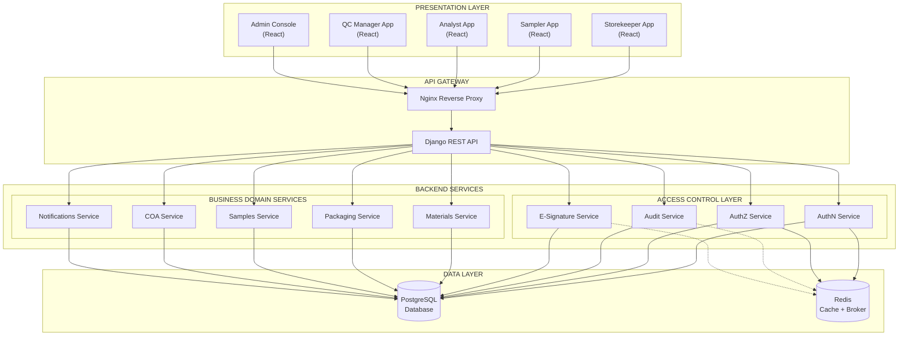

### 3.2 Backend Module Dependencies

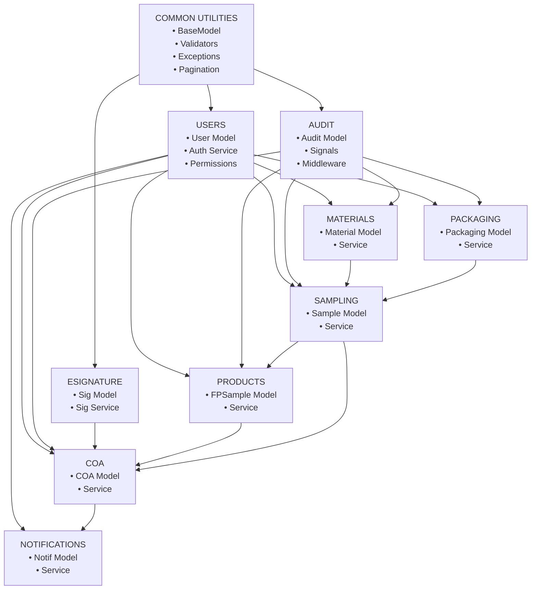

### 3.3 Data Architecture Refinement

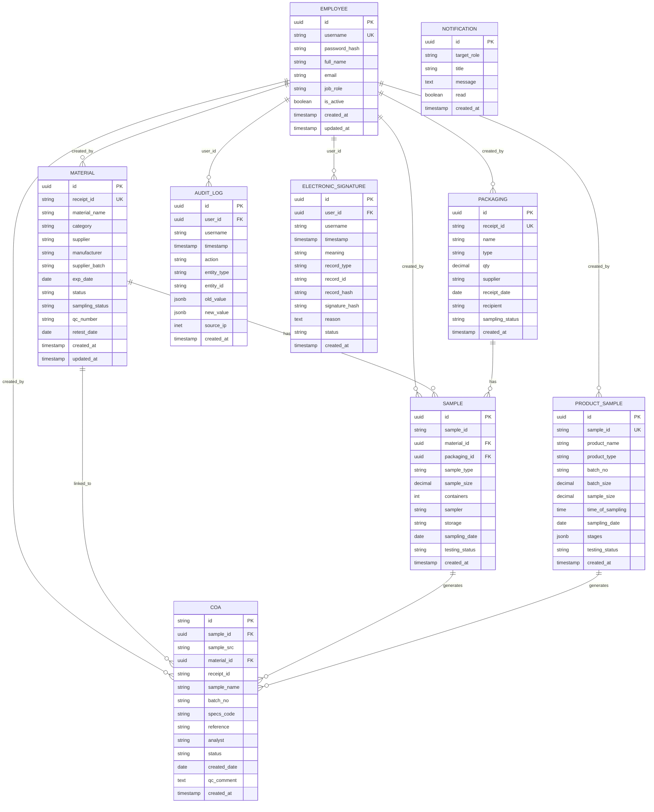

---

## 4. Detailed Component Design

### 4.1 Access Control Layer Components

#### 4.1.1 Authentication Service

| Attribute | Specification |
|-----------|---------------|
| **Purpose** | Authenticate employees using username/password; issue session tokens |
| **Technology** | Django Authentication + JWT (djangorestframework-simplejwt) |
| **Package** | `apps.users.services.AuthService` |

**Authentication Flow:**

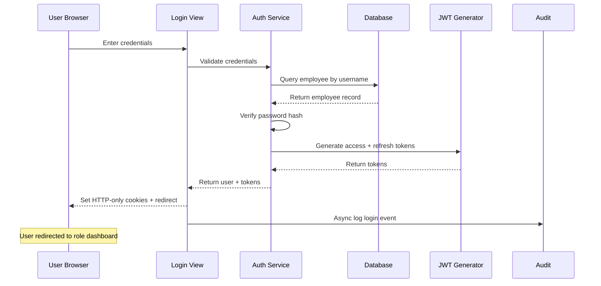

**JWT Token Structure:**
```json
{
  "access_token": "eyJhbGciOiJIUzI1NiIs...",
  "refresh_token": "eyJhbGciOiJIUzI1NiIs...",
  "user": {
    "id": "uuid",
    "username": "jdoe",
    "full_name": "John Doe",
    "job_role": "storekeeper"
  }
}
```

#### 4.1.2 Authorisation Service

| Attribute | Specification |
|-----------|---------------|
| **Purpose** | Enforce role-based permissions at API and UI levels |
| **Technology** | Django permissions + DRF permission classes |
| **Package** | `apps.users.permissions` + `apps.users.services.AuthorizationService` |

**Permission Checking Flow:**

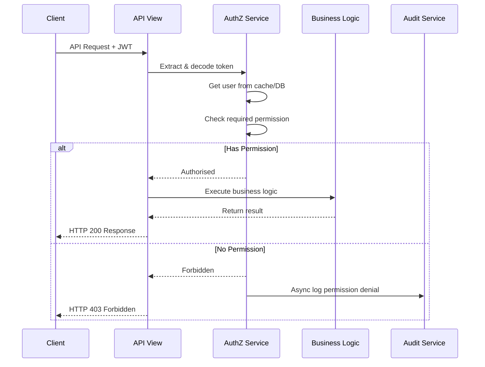

**Role → Permissions Mapping:**

| Role | Permissions |
|------|-------------|
| Storekeeper | `materials.view`, `materials.create`, `materials.update`, `packaging.view`, `packaging.create`, `packaging.update`, `materials.request_sampling`, `packaging.request_sampling` |
| Sampler | `samples.view`, `samples.create`, `samples.print_label`, `product_samples.view`, `product_samples.create` |
| Analyst | `samples.view`, `samples.start_testing`, `coa.view`, `coa.create`, `coa.update`, `coa.submit`, `coa.complete` |
| QC Manager | `coa.view`, `coa.approve`, `coa.reject`, `materials.release` |
| Admin | `employees.*`, `roles.*`, `audit.*` |

#### 4.1.3 Electronic Signature Service

| Attribute | Specification |
|-----------|---------------|
| **Purpose** | Create and verify electronic signatures for GMP decisions |
| **Technology** | Django models + cryptographic hashing (SHA-256) |
| **Package** | `apps.esignature.services.SignatureService` |

**Signature Flow:**

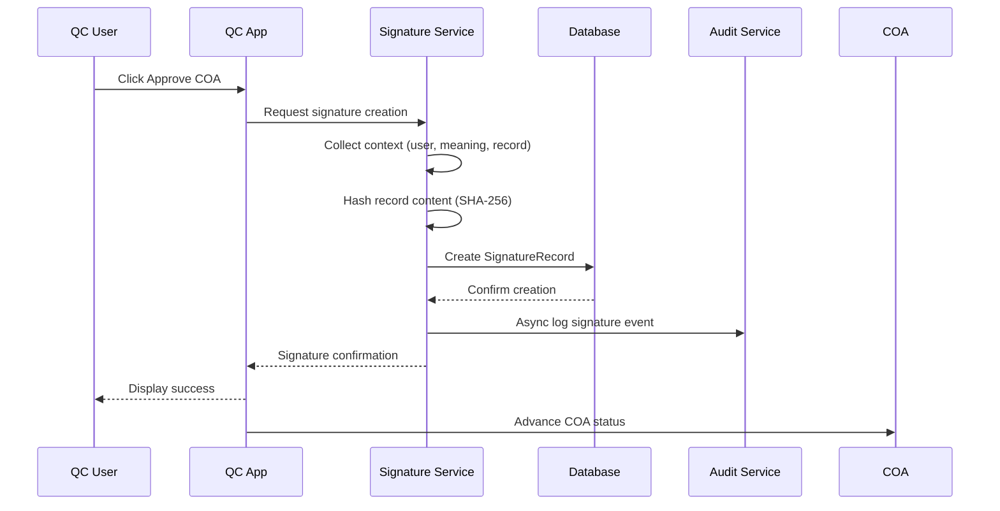

---

### 4.2 Storekeeper Application Components

#### 4.2.1 Material Registration Component

| Attribute | Specification |
|-----------|---------------|
| **Purpose** | Register incoming raw materials |
| **Component** | `MaterialForm.tsx` |
| **State** | React Hook Form + Zod validation |
| **API** | POST `/api/v1/materials/` |

**Form Field Mapping:**

| Field | Type | Required | Default | Validation |
|-------|------|----------|---------|------------|
| `receiptId` | Text (auto) | Yes | `RCV-YYYY-####` | Auto-generated |
| `materialName` | Dropdown | Yes | — | Must be in list |
| `supplier` | Dropdown | Yes | — | Must be in list |
| `supplierBatch` | Text | Yes | — | Not empty |
| `expDate` | Date | Yes | — | Must be future |
| `receiptDate` | Date | Yes | Today | — |
| `receivedBy` | Text | Yes | — | Not empty |

**Validation Rules:**
- Required fields: `materialName`, `supplier`, `supplierBatch`, `expDate`, `receiptDate`, `receivedBy`
- `totalQty` = `numPackages` × `packageSize` (auto-calculated)

#### 4.2.2 Material Table Component

| Attribute | Specification |
|-----------|---------------|
| **Purpose** | Display materials with search and filter capabilities |
| **Component** | `MaterialTable.tsx` |
| **State** | React Query (server state) |
| **API** | GET `/api/v1/materials/?search=&status=&sampling=` |

**Columns:**
Receipt ID | Material Name | Supplier Batch | Receiving Date | Total Qty | Status | Sampling Status | Expire Date | Actions

**Features:**
- Server-side pagination (20 records per page)
- Search across Receipt ID, Material Name, Supplier Batch
- Filter by Status, Sampling Status
- Inline actions (View, Request Sampling, Print Label)

---

### 4.3 Sampler Application Components

#### 4.3.1 Sampling Form Component

| Attribute | Specification |
|-----------|---------------|
| **Purpose** | Record a sampling event |
| **Component** | `SamplingForm.tsx` |
| **State** | React Hook Form + Zod validation |
| **API** | POST `/api/v1/samples/` |

**Form Field Mapping:**

| Field | Type | Required | Source |
|-------|------|----------|--------|
| `sampleId` | Text (auto) | Yes | Material.receiptId |
| `materialName` | Text | Yes | Material.materialName |
| `sampleSize` | Number | Yes | User input |
| `containers` | Number | Yes | User input |
| `sampler` | Text | Yes | User input |
| `storageCondition` | Dropdown | Yes | Ambient/Refrigerated/Frozen/Protected/CRT |
| `samplingDate` | Date | Yes | User input (defaults to today) |

**Post-Save Behaviour:**
1. Create sample record (testingStatus = Not Tested)
2. Update material samplingStatus → Sampled
3. Open Label Preview (two labels side by side)

#### 4.3.2 Product Sample Registration Component

| Attribute | Specification |
|-----------|---------------|
| **Purpose** | Register FP, SFP, and Bulk samples |
| **Component** | `ProductSampleForm.tsx` |
| **State** | React Hook Form + Zod validation |
| **API** | POST `/api/v1/product-samples/` |

**Sample ID Generation:**
- Finished Product: `FP-YYYY-####`
- Semi-Finished Product: `SFP-YYYY-####`
- Bulk: `BLK-YYYY-####`

**Stage Checkboxes with Conditional Text:**
- [ ] Export to: [___________]
- [ ] Local Market
- [ ] UPA
- [ ] F.M.A
- [ ] For Toll: [___________]

---

### 4.4 Analyst Application Components

#### 4.4.1 Combined Samples Worklist

| Attribute | Specification |
|-----------|---------------|
| **Purpose** | Display all samples (RM, Packaging, Product) in one unified view |
| **Component** | `SampleWorklist.tsx` |
| **State** | React Query |
| **API** | GET `/api/v1/samples/combined/` |

**Type Tags:**
| Type | Badge Style |
|------|-------------|
| Raw Material | `badge-sampled` (green) |
| Packaging | `badge-packaging` (purple) |
| FP | `badge-fp` (amber) |
| SFP | `badge-sfp` (blue) |
| Bulk | `badge-bulk` (green) |

#### 4.4.2 COA Creation Component

| Attribute | Specification |
|-----------|---------------|
| **Purpose** | Create Certificate of Analysis from a sample |
| **Component** | `COAForm.tsx` |
| **State** | React Hook Form + Zod validation |
| **API** | POST `/api/v1/coas/` |

**COA Status Workflow:**

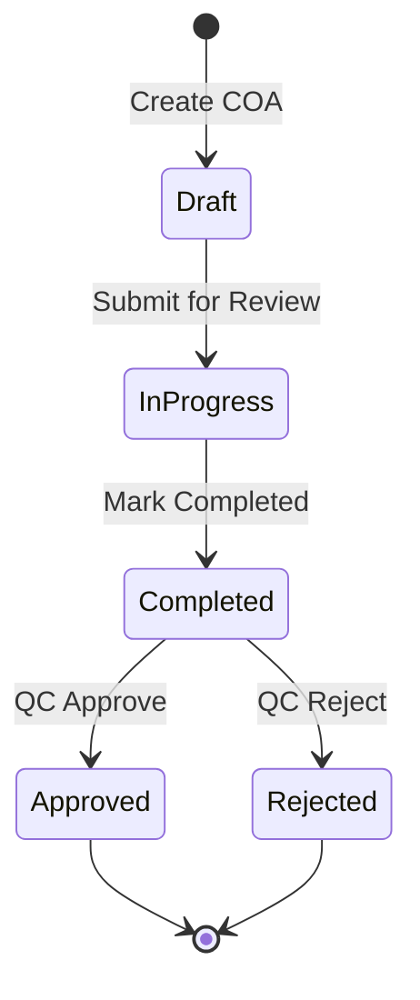

---

### 4.5 QC Manager Application Components

#### 4.5.1 COA Detail Component (QC Manager View)

| Attribute | Specification |
|-----------|---------------|
| **Purpose** | Display full COA with approve/reject actions |
| **Component** | `COADetail.tsx` |
| **State** | React Query |
| **API** | GET `/api/v1/coas/{id}/` |

**COA Detail Layout:**
```
┌─────────────────────────────────────────────────────────────┐
│  CERTIFICATE OF ANALYSIS                                    │
│  COA-2026-0001  ·  Issued: 15/01/2026                      │
├─────────────────────────────────────────────────────────────┤
│  Material & Sample Details                                 │
│  ┌───────────────┐  ┌───────────────┐                     │
│  │ Sample Name   │  │ Paracetamol   │                     │
│  │ Batch No.     │  │ BATCH-2024-001│                     │
│  │ Batch Size    │  │ 1000 kg       │                     │
│  │ Supplier      │  │ PharmaChem Ltd│                     │
│  │ Manufacturer  │  │ BASF SE       │                     │
│  │ Mfg Date      │  │ 15/01/2025    │                     │
│  │ Exp Date      │  │ 15/01/2027    │                     │
│  │ Received Date │  │ 15/01/2026    │                     │
│  └───────────────┘  └───────────────┘                     │
│  Status: [Completed]  QC Comment: [optional]               │
├─────────────────────────────────────────────────────────────┤
│  [Reject]  [Approve COA]                                   │
└─────────────────────────────────────────────────────────────┘
```

#### 4.5.2 Release Modal Component

| Attribute | Specification |
|-----------|---------------|
| **Purpose** | Release raw material after COA approval |
| **Component** | `ReleaseModal.tsx` |
| **State** | React Hook Form + Zod validation |
| **API** | POST `/api/v1/materials/{id}/release/` |

**Release Flow:**

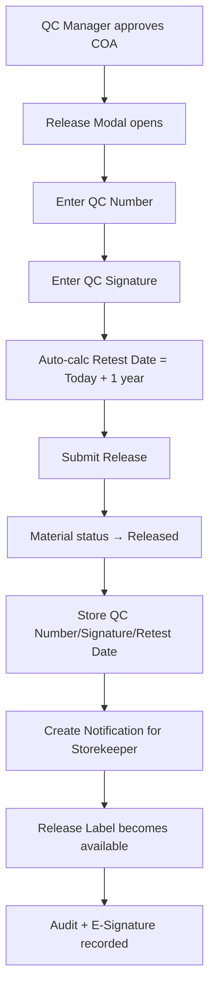

---

## 5. Database Design

### 5.1 Entity-Relationship Diagram

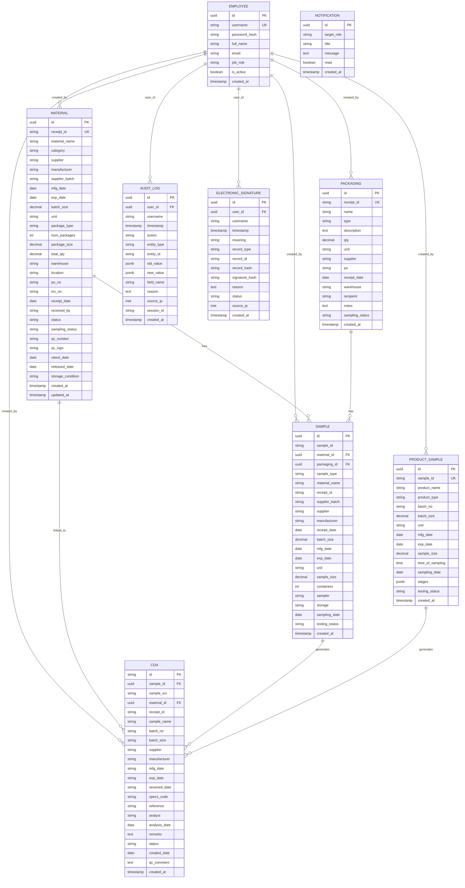

### 5.2 Table Indexing Strategy

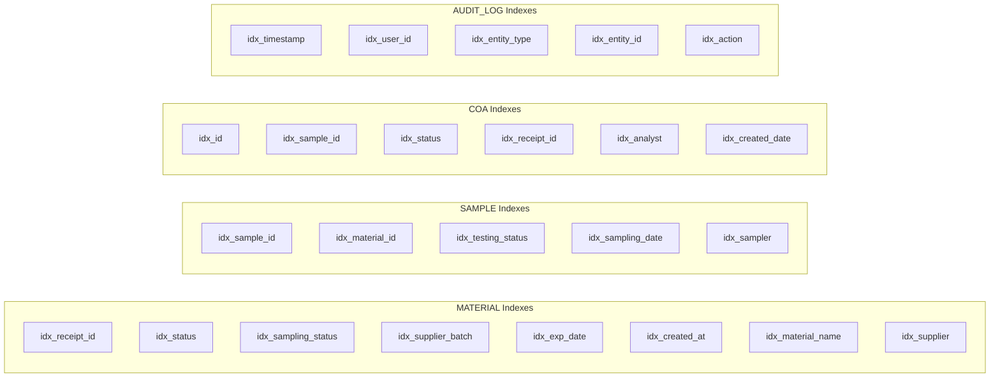

### 5.3 Data Integrity Constraints

**Check Constraints:**
- `status IN ('Quarantine', 'Released', 'Rejected')`
- `sampling_status IN ('Not Sampled', 'Sampling Requested', 'Sampled')`
- `coa.status IN ('Draft', 'In Progress', 'Completed', 'Approved', 'Rejected')`
- `product_type IN ('Finished Product', 'Semi-Finished Product', 'Bulk')`

**Unique Constraints:**
- `material.receipt_id` UNIQUE
- `packaging.receipt_id` UNIQUE
- `product_sample.sample_id` UNIQUE
- `coa.id` PRIMARY KEY
- `employee.username` UNIQUE

---

## 6. UI/UX Design

### 6.1 Design System

**Colour Palette:**

| Variable | Hex | Usage |
|----------|-----|-------|
| `--primary` | #2d6a4f | Primary actions, links, success states |
| `--primary-light` | #e8f4ee | Primary background |
| `--info` | #2563a8 | Information, sampling status |
| `--info-light` | #eff4fb | Info background |
| `--warning` | #b7791f | Warning, quarantine status |
| `--warning-light` | #fef9ec | Warning background |
| `--danger` | #c0392b | Error, rejection, delete |
| `--danger-light` | #fdf0ee | Danger background |
| `--purple` | #6d28d9 | QC Manager, release labels |
| `--bg` | #f5f5f3 | Page background |
| `--surface` | #ffffff | Card/modal backgrounds |
| `--border` | #e8e8e5 | Borders |
| `--text` | #1a1a18 | Primary text |
| `--text2` | #5a5a55 | Secondary text |
| `--text3` | #9a9a94 | Muted text |

**Typography:**

| Element | Font | Size | Weight |
|---------|------|------|--------|
| Body | DM Sans | 14px | 400 |
| Headings | DM Sans | 20px | 600 |
| Labels | DM Sans | 12px | 500 |
| Table cells | DM Sans | 13px | 400 |
| IDs/Batch | DM Mono | 12px | 500 |
| Badges | DM Sans | 11px | 500 |
| Print | DM Mono | 11px | 400 |

### 6.2 UI Component Inventory

| Component | Purpose |
|-----------|---------|
| `Button` | Reusable button with variants |
| `Table` | Data table with sorting/pagination |
| `Modal` | Overlay modal with header/footer |
| `Badge` | Status indicators |
| `StatusBadge` | Role/status badges |
| `Label` | Print label component |
| `Toast` | Notification toast |
| `PrintArea` | Hidden print container |
| `Form` | Form with validation |
| `Input` | Text input |
| `Select` | Dropdown select with add option |
| `DatePicker` | Date input |
| `Textarea` | Multi-line text input |
| `Checkbox` | Checkbox with label |
| `Pagination` | Table pagination |
| `StatsCard` | Dashboard statistics |
| `SearchBar` | Search input with icon |
| `FilterDropdown` | Filter select |

### 6.3 Badge Colour Coding

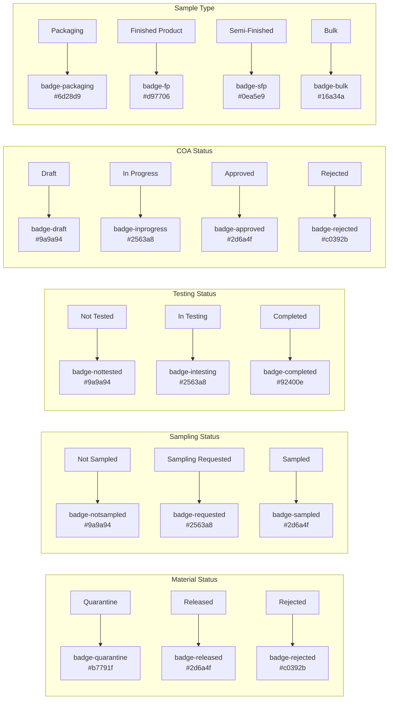

### 6.4 Print Design

**Label Print CSS:**
- Font: DM Mono (monospace)
- Labels: 250px min-width, side by side
- Headers: Coloured bars (green, blue, purple)
- Data: `display: flex; gap: 6px` with key (gray) and value (bold)
- Dividers: Dashed lines between sections
- Page break: `page-break-inside: avoid` on each label

**Print Styles:**
```css
@media print {
  body * { visibility: hidden; }
  #printArea, #printArea * { visibility: visible; }
  #printArea { 
    position: fixed; 
    inset: 0; 
    padding: 30px; 
    background: #fff; 
  }
}
```

---

## 7. API Design

### 7.1 API Architecture

**Base URL:** `https://api.rm-rrs.example.com/api/v1/`

**Authentication:** JWT Bearer token (or HTTP‑only cookie)

**Headers:**
```
Authorization: Bearer <access_token>
Accept: application/json
Content-Type: application/json
X-Correlation-ID: <uuid>
```

**Response Format:**
```json
{
  "data": { ... },
  "meta": { "total": 100, "page": 1, "per_page": 20 },
  "errors": null
}
```

**Error Response:**
```json
{
  "data": null,
  "meta": {},
  "errors": [
    {
      "code": "VALIDATION_ERROR",
      "message": "The field 'material_name' is required.",
      "field": "material_name"
    }
  ]
}
```

### 7.2 API Endpoints

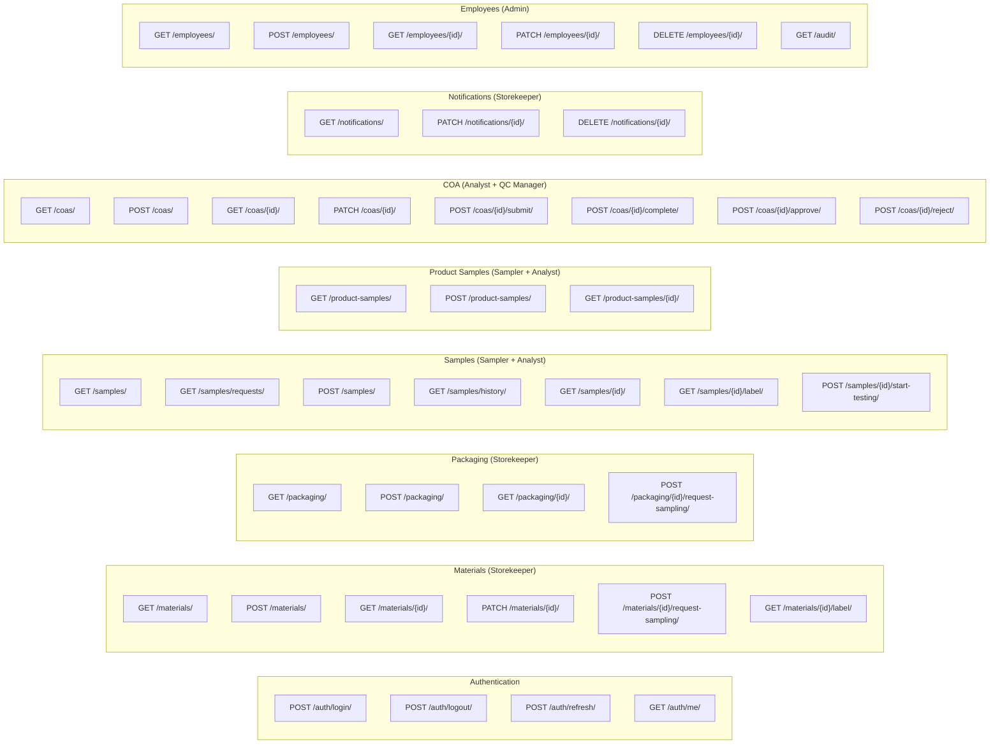

### 7.3 Request/Response Examples

**Create Material (POST /materials/):**

Request:
```json
{
  "material_name": "Paracetamol",
  "supplier": "PharmaChem Ltd",
  "supplier_batch": "BATCH-2024-001",
  "exp_date": "2027-01-15",
  "receipt_date": "2026-01-15",
  "received_by": "John Smith"
}
```

Response:
```json
{
  "data": {
    "id": "mat_abc123",
    "receipt_id": "RCV-2026-0047",
    "material_name": "Paracetamol",
    "status": "Quarantine",
    "sampling_status": "Not Sampled"
  }
}
```

### 7.4 Error Codes

| HTTP Status | Code | Description |
|-------------|------|-------------|
| 400 | `VALIDATION_ERROR` | Invalid input data |
| 400 | `DUPLICATE_ENTITY` | Record already exists |
| 401 | `UNAUTHORIZED` | No/invalid authentication |
| 403 | `FORBIDDEN` | Insufficient permissions |
| 404 | `NOT_FOUND` | Resource not found |
| 409 | `CONFLICT` | State conflict |
| 422 | `UNPROCESSABLE_ENTITY` | Business rule violation |
| 500 | `INTERNAL_ERROR` | Server error |

---

## 8. Security Design

### 8.1 Authentication Flow

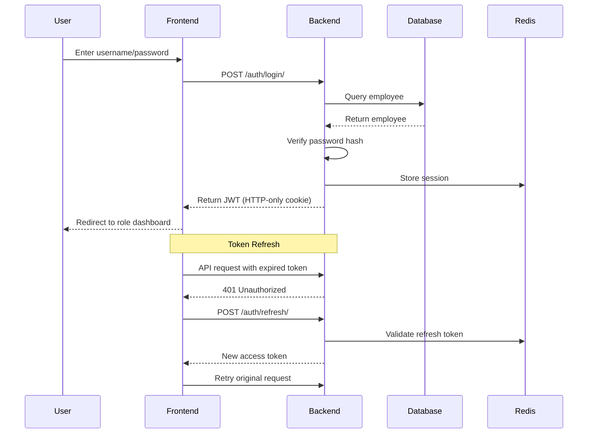

### 8.2 Data Protection Summary

| Concern | Measure |
|---------|---------|
| **Transport** | TLS 1.2+; HSTS headers |
| **At Rest** | Database encrypted at rest |
| **Secrets** | Environment variables; never in code |
| **PII** | Minimal PII stored; audit logs masked |
| **Backups** | Encrypted before off-site transfer |
| **Passwords** | bcrypt hashed; never logged |
| **Tokens** | HTTP-only cookies; not accessible via JS |

### 8.3 Audit Coverage

```mermaid
flowchart LR
    subgraph Events["Audited Events"]
        E1["Material CRUD"]
        E2["Packaging CRUD"]
        E3["Sample CRUD"]
        E4["Product Sample CRUD"]
        E5["COA CRUD"]
        E6["Employee CRUD"]
        E7["Login/Logout"]
        E8["Permission Denials"]
        E9["QC Approve/Reject"]
    end

    subgraph Fields["Audit Fields"]
        F1["User ID"]
        F2["Timestamp"]
        F3["Action Type"]
        F4["Entity Type"]
        F5["Entity ID"]
        F6["Old Value (JSON)"]
        F7["New Value (JSON)"]
        F8["Reason"]
        F9["Source IP"]
    end

    Events --> Fields
```

---

## 9. Operational Design

### 9.1 Deployment Architecture

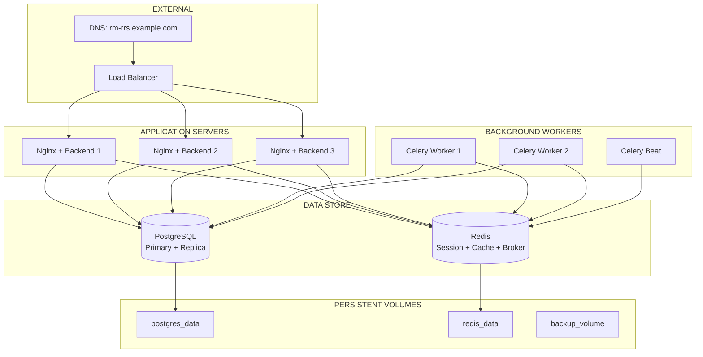

### 9.2 Monitoring and Alerting

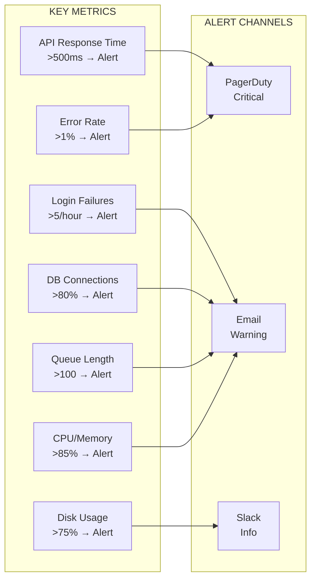

### 9.3 Backup Strategy

| Type | Frequency | Retention |
|------|-----------|-----------|
| Full Database Backup | Daily (02:00 UTC) | 30 days |
| WAL Archiving | Continuous | 7 days |
| Monthly Backup | Last day of month | 12 months |
| Yearly Backup | 31 December | 7 years |
| Application Code | Per commit | Unlimited (Git) |

**RTO:** 4 hours | **RPO:** 1 hour

---

## 10. Appendices

### A. Architectural Decision Log

| Decision ID | Decision | Rationale | Status |
|-------------|----------|-----------|--------|
| DES-001 | JWT with HTTP-only cookies | Secure; prevents XSS token theft | Confirmed |
| DES-002 | Audit via Django signals + Celery | Application-context; async; non-blocking | Confirmed |
| DES-003 | `window.print()` for labels | Simple; matches prototype | Confirmed |
| DES-004 | Shared frontend monorepo (pnpm) | Code reuse; consistent versions | TBS |
| DES-005 | React Query for server state | Caching; revalidation; optimistic updates | TBS |
| DES-006 | PostgreSQL JSONB for audit logs | Flexible; queryable; schema evolution | Confirmed |
| DES-007 | Human-readable sequential IDs | Prototype; human-friendly; auditable | Confirmed |

### B. Design Standards Checklist

| Standard | Status |
|----------|--------|
| All IDs auto-generated per specification | ✅ |
| All forms have validation | ✅ |
| All UI labels match prototype | ✅ |
| All API endpoints have permissions | ✅ |
| All GMP records have audit logging | ✅ |
| All QC decisions have e-signatures | ✅ |
| All errors handled with user-friendly messages | ✅ |
| Print functionality available where specified | ✅ |
| Notifications trigger on release | ✅ |
| Role-based navigation enforced | ✅ |

---

**Document Approval**

| Role | Name | Date |
|------|------|------|
| Author | [Name] | [Date] |
| Reviewer (Architecture) | [Name] | [Date] |
| Reviewer (Product) | [Name] | [Date] |
| Approver | [Name] | [Date] |

---

**Change History**

| Version | Date | Author | Description |
|---------|------|--------|-------------|
| 1.0 | [Date] | [Author] | Initial baseline with mermaid diagrams |

