# 11 — API Specification

**Document Identifier:** RM-RRS-API-001
**Version:** 1.0
**Status:** Baseline
**Traces to:** Project Charter, SRS, NFR, SAS, Design Specification, Database Specification
**Compliance Reference:** OpenAPI 3.0.3, REST API Best Practices, ISO/IEC/IEEE 29148:2018

---

## Table of Contents

1. [Introduction](#1-introduction)
2. [API Overview](#2-api-overview)
3. [Authentication and Authorisation](#3-authentication-and-authorisation)
4. [Common Patterns](#4-common-patterns)
5. [Endpoint Specifications](#5-endpoint-specifications)
6. [Error Handling](#6-error-handling)
7. [Appendices](#7-appendices)

---

## 1. Introduction

### 1.1 Purpose
This document defines the Application Programming Interface (API) for the **Raw Material Receiving & Release System (RM-RRS)** . It specifies all RESTful endpoints, request/response formats, authentication mechanisms, error handling, and common patterns. This specification serves as the authoritative contract between the frontend applications and the backend services, enabling parallel development and ensuring consistency.

### 1.2 Scope
This API specification covers all confirmed MVP endpoints for:
- **Authentication**: Login, logout, token refresh
- **Storekeeper App**: Materials, Packaging, Notifications
- **Sampler App**: Samples (RM + Packaging), Product Samples
- **Analyst App**: COA creation, status updates, certificates
- **QC Manager App**: COA review, approval/rejection, release
- **Admin Console**: Employee management, audit trail

### 1.3 References

| Document | Reference |
|----------|-----------|
| 06_SRS.md | Software Requirements Specification |
| 07_NFR.md | Non-Functional Requirements |
| 08_SAS.md | Software Architecture Specification |
| 09_Design.md | Design Specification |
| 10_Database.md | Database Specification |
| OpenAPI 3.0.3 | https://swagger.io/specification/ |
| REST API Best Practices | Microsoft, Google API Design Guide |

---

## 2. API Overview

### 2.1 API Architecture

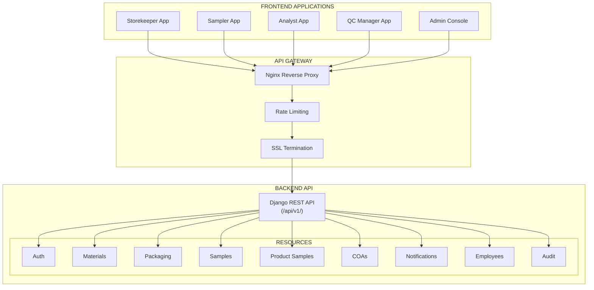

### 2.2 Base Information

| Attribute | Value |
|-----------|-------|
| **Base URL** | `https://api.rm-rrs.example.com/api/v1/` |
| **Protocol** | HTTPS (TLS 1.2+) |
| **Data Format** | JSON |
| **Character Encoding** | UTF-8 |
| **API Versioning** | Path-based (`/api/v1/`) |
| **Response Format** | Envelope pattern with `data`, `meta`, `errors` |

### 2.3 API Design Principles

1. **RESTful**: Resources as nouns, standard HTTP methods
2. **Stateless**: No server-side session storage; JWT-based authentication
3. **Consistent**: Uniform response structures and error handling
4. **Secure**: HTTPS only, JWT authentication, permission checks on every endpoint
5. **Versioned**: Breaking changes introduced via new API versions
6. **Paginated**: List endpoints support pagination with `limit` and `offset`
7. **Filterable**: Query parameters for filtering list results
8. **Sortable**: `ordering` query parameter for sorting

---

## 3. Authentication and Authorisation

### 3.1 Authentication Flow

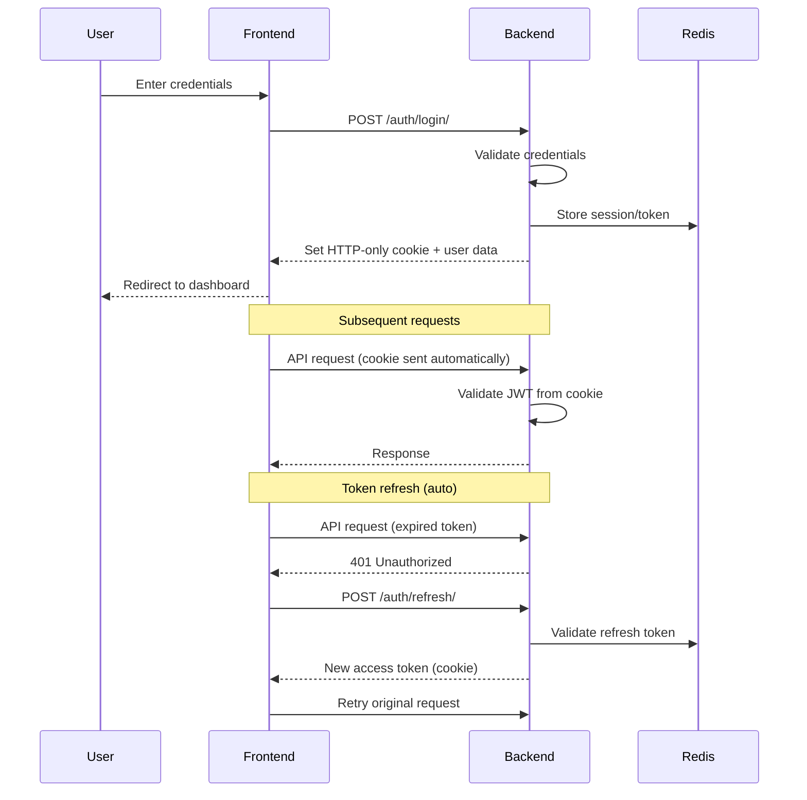

### 3.2 Authentication Mechanism

**Method**: JWT (JSON Web Tokens) stored in HTTP-only cookies

**Cookie Configuration:**
| Attribute | Value |
|-----------|-------|
| Name | `access_token` / `refresh_token` |
| HttpOnly | `true` |
| Secure | `true` (production) |
| SameSite | `Strict` |
| Path | `/api/` |
| Max-Age | Access: 15 minutes; Refresh: 7 days |

**Token Payload (Access Token):**
```json
{
  "sub": "uuid",
  "username": "jdoe",
  "job_role": "storekeeper",
  "exp": 1700000000,
  "iat": 1700000000
}
```

**Authentication Header Alternative:**
```
Authorization: Bearer <access_token>
```

### 3.3 Authorisation Model

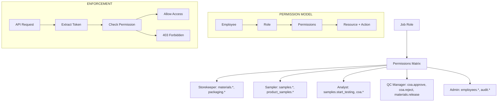

### 3.4 Permissions Matrix

| Permission | Storekeeper | Sampler | Analyst | QC Manager | Admin |
|------------|-------------|---------|---------|------------|-------|
| `auth.login` | ✅ | ✅ | ✅ | ✅ | ✅ |
| `auth.logout` | ✅ | ✅ | ✅ | ✅ | ✅ |
| `materials.view` | ✅ | — | — | — | — |
| `materials.create` | ✅ | — | — | — | — |
| `materials.update` | ✅ | — | — | — | — |
| `materials.request_sampling` | ✅ | — | — | — | — |
| `materials.release` | — | — | — | ✅ | — |
| `packaging.view` | ✅ | — | — | — | — |
| `packaging.create` | ✅ | — | — | — | — |
| `packaging.request_sampling` | ✅ | — | — | — | — |
| `samples.view` | — | ✅ | ✅ | — | — |
| `samples.create` | — | ✅ | — | — | — |
| `samples.start_testing` | — | — | ✅ | — | — |
| `product_samples.view` | — | ✅ | ✅ | — | — |
| `product_samples.create` | — | ✅ | — | — | — |
| `coa.view` | — | — | ✅ | ✅ | — |
| `coa.create` | — | — | ✅ | — | — |
| `coa.update` | — | — | ✅ | — | — |
| `coa.submit` | — | — | ✅ | — | — |
| `coa.complete` | — | — | ✅ | — | — |
| `coa.approve` | — | — | — | ✅ | — |
| `coa.reject` | — | — | — | ✅ | — |
| `notifications.view` | ✅ | — | — | — | — |
| `employees.*` | — | — | — | — | ✅ |
| `audit.*` | — | — | — | — | ✅ |

---

## 4. Common Patterns

### 4.1 Request Headers

| Header | Required | Description |
|--------|----------|-------------|
| `Accept` | Yes | `application/json` |
| `Content-Type` | Yes (POST/PUT/PATCH) | `application/json` |
| `X-Correlation-ID` | No | UUID for request tracing |
| `X-Forwarded-For` | No | Client IP (set by proxy) |

### 4.2 Response Envelope

**Success Response:**
```json
{
  "data": {
    // Resource data
  },
  "meta": {
    "page": 1,
    "per_page": 20,
    "total": 100,
    "total_pages": 5
  },
  "errors": null
}
```

**Error Response:**
```json
{
  "data": null,
  "meta": {},
  "errors": [
    {
      "code": "VALIDATION_ERROR",
      "message": "The field 'material_name' is required.",
      "field": "material_name",
      "details": null
    }
  ]
}
```

### 4.3 Filtering, Sorting, Pagination

| Parameter | Type | Description | Example |
|-----------|------|-------------|---------|
| `search` | string | Full-text search | `?search=paracetamol` |
| `limit` | integer | Records per page (1-100) | `?limit=20` |
| `offset` | integer | Records to skip | `?offset=40` |
| `ordering` | string | Sort field (prefix `-` for desc) | `?ordering=-created_at` |
| `status` | string | Filter by status | `?status=Quarantine` |
| `sampling_status` | string | Filter by sampling | `?sampling_status=Sampling%20Requested` |
| `testing_status` | string | Filter by testing | `?testing_status=Not%20Tested` |

**Example:**
```
GET /api/v1/materials/?search=para&status=Quarantine&ordering=-created_at&limit=20&offset=0
```

### 4.4 HTTP Status Codes

| Code | Description |
|------|-------------|
| 200 | OK — Successful request |
| 201 | Created — Resource created |
| 204 | No Content — Successful delete |
| 400 | Bad Request — Validation error |
| 401 | Unauthorised — No/invalid authentication |
| 403 | Forbidden — Insufficient permissions |
| 404 | Not Found — Resource doesn't exist |
| 409 | Conflict — State conflict |
| 422 | Unprocessable Entity — Business rule violation |
| 500 | Internal Server Error |

### 4.5 ID Formats

| Entity | Format | Example |
|--------|--------|---------|
| Material Receipt | `RCV-YYYY-####` | `RCV-2026-0001` |
| Packaging Receipt | `PKG-YYYY-####` | `PKG-2026-0001` |
| Packaging Sample | `PKG-SMP-YYYY-####` | `PKG-SMP-2026-0001` |
| Product Sample | `FP-YYYY-####`, `SFP-YYYY-####`, `BLK-YYYY-####` | `FP-2026-0001` |
| COA | `COA-YYYY-####` | `COA-2026-0001` |
| QC Number | `QC-YYYY-####` | `QC-2026-0001` |

---

## 5. Endpoint Specifications

### 5.1 Authentication

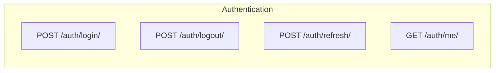

#### 5.1.1 Login

**Endpoint:** `POST /auth/login/`

**Request:**
```json
{
  "username": "storekeeper1",
  "password": "SecurePassword123!"
}
```

**Response (200 OK):**
```json
{
  "data": {
    "user": {
      "id": "550e8400-e29b-41d4-a716-446655440000",
      "username": "storekeeper1",
      "full_name": "John Storekeeper",
      "job_role": "storekeeper",
      "email": "john@example.com"
    }
  },
  "meta": {},
  "errors": null
}
```

**Error (401 Unauthorized):**
```json
{
  "data": null,
  "meta": {},
  "errors": [
    {
      "code": "INVALID_CREDENTIALS",
      "message": "Invalid username or password.",
      "field": null,
      "details": null
    }
  ]
}
```

#### 5.1.2 Logout

**Endpoint:** `POST /auth/logout/`

**Response (204 No Content):** No body; clears cookies.

#### 5.1.3 Refresh Token

**Endpoint:** `POST /auth/refresh/`

**Response (200 OK):**
```json
{
  "data": {
    "access_token_expires_in": 900
  },
  "meta": {},
  "errors": null
}
```
Sets new `access_token` cookie.

#### 5.1.4 Get Current User

**Endpoint:** `GET /auth/me/`

**Response (200 OK):**
```json
{
  "data": {
    "id": "550e8400-e29b-41d4-a716-446655440000",
    "username": "storekeeper1",
    "full_name": "John Storekeeper",
    "job_role": "storekeeper",
    "email": "john@example.com",
    "is_active": true,
    "created_at": "2026-01-15T10:00:00Z"
  },
  "meta": {},
  "errors": null
}
```

---

### 5.2 Materials

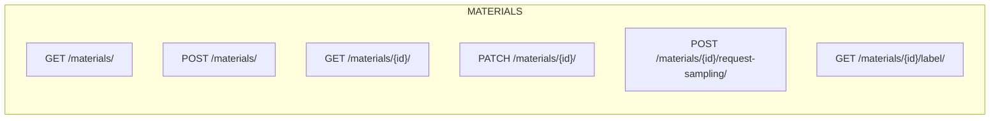

#### 5.2.1 List Materials

**Endpoint:** `GET /materials/`
**Permissions:** `materials.view` (Storekeeper)

**Query Parameters:**
| Parameter | Type | Description |
|-----------|------|-------------|
| `search` | string | Search by `receipt_id`, `material_name`, `supplier_batch`, `supplier` |
| `status` | string | `Quarantine`, `Released`, `Rejected` |
| `sampling_status` | string | `Not Sampled`, `Sampling Requested`, `Sampled` |
| `ordering` | string | `receipt_id`, `-created_at`, `material_name` |
| `limit` | integer | 1–100 (default 20) |
| `offset` | integer | Default 0 |

**Response (200 OK):**
```json
{
  "data": [
    {
      "id": "550e8400-e29b-41d4-a716-446655440000",
      "receipt_id": "RCV-2026-0001",
      "material_name": "Paracetamol",
      "category": "API",
      "supplier": "PharmaChem Ltd",
      "manufacturer": "BASF SE",
      "supplier_batch": "BATCH-2024-001",
      "exp_date": "2027-01-15",
      "receipt_date": "2026-01-15",
      "received_by": "John Storekeeper",
      "status": "Quarantine",
      "sampling_status": "Not Sampled",
      "total_qty": "250.00",
      "unit": "kg",
      "created_at": "2026-01-15T10:00:00Z"
    }
  ],
  "meta": {
    "page": 1,
    "per_page": 20,
    "total": 45,
    "total_pages": 3
  },
  "errors": null
}
```

#### 5.2.2 Create Material

**Endpoint:** `POST /materials/`
**Permissions:** `materials.create` (Storekeeper)

**Request:**
```json
{
  "material_name": "Paracetamol",
  "category": "API",
  "supplier": "PharmaChem Ltd",
  "manufacturer": "BASF SE",
  "country_origin": "Germany",
  "supplier_batch": "BATCH-2024-001",
  "mfg_date": "2025-01-15",
  "exp_date": "2027-01-15",
  "batch_size": "1000.00",
  "unit": "kg",
  "package_type": "Drum",
  "num_packages": 10,
  "package_size": "25.00",
  "warehouse": "WH-01 (Cold Storage)",
  "location": "Shelf A-3",
  "po_no": "PO-2024-001",
  "inv_no": "INV-001",
  "receipt_date": "2026-01-15",
  "received_by": "John Storekeeper"
}
```

**Response (201 Created):**
```json
{
  "data": {
    "id": "550e8400-e29b-41d4-a716-446655440000",
    "receipt_id": "RCV-2026-0047",
    "material_name": "Paracetamol",
    "supplier": "PharmaChem Ltd",
    "supplier_batch": "BATCH-2024-001",
    "status": "Quarantine",
    "sampling_status": "Not Sampled",
    "created_at": "2026-01-15T10:30:00Z"
  },
  "meta": {},
  "errors": null
}
```

**Validation Errors (400):**
```json
{
  "data": null,
  "meta": {},
  "errors": [
    {
      "code": "VALIDATION_ERROR",
      "message": "This field is required.",
      "field": "material_name",
      "details": null
    },
    {
      "code": "VALIDATION_ERROR",
      "message": "Ensure this value is at least 1.",
      "field": "num_packages",
      "details": null
    }
  ]
}
```

#### 5.2.3 Get Material Detail

**Endpoint:** `GET /materials/{id}/`
**Permissions:** `materials.view` (Storekeeper)

**Response (200 OK):**
```json
{
  "data": {
    "id": "550e8400-e29b-41d4-a716-446655440000",
    "receipt_id": "RCV-2026-0001",
    "material_name": "Paracetamol",
    "category": "API",
    "supplier": "PharmaChem Ltd",
    "manufacturer": "BASF SE",
    "country_origin": "Germany",
    "supplier_batch": "BATCH-2024-001",
    "mfg_date": "2025-01-15",
    "exp_date": "2027-01-15",
    "batch_size": "1000.00",
    "unit": "kg",
    "package_type": "Drum",
    "num_packages": 10,
    "package_size": "25.00",
    "total_qty": "250.00",
    "warehouse": "WH-01 (Cold Storage)",
    "location": "Shelf A-3",
    "po_no": "PO-2024-001",
    "inv_no": "INV-001",
    "receipt_date": "2026-01-15",
    "received_by": "John Storekeeper",
    "status": "Quarantine",
    "sampling_status": "Not Sampled",
    "qc_number": null,
    "qc_sign": null,
    "retest_date": null,
    "released_date": null,
    "storage_condition": null,
    "created_at": "2026-01-15T10:00:00Z",
    "updated_at": "2026-01-15T10:00:00Z"
  },
  "meta": {},
  "errors": null
}
```

#### 5.2.4 Update Material

**Endpoint:** `PATCH /materials/{id}/`
**Permissions:** `materials.update` (Storekeeper)

**Request:** Partial update (only send fields to change)

**Response (200 OK):** Returns updated material.

#### 5.2.5 Request Sampling

**Endpoint:** `POST /materials/{id}/request-sampling/`
**Permissions:** `materials.request_sampling` (Storekeeper)

**Request:** No body required.

**Response (200 OK):**
```json
{
  "data": {
    "id": "550e8400-e29b-41d4-a716-446655440000",
    "receipt_id": "RCV-2026-0001",
    "sampling_status": "Sampling Requested"
  },
  "meta": {},
  "errors": null
}
```

**Error (409 Conflict):**
```json
{
  "data": null,
  "meta": {},
  "errors": [
    {
      "code": "CONFLICT",
      "message": "Sampling has already been requested for this material.",
      "field": null,
      "details": {
        "current_status": "Sampling Requested"
      }
    }
  ]
}
```

#### 5.2.6 Get Release Label

**Endpoint:** `GET /materials/{id}/label/`
**Permissions:** `materials.view` (Storekeeper, QC Manager)

**Response (200 OK):**
```json
{
  "data": {
    "receipt_id": "RCV-2026-0001",
    "material_name": "Paracetamol",
    "batch_no": "BATCH-2024-001",
    "batch_size": "1000 kg",
    "supplier": "PharmaChem Ltd",
    "mfg_date": "15/01/2025",
    "exp_date": "15/01/2027",
    "container_no": "3",
    "qc_number": "QC-2026-0001",
    "storage_condition": "Ambient (15–25°C)",
    "retest_date": "15/01/2027",
    "qc_sign": "Jane QC Manager",
    "release_date": "15/01/2026"
  },
  "meta": {},
  "errors": null
}
```

---

### 5.3 Packaging

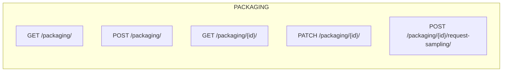

#### 5.3.1 List Packaging

**Endpoint:** `GET /packaging/`
**Permissions:** `packaging.view` (Storekeeper)

**Query Parameters:**
| Parameter | Type | Description |
|-----------|------|-------------|
| `search` | string | Search by `receipt_id`, `name`, `supplier` |
| `type` | string | `Primary`, `Secondary`, `Tertiary`, `Labelling`, `Other` |
| `ordering` | string | `receipt_id`, `-created_at`, `name` |
| `limit` | integer | 1–100 (default 20) |
| `offset` | integer | Default 0 |

**Response (200 OK):**
```json
{
  "data": [
    {
      "id": "660e8400-e29b-41d4-a716-446655440001",
      "receipt_id": "PKG-2026-0001",
      "name": "Aluminium Blister Foil",
      "type": "Primary",
      "description": "50μm aluminium foil for blister packaging",
      "qty": "500.00",
      "unit": "rolls",
      "supplier": "PackCo Inc",
      "po": "PO-2026-001",
      "receipt_date": "2026-01-15",
      "warehouse": "WH-02 (Ambient)",
      "recipient": "John Storekeeper",
      "notes": "Temperature sensitive",
      "sampling_status": "Not Sampled",
      "created_at": "2026-01-15T11:00:00Z"
    }
  ],
  "meta": {
    "page": 1,
    "per_page": 20,
    "total": 12,
    "total_pages": 1
  },
  "errors": null
}
```

#### 5.3.2 Create Packaging

**Endpoint:** `POST /packaging/`
**Permissions:** `packaging.create` (Storekeeper)

**Request:**
```json
{
  "name": "Aluminium Blister Foil",
  "type": "Primary",
  "description": "50μm aluminium foil for blister packaging",
  "qty": "500.00",
  "unit": "rolls",
  "supplier": "PackCo Inc",
  "po": "PO-2026-001",
  "receipt_date": "2026-01-15",
  "warehouse": "WH-02 (Ambient)",
  "recipient": "John Storekeeper",
  "notes": "Temperature sensitive"
}
```

**Response (201 Created):**
```json
{
  "data": {
    "id": "660e8400-e29b-41d4-a716-446655440001",
    "receipt_id": "PKG-2026-0042",
    "name": "Aluminium Blister Foil",
    "type": "Primary",
    "supplier": "PackCo Inc",
    "sampling_status": "Not Sampled",
    "created_at": "2026-01-15T11:00:00Z"
  },
  "meta": {},
  "errors": null
}
```

#### 5.3.3 Request Sampling (Packaging)

**Endpoint:** `POST /packaging/{id}/request-sampling/`
**Permissions:** `packaging.request_sampling` (Storekeeper)

**Response (200 OK):**
```json
{
  "data": {
    "id": "660e8400-e29b-41d4-a716-446655440001",
    "receipt_id": "PKG-2026-0001",
    "sampling_status": "Sampling Requested"
  },
  "meta": {},
  "errors": null
}
```

---

### 5.4 Samples

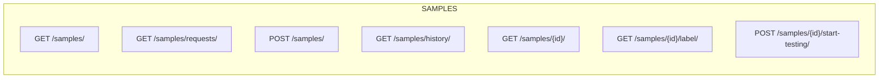

#### 5.4.1 List Samples (Combined Worklist)

**Endpoint:** `GET /samples/`
**Permissions:** `samples.view` (Analyst)

**Query Parameters:**
| Parameter | Type | Description |
|-----------|------|-------------|
| `search` | string | Search by `sample_id`, `material_name`, `receipt_id` |
| `testing_status` | string | `Not Tested`, `In Testing`, `Completed` |
| `sample_type` | string | `RM`, `Packaging`, `FP`, `SFP`, `Bulk` |
| `ordering` | string | `-created_at`, `sample_id` |
| `limit` | integer | 1–100 (default 20) |
| `offset` | integer | Default 0 |

**Response (200 OK):**
```json
{
  "data": [
    {
      "id": "770e8400-e29b-41d4-a716-446655440002",
      "sample_id": "RCV-2026-0001",
      "receipt_id": "RCV-2026-0001",
      "material_name": "Paracetamol",
      "sample_type": "RM",
      "supplier_batch": "BATCH-2024-001",
      "receipt_date": "2026-01-15",
      "sample_size": "200.00",
      "unit": "kg",
      "containers": 3,
      "sampler": "John Sampler",
      "sampling_date": "2026-01-15",
      "exp_date": "2027-01-15",
      "testing_status": "Not Tested"
    },
    {
      "id": "770e8400-e29b-41d4-a716-446655440003",
      "sample_id": "FP-2026-0001",
      "receipt_id": "FP-2026-0001",
      "material_name": "Paracetamol 500mg Tablet (Finished Product)",
      "sample_type": "FP",
      "supplier_batch": "BN-2026-001",
      "receipt_date": "2026-01-16",
      "sample_size": "50.00",
      "unit": "tablets",
      "containers": 1,
      "sampler": "John Sampler",
      "sampling_date": "2026-01-16",
      "exp_date": "2027-01-16",
      "testing_status": "Not Tested"
    }
  ],
  "meta": {
    "page": 1,
    "per_page": 20,
    "total": 30,
    "total_pages": 2
  },
  "errors": null
}
```

#### 5.4.2 Get Sampling Requests

**Endpoint:** `GET /samples/requests/`
**Permissions:** `samples.view` (Sampler)

**Query Parameters:**
| Parameter | Type | Description |
|-----------|------|-------------|
| `search` | string | Search by `material_name`, `receipt_id` |
| `view` | string | `pending` (default) or `all` |

**Response (200 OK):**
```json
{
  "data": [
    {
      "id": "550e8400-e29b-41d4-a716-446655440000",
      "receipt_id": "RCV-2026-0001",
      "material_name": "Paracetamol",
      "category": "API",
      "supplier_batch": "BATCH-2024-001",
      "receipt_date": "2026-01-15",
      "total_qty": "250.00",
      "unit": "kg",
      "status": "Quarantine",
      "sampling_status": "Sampling Requested",
      "exp_date": "2027-01-15",
      "num_packages": 10
    }
  ],
  "meta": {
    "total": 5
  },
  "errors": null
}
```

#### 5.4.3 Create Sample (Record Sampling)

**Endpoint:** `POST /samples/`
**Permissions:** `samples.create` (Sampler)

**Request:**
```json
{
  "material_id": "550e8400-e29b-41d4-a716-446655440000",
  "sample_size": "200.00",
  "containers": 3,
  "sampler": "John Sampler",
  "storage": "Ambient (15–25°C)",
  "sampling_date": "2026-01-15"
}
```

**Response (201 Created):**
```json
{
  "data": {
    "id": "770e8400-e29b-41d4-a716-446655440002",
    "sample_id": "RCV-2026-0001",
    "material_name": "Paracetamol",
    "sample_size": "200.00",
    "unit": "kg",
    "containers": 3,
    "sampler": "John Sampler",
    "storage": "Ambient (15–25°C)",
    "sampling_date": "2026-01-15",
    "testing_status": "Not Tested",
    "created_at": "2026-01-15T12:00:00Z"
  },
  "meta": {},
  "errors": null
}
```

#### 5.4.4 Get Sample History

**Endpoint:** `GET /samples/history/`
**Permissions:** `samples.view` (Sampler)

**Query Parameters:**
| Parameter | Type | Description |
|-----------|------|-------------|
| `search` | string | Search by `sample_id`, `material_name`, `supplier_batch` |
| `limit` | integer | 1–100 (default 20) |
| `offset` | integer | Default 0 |

**Response (200 OK):** Similar to list, but with all historical samples.

#### 5.4.5 Get Sample Labels

**Endpoint:** `GET /samples/{id}/label/`
**Permissions:** `samples.view` (Sampler)

**Response (200 OK):**
```json
{
  "data": {
    "sample_id": "RCV-2026-0001",
    "material_name": "Paracetamol",
    "supplier": "PharmaChem Ltd",
    "supplier_batch": "BATCH-2024-001",
    "sample_size": "200.00",
    "unit": "kg",
    "storage": "Ambient (15–25°C)",
    "sampling_date": "15/01/2026",
    "exp_date": "15/01/2027",
    "sampler": "John Sampler",
    "location": "Shelf A-3",
    "containers": 3,
    "manufacturer": "BASF SE"
  },
  "meta": {},
  "errors": null
}
```

#### 5.4.6 Start Testing

**Endpoint:** `POST /samples/{id}/start-testing/`
**Permissions:** `samples.start_testing` (Analyst)

**Request:** No body required.

**Response (200 OK):**
```json
{
  "data": {
    "id": "770e8400-e29b-41d4-a716-446655440002",
    "testing_status": "In Testing"
  },
  "meta": {},
  "errors": null
}
```

---

### 5.5 Product Samples

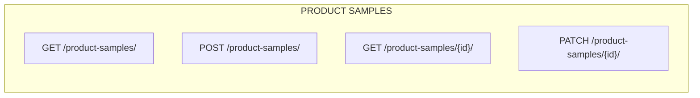

#### 5.5.1 List Product Samples

**Endpoint:** `GET /product-samples/`
**Permissions:** `product_samples.view` (Sampler, Analyst)

**Query Parameters:**
| Parameter | Type | Description |
|-----------|------|-------------|
| `search` | string | Search by `sample_id`, `product_name`, `batch_no` |
| `product_type` | string | `Finished Product`, `Semi-Finished Product`, `Bulk` |
| `testing_status` | string | `Not Tested`, `In Testing`, `Completed` |
| `ordering` | string | `-created_at`, `sample_id` |
| `limit` | integer | 1–100 (default 20) |
| `offset` | integer | Default 0 |

**Response (200 OK):**
```json
{
  "data": [
    {
      "id": "880e8400-e29b-41d4-a716-446655440004",
      "sample_id": "FP-2026-0001",
      "product_name": "Paracetamol 500mg Tablet",
      "product_type": "Finished Product",
      "batch_no": "BN-2026-001",
      "batch_size": "100000.00",
      "unit": "tablets",
      "mfg_date": "2026-01-01",
      "exp_date": "2027-01-01",
      "sample_size": "50.00",
      "time_of_sampling": "10:30:00",
      "sampling_date": "2026-01-15",
      "stages": ["Export to: USA", "Local Market"],
      "testing_status": "Not Tested",
      "created_at": "2026-01-15T13:00:00Z"
    }
  ],
  "meta": {
    "page": 1,
    "per_page": 20,
    "total": 15,
    "total_pages": 1
  },
  "errors": null
}
```

#### 5.5.2 Create Product Sample

**Endpoint:** `POST /product-samples/`
**Permissions:** `product_samples.create` (Sampler)

**Request:**
```json
{
  "product_name": "Paracetamol 500mg Tablet",
  "product_type": "Finished Product",
  "batch_no": "BN-2026-001",
  "batch_size": "100000.00",
  "unit": "tablets",
  "mfg_date": "2026-01-01",
  "exp_date": "2027-01-01",
  "sample_size": "50.00",
  "time_of_sampling": "10:30:00",
  "sampling_date": "2026-01-15",
  "stages": [
    "Export to: USA",
    "Local Market"
  ]
}
```

**Response (201 Created):**
```json
{
  "data": {
    "id": "880e8400-e29b-41d4-a716-446655440004",
    "sample_id": "FP-2026-0042",
    "product_name": "Paracetamol 500mg Tablet",
    "product_type": "Finished Product",
    "batch_no": "BN-2026-001",
    "testing_status": "Not Tested",
    "created_at": "2026-01-15T13:00:00Z"
  },
  "meta": {},
  "errors": null
}
```

---

### 5.6 COA

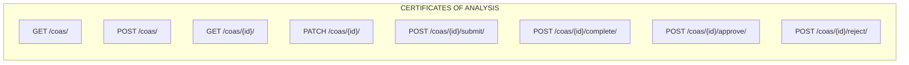

#### 5.6.1 List COAs

**Endpoint:** `GET /coas/`
**Permissions:** `coa.view` (Analyst, QC Manager)

**Query Parameters:**
| Parameter | Type | Description |
|-----------|------|-------------|
| `search` | string | Search by `id`, `sample_name`, `batch_no`, `receipt_id` |
| `status` | string | `Draft`, `In Progress`, `Completed`, `Approved`, `Rejected` |
| `analyst` | string | Filter by analyst name |
| `ordering` | string | `-created_at`, `-created_date` |
| `limit` | integer | 1–100 (default 20) |
| `offset` | integer | Default 0 |

**Response (200 OK):**
```json
{
  "data": [
    {
      "id": "COA-2026-0001",
      "receipt_id": "RCV-2026-0001",
      "sample_name": "Paracetamol",
      "batch_no": "BATCH-2024-001",
      "batch_size": "1000 kg",
      "analyst": "Jane Analyst",
      "status": "Completed",
      "created_date": "2026-01-15",
      "created_at": "2026-01-15T14:00:00Z"
    }
  ],
  "meta": {
    "page": 1,
    "per_page": 20,
    "total": 25,
    "total_pages": 2
  },
  "errors": null
}
```

#### 5.6.2 Create COA

**Endpoint:** `POST /coas/`
**Permissions:** `coa.create` (Analyst)

**Request:**
```json
{
  "sample_id": "770e8400-e29b-41d4-a716-446655440002",
  "sample_src": "rm",
  "specs_code": "SPC-2024-001",
  "reference": "BP 2025",
  "analyst": "Jane Analyst",
  "analysis_date": "2026-01-15",
  "remarks": "All specifications met."
}
```

**Response (201 Created):**
```json
{
  "data": {
    "id": "COA-2026-0042",
    "sample_id": "770e8400-e29b-41d4-a716-446655440002",
    "sample_name": "Paracetamol",
    "batch_no": "BATCH-2024-001",
    "batch_size": "1000 kg",
    "supplier": "PharmaChem Ltd",
    "manufacturer": "BASF SE",
    "specs_code": "SPC-2024-001",
    "reference": "BP 2025",
    "analyst": "Jane Analyst",
    "status": "Draft",
    "created_date": "2026-01-15",
    "created_at": "2026-01-15T14:00:00Z"
  },
  "meta": {},
  "errors": null
}
```

#### 5.6.3 Get COA Detail

**Endpoint:** `GET /coas/{id}/`
**Permissions:** `coa.view` (Analyst, QC Manager)

**Response (200 OK):**
```json
{
  "data": {
    "id": "COA-2026-0001",
    "sample_id": "770e8400-e29b-41d4-a716-446655440002",
    "sample_src": "rm",
    "receipt_id": "RCV-2026-0001",
    "sample_name": "Paracetamol",
    "batch_no": "BATCH-2024-001",
    "batch_size": "1000 kg",
    "supplier": "PharmaChem Ltd",
    "manufacturer": "BASF SE",
    "mfg_date": "15/01/2025",
    "exp_date": "15/01/2027",
    "received_date": "15/01/2026",
    "specs_code": "SPC-2024-001",
    "reference": "BP 2025",
    "analyst": "Jane Analyst",
    "analysis_date": "2026-01-15",
    "remarks": "All specifications met.",
    "status": "Completed",
    "created_date": "2026-01-15",
    "qc_comment": null,
    "created_at": "2026-01-15T14:00:00Z",
    "updated_at": "2026-01-15T14:30:00Z"
  },
  "meta": {},
  "errors": null
}
```

#### 5.6.4 Submit COA (Draft → In Progress)

**Endpoint:** `POST /coas/{id}/submit/`
**Permissions:** `coa.submit` (Analyst)

**Response (200 OK):**
```json
{
  "data": {
    "id": "COA-2026-0001",
    "status": "In Progress"
  },
  "meta": {},
  "errors": null
}
```

#### 5.6.5 Complete COA (In Progress → Completed)

**Endpoint:** `POST /coas/{id}/complete/`
**Permissions:** `coa.complete` (Analyst)

**Response (200 OK):**
```json
{
  "data": {
    "id": "COA-2026-0001",
    "status": "Completed"
  },
  "meta": {},
  "errors": null
}
```

#### 5.6.6 Approve COA

**Endpoint:** `POST /coas/{id}/approve/`
**Permissions:** `coa.approve` (QC Manager)

**Request:**
```json
{
  "comment": "All specifications verified. Approved."
}
```

**Response (200 OK):**
```json
{
  "data": {
    "id": "COA-2026-0001",
    "status": "Approved",
    "qc_comment": "All specifications verified. Approved."
  },
  "meta": {},
  "errors": null
}
```

**Error (422 - Not Completed):**
```json
{
  "data": null,
  "meta": {},
  "errors": [
    {
      "code": "UNPROCESSABLE_ENTITY",
      "message": "COA must be in 'Completed' status to approve.",
      "field": "status",
      "details": {
        "current_status": "Draft"
      }
    }
  ]
}
```

#### 5.6.7 Reject COA

**Endpoint:** `POST /coas/{id}/reject/`
**Permissions:** `coa.reject` (QC Manager)

**Request:**
```json
{
  "comment": "Failed specification test. Rejected."
}
```

**Response (200 OK):**
```json
{
  "data": {
    "id": "COA-2026-0001",
    "status": "Rejected",
    "qc_comment": "Failed specification test. Rejected."
  },
  "meta": {},
  "errors": null
}
```

---

### 5.7 Notifications

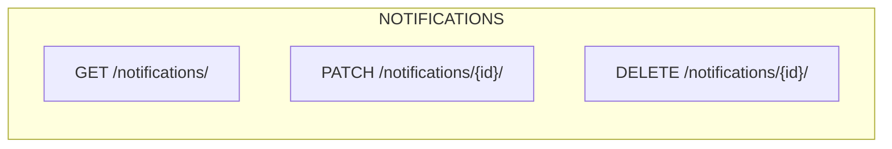

#### 5.7.1 List Notifications

**Endpoint:** `GET /notifications/`
**Permissions:** `notifications.view` (Storekeeper)

**Query Parameters:**
| Parameter | Type | Description |
|-----------|------|-------------|
| `read` | boolean | `true`, `false`, or omit for all |
| `ordering` | string | `-created_at` (default) |
| `limit` | integer | 1–100 (default 20) |
| `offset` | integer | Default 0 |

**Response (200 OK):**
```json
{
  "data": [
    {
      "id": "990e8400-e29b-41d4-a716-446655440005",
      "title": "Material Released: Paracetamol",
      "message": "Receipt ID: RCV-2026-0001 · QC No: QC-2026-0001 · Retest by: 15/01/2027",
      "read": false,
      "created_at": "2026-01-15T14:45:00Z"
    }
  ],
  "meta": {
    "page": 1,
    "per_page": 20,
    "total": 3,
    "total_pages": 1
  },
  "errors": null
}
```

#### 5.7.2 Mark Notification as Read

**Endpoint:** `PATCH /notifications/{id}/`
**Permissions:** `notifications.view` (Storekeeper)

**Request:**
```json
{
  "read": true
}
```

**Response (200 OK):**
```json
{
  "data": {
    "id": "990e8400-e29b-41d4-a716-446655440005",
    "read": true
  },
  "meta": {},
  "errors": null
}
```

#### 5.7.3 Delete Notification

**Endpoint:** `DELETE /notifications/{id}/`
**Permissions:** `notifications.view` (Storekeeper)

**Response (204 No Content)**

---

### 5.8 Employees (Admin)

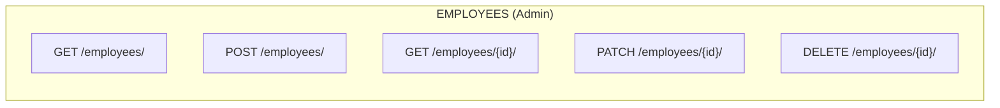

#### 5.8.1 List Employees

**Endpoint:** `GET /employees/`
**Permissions:** `employees.view` (Admin)

**Query Parameters:**
| Parameter | Type | Description |
|-----------|------|-------------|
| `search` | string | Search by `username`, `full_name`, `email` |
| `job_role` | string | `storekeeper`, `sampler`, `analyst`, `qcmanager` |
| `is_active` | boolean | `true`, `false` |
| `ordering` | string | `username`, `-created_at` |
| `limit` | integer | 1–100 (default 20) |
| `offset` | integer | Default 0 |

**Response (200 OK):**
```json
{
  "data": [
    {
      "id": "550e8400-e29b-41d4-a716-446655440000",
      "username": "storekeeper1",
      "full_name": "John Storekeeper",
      "email": "john@example.com",
      "job_role": "storekeeper",
      "is_active": true,
      "created_at": "2026-01-01T10:00:00Z"
    }
  ],
  "meta": {
    "page": 1,
    "per_page": 20,
    "total": 12,
    "total_pages": 1
  },
  "errors": null
}
```

#### 5.8.2 Create Employee

**Endpoint:** `POST /employees/`
**Permissions:** `employees.create` (Admin)

**Request:**
```json
{
  "username": "newuser",
  "password": "SecurePassword123!",
  "full_name": "New User",
  "email": "newuser@example.com",
  "job_role": "sampler"
}
```

**Response (201 Created):**
```json
{
  "data": {
    "id": "aa0e8400-e29b-41d4-a716-446655440006",
    "username": "newuser",
    "full_name": "New User",
    "email": "newuser@example.com",
    "job_role": "sampler",
    "is_active": true,
    "created_at": "2026-01-15T15:00:00Z"
  },
  "meta": {},
  "errors": null
}
```

#### 5.8.3 Update Employee

**Endpoint:** `PATCH /employees/{id}/`
**Permissions:** `employees.update` (Admin)

**Request:**
```json
{
  "full_name": "Updated Name",
  "job_role": "analyst",
  "is_active": false
}
```

**Response (200 OK):** Returns updated employee.

---

### 5.9 Audit Trail (Admin)

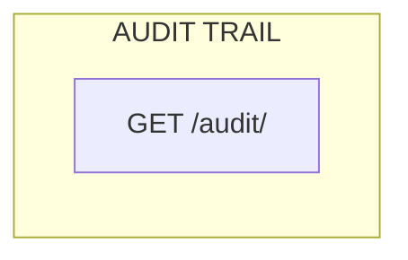

#### 5.9.1 List Audit Entries

**Endpoint:** `GET /audit/`
**Permissions:** `audit.view` (Admin)

**Query Parameters:**
| Parameter | Type | Description |
|-----------|------|-------------|
| `search` | string | Search by `username`, `entity_id`, `entity_type` |
| `user_id` | uuid | Filter by specific user |
| `action` | string | `CREATE`, `UPDATE`, `DELETE`, `LOGIN`, `LOGOUT` |
| `entity_type` | string | `material`, `packaging`, `sample`, `coa`, `employee` |
| `start_date` | date | ISO date (YYYY-MM-DD) |
| `end_date` | date | ISO date (YYYY-MM-DD) |
| `ordering` | string | `-timestamp` (default) |
| `limit` | integer | 1–100 (default 20) |
| `offset` | integer | Default 0 |

**Response (200 OK):**
```json
{
  "data": [
    {
      "id": "bb0e8400-e29b-41d4-a716-446655440007",
      "user_id": "550e8400-e29b-41d4-a716-446655440000",
      "username": "storekeeper1",
      "timestamp": "2026-01-15T10:30:00Z",
      "action": "CREATE",
      "entity_type": "material",
      "entity_id": "RCV-2026-0001",
      "old_value": null,
      "new_value": {
        "material_name": "Paracetamol",
        "supplier": "PharmaChem Ltd"
      },
      "field_name": null,
      "reason": null,
      "source_ip": "192.168.1.100"
    }
  ],
  "meta": {
    "page": 1,
    "per_page": 20,
    "total": 150,
    "total_pages": 8
  },
  "errors": null
}
```

---

## 6. Error Handling

### 6.1 Error Codes Reference

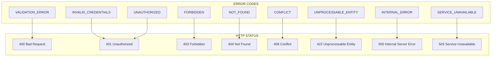

### 6.2 Error Response Structure

```json
{
  "data": null,
  "meta": {},
  "errors": [
    {
      "code": "VALIDATION_ERROR",
      "message": "Human-readable message",
      "field": "field_name",
      "details": {
        "reason": "Additional context"
      }
    }
  ]
}
```

### 6.3 Common Error Examples

**Validation Error (400):**
```json
{
  "data": null,
  "meta": {},
  "errors": [
    {
      "code": "VALIDATION_ERROR",
      "message": "Ensure expiry date is after today.",
      "field": "exp_date",
      "details": {
        "expected": "future date",
        "received": "2025-01-15"
      }
    }
  ]
}
```

**Unauthorised (401):**
```json
{
  "data": null,
  "meta": {},
  "errors": [
    {
      "code": "UNAUTHORIZED",
      "message": "Authentication credentials were not provided or are invalid.",
      "field": null,
      "details": {
        "token_expired": true
      }
    }
  ]
}
```

**Forbidden (403):**
```json
{
  "data": null,
  "meta": {},
  "errors": [
    {
      "code": "FORBIDDEN",
      "message": "You do not have permission to perform this action.",
      "field": null,
      "details": {
        "required_permission": "coa.approve",
        "user_role": "analyst"
      }
    }
  ]
}
```

**Not Found (404):**
```json
{
  "data": null,
  "meta": {},
  "errors": [
    {
      "code": "NOT_FOUND",
      "message": "Material with ID 'RCV-2026-9999' does not exist.",
      "field": null,
      "details": {
        "entity_type": "material",
        "entity_id": "RCV-2026-9999"
      }
    }
  ]
}
```

**Conflict (409):**
```json
{
  "data": null,
  "meta": {},
  "errors": [
    {
      "code": "CONFLICT",
      "message": "Sampling has already been requested for this material.",
      "field": null,
      "details": {
        "current_status": "Sampling Requested"
      }
    }
  ]
}
```

---

## 7. Appendices

### A. Full Endpoint Summary

| Method | Endpoint | Permissions | Description |
|--------|----------|-------------|-------------|
| POST | `/auth/login/` | Public | Authenticate user |
| POST | `/auth/logout/` | Authenticated | Logout |
| POST | `/auth/refresh/` | Authenticated | Refresh access token |
| GET | `/auth/me/` | Authenticated | Get current user |
| GET | `/materials/` | materials.view | List materials |
| POST | `/materials/` | materials.create | Create material |
| GET | `/materials/{id}/` | materials.view | Get material detail |
| PATCH | `/materials/{id}/` | materials.update | Update material |
| POST | `/materials/{id}/request-sampling/` | materials.request_sampling | Request sampling |
| GET | `/materials/{id}/label/` | materials.view | Get release label |
| GET | `/packaging/` | packaging.view | List packaging |
| POST | `/packaging/` | packaging.create | Create packaging |
| GET | `/packaging/{id}/` | packaging.view | Get packaging detail |
| POST | `/packaging/{id}/request-sampling/` | packaging.request_sampling | Request sampling |
| GET | `/samples/` | samples.view | List combined samples |
| GET | `/samples/requests/` | samples.view | Get sampling requests |
| POST | `/samples/` | samples.create | Create sample |
| GET | `/samples/history/` | samples.view | Get sample history |
| GET | `/samples/{id}/` | samples.view | Get sample detail |
| GET | `/samples/{id}/label/` | samples.view | Get sample labels |
| POST | `/samples/{id}/start-testing/` | samples.start_testing | Start testing |
| GET | `/product-samples/` | product_samples.view | List product samples |
| POST | `/product-samples/` | product_samples.create | Create product sample |
| GET | `/product-samples/{id}/` | product_samples.view | Get product sample detail |
| GET | `/coas/` | coa.view | List COAs |
| POST | `/coas/` | coa.create | Create COA |
| GET | `/coas/{id}/` | coa.view | Get COA detail |
| PATCH | `/coas/{id}/` | coa.update | Update COA |
| POST | `/coas/{id}/submit/` | coa.submit | Submit COA (Draft → In Progress) |
| POST | `/coas/{id}/complete/` | coa.complete | Complete COA (In Progress → Completed) |
| POST | `/coas/{id}/approve/` | coa.approve | Approve COA |
| POST | `/coas/{id}/reject/` | coa.reject | Reject COA |
| GET | `/notifications/` | notifications.view | List notifications |
| PATCH | `/notifications/{id}/` | notifications.view | Mark notification as read |
| DELETE | `/notifications/{id}/` | notifications.view | Delete notification |
| GET | `/employees/` | employees.view | List employees |
| POST | `/employees/` | employees.create | Create employee |
| GET | `/employees/{id}/` | employees.view | Get employee detail |
| PATCH | `/employees/{id}/` | employees.update | Update employee |
| DELETE | `/employees/{id}/` | employees.delete | Deactivate employee |
| GET | `/audit/` | audit.view | List audit entries |

### B. Response Status Codes Summary

| Code | Description | Typical Use |
|------|-------------|-------------|
| 200 OK | Success | GET, PATCH, POST (non-creation) |
| 201 Created | Resource created | POST (create) |
| 204 No Content | Success, no body | DELETE |
| 400 Bad Request | Validation error | Invalid input |
| 401 Unauthorised | Not authenticated | Missing/invalid token |
| 403 Forbidden | Not authorised | Insufficient permissions |
| 404 Not Found | Resource missing | Invalid ID |
| 409 Conflict | State conflict | Duplicate, invalid state |
| 422 Unprocessable Entity | Business rule violation | Invalid workflow transition |
| 500 Internal Server Error | Server error | Unexpected exception |

### C. Rate Limiting (Future)

| Parameter | Value |
|-----------|-------|
| Default Limit | 100 requests per minute per IP |
| Authenticated Limit | 500 requests per minute per user |
| Burst Limit | 200 requests per 5 minutes |
| Headers | `X-RateLimit-Limit`, `X-RateLimit-Remaining`, `X-RateLimit-Reset` |

---

**Document Approval**

| Role | Name | Date |
|------|------|------|
| Author | [Name] | [Date] |
| Reviewer (Backend) | [Name] | [Date] |
| Reviewer (Frontend) | [Name] | [Date] |
| Approver | [Name] | [Date] |

---

**Change History**

| Version | Date | Author | Description |
|---------|------|--------|-------------|
| 1.0 | [Date] | [Author] | Initial baseline API specification |
