# 12 — Security Specification

**Document Identifier:** RM-RRS-SEC-001
**Version:** 1.0
**Status:** Baseline
**Traces to:** Project Charter, SRS, NFR, SAS, Design Specification, API Specification
**Compliance Reference:** 21 CFR Part 11, EU GMP Annex 11, NIST SP 800-53, OWASP Top 10, ISO 27001

---

## Table of Contents

1. [Introduction](#1-introduction)
2. [Security Architecture Overview](#2-security-architecture-overview)
3. [Authentication](#3-authentication)
4. [Authorisation and Access Control](#4-authorisation-and-access-control)
5. [Data Protection](#5-data-protection)
6. [Audit and Logging](#6-audit-and-logging)
7. [Electronic Signatures](#7-electronic-signatures)
8. [Secure Development](#8-secure-development)
9. [Environment Security](#9-environment-security)
10. [Incident Response](#10-incident-response)
11. [Compliance Mapping](#11-compliance-mapping)
12. [Appendices](#12-appendices)

---

## 1. Introduction

### 1.1 Purpose
This document defines the security requirements, controls, and implementation approach for the **Raw Material Receiving & Release System (RM-RRS)** . It establishes the security framework necessary to protect the system, its data, and its users while meeting regulatory requirements including 21 CFR Part 11 and EU GMP Annex 11. This specification covers authentication, authorisation, data protection, auditing, electronic signatures, and operational security.

### 1.2 Scope
This security specification applies to all components of the RM-RRS:
- **Access Control Layer**: Authentication, authorisation, audit, e-signature
- **Four Business Applications**: Storekeeper, Sampler, Analyst, QC Manager
- **Administrator Console**: Employee and role management
- **Infrastructure**: Containers, database, cache, networking
- **Development and Operations**: SDLC, deployment, monitoring, incident response

### 1.3 References

| Document | Reference |
|----------|-----------|
| 00_Project_Charter.md | Charter |
| 06_SRS.md | Software Requirements Specification |
| 07_NFR.md | Non-Functional Requirements |
| 08_SAS.md | Software Architecture Specification |
| 09_Design.md | Design Specification |
| 11_API.md | API Specification |
| 21 CFR Part 11 | Electronic Records; Electronic Signatures |
| EU GMP Annex 11 | Computerised Systems |
| NIST SP 800-53 | Security and Privacy Controls |
| OWASP Top 10 | Web Application Security Risks |
| ISO 27001 | Information Security Management |

---

## 2. Security Architecture Overview

### 2.1 Security Principles

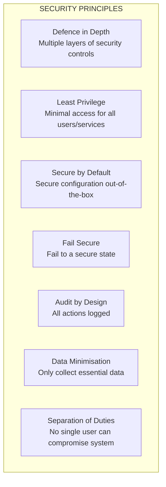

### 2.2 Security Architecture Diagram

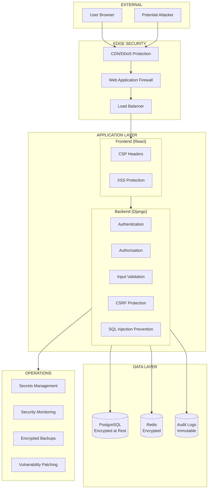

### 2.3 Threat Model

| Threat | Description | Mitigation |
|--------|-------------|------------|
| **T1 - Unauthorised Access** | Attacker gains access to user accounts | MFA, strong passwords, account lockout |
| **T2 - Data Breach** | Sensitive data exposed | Encryption at rest and in transit |
| **T3 - Session Hijacking** | Session tokens stolen | HTTP-only, Secure, SameSite cookies |
| **T4 - SQL Injection** | Malicious database queries | Django ORM, parameterised queries |
| **T5 - XSS** | Client-side script injection | React auto-escaping, CSP headers |
| **T6 - CSRF** | Cross-site request forgery | CSRF tokens, SameSite cookies |
| **T7 - Privilege Escalation** | User gains higher permissions | RBAC, permission checks at API |
| **T8 - Data Tampering** | Audit logs modified | Immutable logs, append-only |
| **T9 - Denial of Service** | System availability affected | Rate limiting, DDoS protection |
| **T10 - Insider Threat** | Malicious/negligent employee | Audit trails, separation of duties |

---

## 3. Authentication

### 3.1 Authentication Requirements

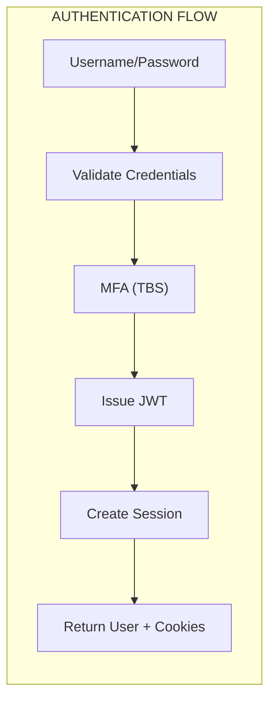

| Requirement | ID | Status |
|-------------|-----|--------|
| Username and password authentication | SEC-AUTH-001 | Confirmed |
| Password hashing (bcrypt) | SEC-AUTH-002 | Confirmed |
| Session timeout (30 minutes) | SEC-AUTH-003 | Confirmed |
| Account lockout after failed attempts | SEC-AUTH-004 | TBS |
| Multi-factor authentication | SEC-AUTH-005 | TBS |
| Secure password reset mechanism | SEC-AUTH-006 | TBS |
| Password complexity requirements | SEC-AUTH-007 | TBS |

### 3.2 Password Policy

| Requirement | Value | Status |
|-------------|-------|--------|
| Minimum length | 12 characters | TBS |
| Character classes | Mixed case, numbers, special | TBS |
| Password expiry | 90 days | TBS |
| Password history | Last 5 passwords cannot be reused | TBS |
| Password hashing algorithm | bcrypt (cost factor ≥ 12) | Confirmed |
| Storage | Django `User` model with `set_password()` | Confirmed |

### 3.3 Token Management

| Attribute | Value |
|-----------|-------|
| Token Type | JWT (JSON Web Tokens) |
| Access Token Lifetime | 15 minutes |
| Refresh Token Lifetime | 7 days |
| Storage | HTTP-only cookies |
| Cookie Flags | `Secure`, `HttpOnly`, `SameSite=Strict` |
| Signature Algorithm | RS256 (or HS256 with strong secret) |

### 3.4 Session Management

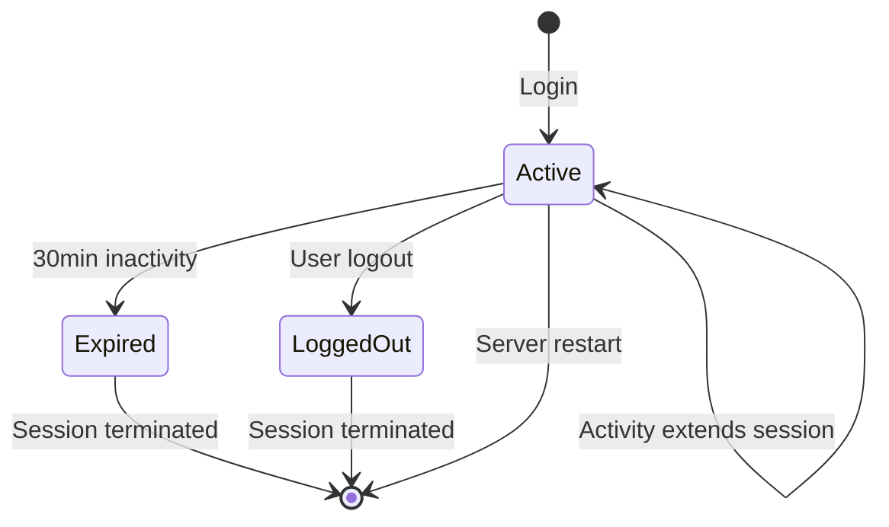

**Session Validation:**
1. Token signature verified on each request
2. Token expiration checked
3. User account status verified (is_active = true)
4. Token blacklist check (for logout/revoked tokens)

---

## 4. Authorisation and Access Control

### 4.1 Role-Based Access Control (RBAC)

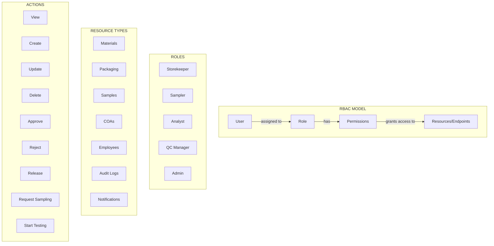

### 4.2 Permission Matrix

| Permission | SK | SM | AN | QC | Admin |
|------------|:--:|:--:|:--:|:--:|:-----:|
| `auth.login` | ✅ | ✅ | ✅ | ✅ | ✅ |
| `auth.logout` | ✅ | ✅ | ✅ | ✅ | ✅ |
| `materials.view` | ✅ | — | — | — | — |
| `materials.create` | ✅ | — | — | — | — |
| `materials.update` | ✅ | — | — | — | — |
| `materials.request_sampling` | ✅ | — | — | — | — |
| `materials.release` | — | — | — | ✅ | — |
| `packaging.view` | ✅ | — | — | — | — |
| `packaging.create` | ✅ | — | — | — | — |
| `packaging.request_sampling` | ✅ | — | — | — | — |
| `samples.view` | — | ✅ | ✅ | — | — |
| `samples.create` | — | ✅ | — | — | — |
| `samples.start_testing` | — | — | ✅ | — | — |
| `product_samples.view` | — | ✅ | ✅ | — | — |
| `product_samples.create` | — | ✅ | — | — | — |
| `coa.view` | — | — | ✅ | ✅ | — |
| `coa.create` | — | — | ✅ | — | — |
| `coa.update` | — | — | ✅ | — | — |
| `coa.submit` | — | — | ✅ | — | — |
| `coa.complete` | — | — | ✅ | — | — |
| `coa.approve` | — | — | — | ✅ | — |
| `coa.reject` | — | — | — | ✅ | — |
| `notifications.view` | ✅ | — | — | — | — |
| `employees.*` | — | — | — | — | ✅ |
| `audit.*` | — | — | — | — | ✅ |

### 4.3 Permission Enforcement

**API-Level Enforcement:**
```python
# Django REST Framework permission class
from rest_framework.permissions import BasePermission

class HasPermission(BasePermission):
    def __init__(self, permission_code):
        self.permission_code = permission_code

    def has_permission(self, request, view):
        return request.user.has_perm(self.permission_code)

# Usage on view
class MaterialViewSet(ModelViewSet):
    permission_classes = [HasPermission('materials.view')]
```

**UI-Level Enforcement:**
```javascript
// React hook for permission checking
const usePermission = (permission) => {
  const { user } = useAuth();
  return user?.permissions?.includes(permission) || false;
};

// Usage in component
const canCreate = usePermission('materials.create');
{canCreate && <Button onClick={openForm}>Register Material</Button>}
```

---

## 5. Data Protection

### 5.1 Data Classification

| Classification | Examples | Controls |
|----------------|----------|----------|
| **Critical** | Audit logs, e-signatures, COAs | Encryption at rest, immutable, access restricted |
| **Sensitive** | Employee data, QC decisions | Access control, audit logging |
| **Business** | Materials, Samples, Packaging | Access control, audit logging |
| **Public** | System status, documentation | No controls required |

### 5.2 Data Encryption

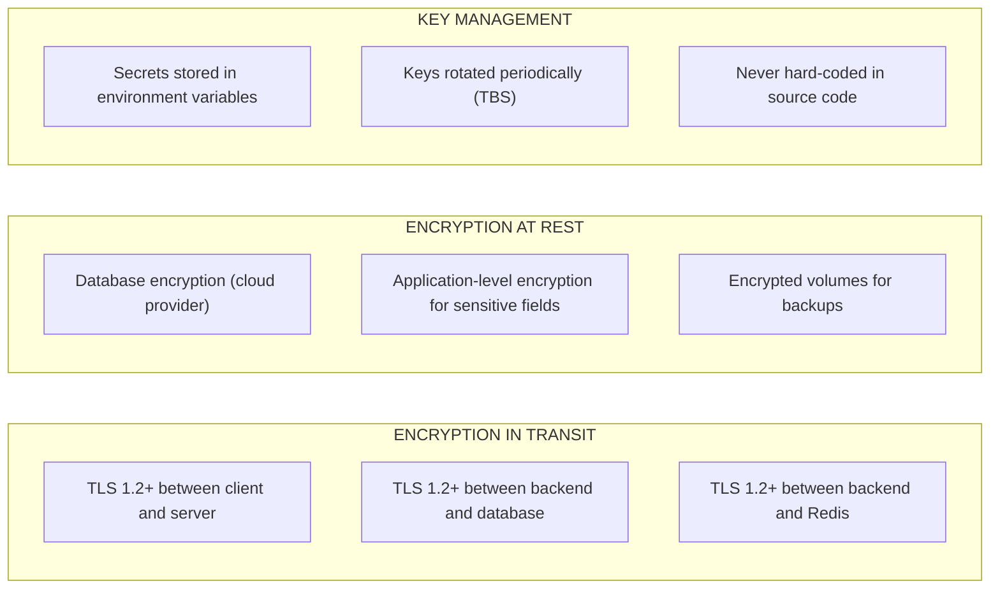

| Requirement | Value | Status |
|-------------|-------|--------|
| Transport encryption | TLS 1.2+ | Confirmed |
| Database encryption | Cloud provider KMS | TBS |
| Backup encryption | AES-256 | TBS |
| Secrets management | Environment variables + Vault | TBS |
| Key rotation | 90 days (TBS) | TBS |

### 5.3 Data Sanitisation and Masking

| Data Type | Sanitisation/Masking | Environment |
|-----------|---------------------|-------------|
| Passwords | Never logged, always hashed | All |
| Employee names | Full name displayed; masked in logs | Production |
| Email addresses | Full display; redacted in logs | Production |
| IP addresses | Logged for audit; retained per policy | Production |
| Audit old_values | Full JSON stored; access restricted | All |

### 5.4 Data Retention and Disposal

| Data Type | Retention Period | Disposal Method |
|-----------|------------------|-----------------|
| Business records (Materials, Samples, COAs) | 7 years after expiry/release | Archival then secure delete |
| Audit logs | 10 years | Archival then secure delete |
| Employee data | Until account deactivation + 7 years | Anonymisation |
| Notifications | 90 days | Automatic purge |

---

## 6. Audit and Logging

### 6.1 Audit Requirements

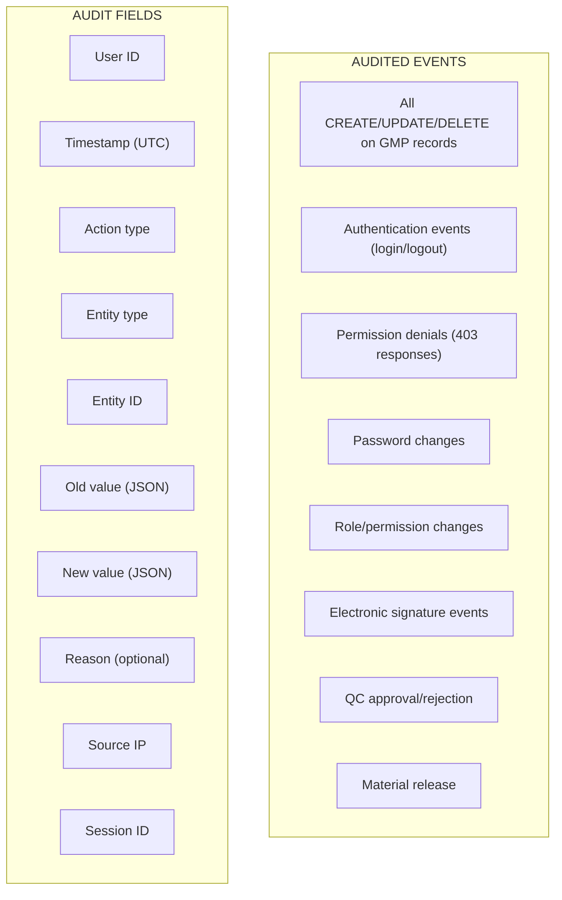

### 6.2 Audit Log Implementation

**Audit Log Schema:**

| Column | Type | Description |
|--------|------|-------------|
| `id` | UUID | Primary key |
| `user_id` | UUID (FK) | Employee who performed action |
| `username` | VARCHAR(50) | Denormalised username (snapshot) |
| `timestamp` | TIMESTAMPTZ | Action timestamp (UTC) |
| `action` | VARCHAR(20) | CREATE, UPDATE, DELETE, LOGIN, LOGOUT |
| `entity_type` | VARCHAR(20) | Table/entity name |
| `entity_id` | VARCHAR(20) | Business identifier |
| `old_value` | JSONB | Previous state (for UPDATE) |
| `new_value` | JSONB | New state (for CREATE/UPDATE) |
| `field_name` | VARCHAR(50) | For partial updates |
| `reason` | TEXT | Optional reason for change |
| `source_ip` | INET | Client IP address |
| `session_id` | VARCHAR(50) | Session/tracking ID |
| `created_at` | TIMESTAMPTZ | Insertion timestamp |

**Audit Implementation Flow:**

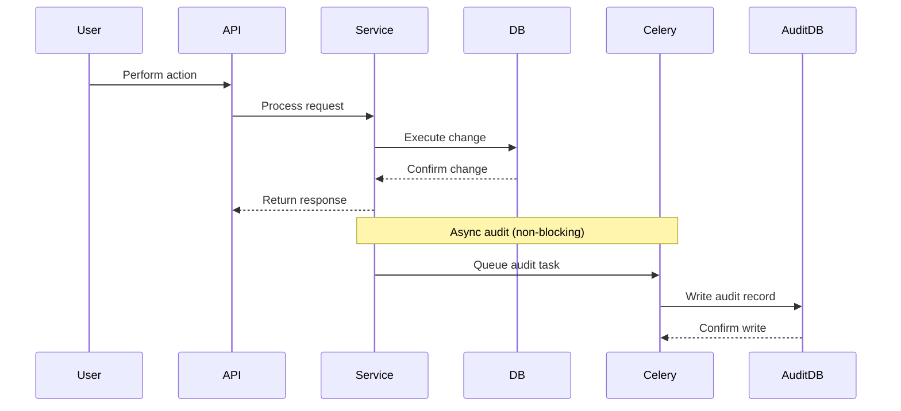

### 6.3 Security Logging

| Log Type | Content | Retention |
|----------|---------|-----------|
| **Application logs** | Request/response metadata, errors | 30 days |
| **Security logs** | Authentication failures, permission denials, security events | 90 days |
| **Audit logs** | All GMP-relevant changes | 10 years |
| **Access logs** | All API requests (Nginx) | 30 days |
| **Infrastructure logs** | System events, container logs | 30 days |

### 6.4 Log Integrity

- Audit logs are **append-only** — no updates or deletes
- All logs are written to **immutable storage**
- **Log tampering detection**: Cryptographic hashing (TBS)
- **Time synchronisation**: NTP across all servers

---

## 7. Electronic Signatures

### 7.1 Regulatory Requirements

| Requirement | 21 CFR Part 11 | Annex 11 | Status |
|-------------|----------------|----------|--------|
| Signature meaning | Clear indication of meaning | Yes | Confirmed |
| Timestamp | Date and time recorded | Yes | Confirmed |
| Signer identification | Unique user ID | Yes | Confirmed |
| Integrity | Cryptographic binding to record | Yes | Confirmed |
| Audit trail | Signed record linked to audit trail | Yes | Confirmed |
| Revocation | Signature can be revoked if needed | Yes | TBS |

### 7.2 Electronic Signature Implementation

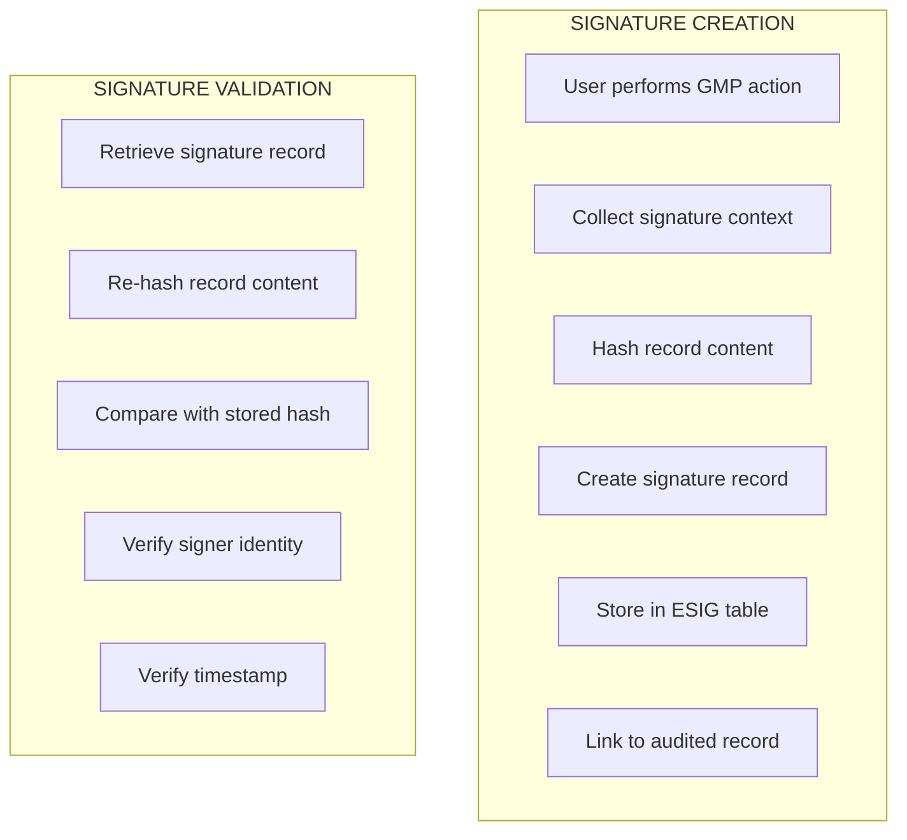

**Signature Record Schema:**

| Column | Type | Description |
|--------|------|-------------|
| `id` | UUID | Primary key |
| `user_id` | UUID (FK) | Signer's ID |
| `username` | VARCHAR(50) | Snapshot of username |
| `timestamp` | TIMESTAMPTZ | Signature time (UTC) |
| `meaning` | VARCHAR(100) | e.g., "Approve COA", "Release Material" |
| `record_type` | VARCHAR(20) | e.g., "coa", "material" |
| `record_id` | VARCHAR(20) | Business ID of signed record |
| `record_hash` | VARCHAR(100) | SHA-256 of record content |
| `signature_hash` | VARCHAR(100) | SHA-256 of signature data |
| `reason` | TEXT | Optional reason |
| `status` | VARCHAR(20) | "executed", "revoked" |
| `source_ip` | INET | Client IP |
| `created_at` | TIMESTAMPTZ | Insertion timestamp |

**Signature Meaning Values:**

| Action | Meaning |
|--------|---------|
| QC approves COA | "Approve COA" |
| QC rejects COA | "Reject COA" |
| QC releases material | "Release Material" |

### 7.3 Signature Verification

```python
def verify_signature(signature_id, record_content):
    signature = ElectronicSignature.objects.get(id=signature_id)
    current_hash = sha256(record_content.encode()).hexdigest()
    
    # Verify record hasn't changed
    if current_hash != signature.record_hash:
        return False, "Record has been modified since signing"
    
    # Verify signature integrity
    signature_data = f"{signature.user_id}{signature.timestamp}{signature.meaning}{signature.record_id}"
    expected_hash = sha256(signature_data.encode()).hexdigest()
    
    if expected_hash != signature.signature_hash:
        return False, "Signature data has been modified"
    
    return True, "Signature verified"
```

---

## 8. Secure Development

### 8.1 Secure Development Lifecycle (SDL)

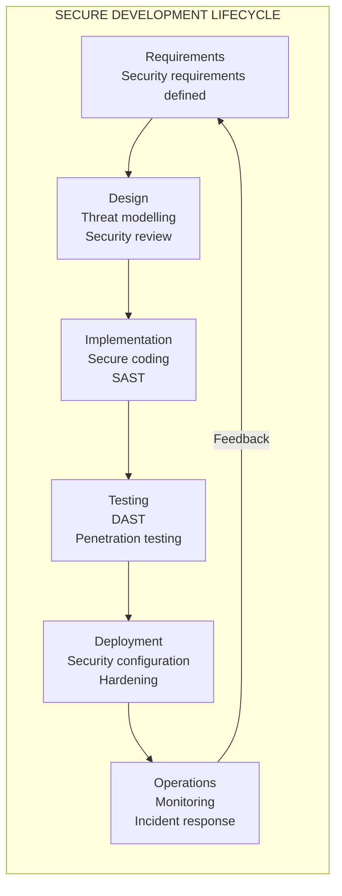

### 8.2 Secure Coding Practices

| Practice | Implementation | Status |
|----------|----------------|--------|
| **Input Validation** | DRF serialisers, Zod (frontend) | Confirmed |
| **Output Encoding** | React auto-escaping, Django templates | Confirmed |
| **SQL Injection Prevention** | Django ORM, parameterised queries | Confirmed |
| **XSS Prevention** | React auto-escaping, CSP headers | Confirmed |
| **CSRF Protection** | DRF CSRF token, SameSite cookies | Confirmed |
| **Authentication** | JWT + HTTP-only cookies | Confirmed |
| **Authorisation** | DRF permission classes | Confirmed |
| **Session Management** | Redis session store | Confirmed |
| **Secrets Management** | Environment variables | Confirmed |

### 8.3 Security Testing

| Test Type | Frequency | Tools |
|-----------|-----------|-------|
| **SAST (Static Analysis)** | Every commit | SonarQube, Bandit |
| **DAST (Dynamic Analysis)** | Weekly | OWASP ZAP |
| **Dependency Scanning** | Every commit | Snyk, Dependabot |
| **Container Scanning** | Every build | Trivy, Clair |
| **Penetration Testing** | Quarterly | External firm |
| **Security Code Review** | Every feature | Peer review with security focus |

### 8.4 Vulnerability Management

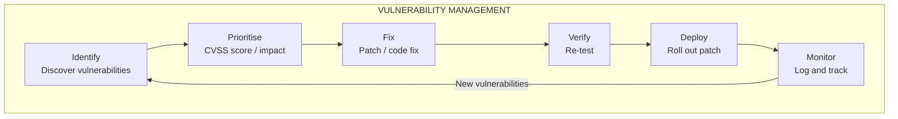

---

## 9. Environment Security

### 9.1 Infrastructure Security

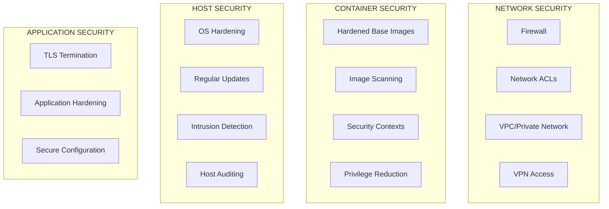

### 9.2 Container Security

| Control | Implementation | Status |
|---------|----------------|--------|
| Base images | Alpine Linux (minimal, hardened) | Confirmed |
| Image scanning | Trivy, Grype | TBS |
| Non-root user | Run containers as non-root | Confirmed |
| Read-only filesystem | Where possible | TBS |
| Resource limits | CPU/memory limits set | TBS |
| Secrets | Environment variables, not built in | Confirmed |

### 9.3 Database Security

| Control | Implementation | Status |
|---------|----------------|--------|
| Network isolation | Private subnet, no public access | Confirmed |
| Authentication | Strong passwords, SSL | Confirmed |
| Encryption | At rest (cloud KMS) | TBS |
| Backup encryption | Encrypted backups | TBS |
| Access control | Least privilege DB users | Confirmed |
| Audit logging | PostgreSQL audit logs | TBS |

### 9.4 Secrets Management

| Secret Type | Storage | Access |
|-------------|---------|--------|
| Database credentials | Environment variables | Backend only |
| JWT secrets | Environment variables | Backend only |
| API keys | Environment variables | Backend only |
| Third-party credentials | Environment variables / Vault | Backend only |
| TLS certificates | Volume mounts, Nginx | Nginx only |

---

## 10. Incident Response

### 10.1 Incident Response Plan

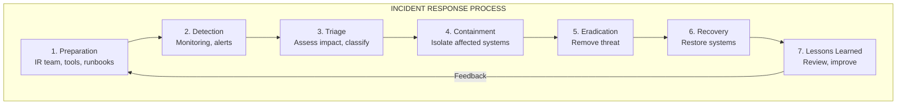

### 10.2 Incident Classification

| Level | Description | Response Time | Escalation |
|-------|-------------|---------------|------------|
| **P1 - Critical** | System compromise, data breach | Immediate (15 min) | Security team, management |
| **P2 - High** | Unauthorised access, denial of service | 1 hour | Security team |
| **P3 - Medium** | Suspicious activity, policy violation | 4 hours | Security team |
| **P4 - Low** | Minor security event | 24 hours | Logged for review |

### 10.3 Security Monitoring

```mermaid
flowchart LR
    subgraph Sources["MONITORING SOURCES"]
        S1["Application Logs"]
        S2["Nginx Access Logs"]
        S3["Database Logs"]
        S4["Container Logs"]
        S5["Security Tools"]
    end

    subgraph Aggregation["AGGREGATION"]
        A1["ELK / Datadog"]
        A2["SIEM"]
    end

    subgraph Alerts["ALERTS"]
        Al1["Login Failures >5/hour"]
        Al2["Permission Denials Spike"]
        Al3["Unusual Access Patterns"]
        Al4["System Downtime"]
        Al5["Intrusion Attempts"]
    end

    Sources --> Aggregation
    Aggregation --> Alerts
    Alerts --> Response["Security Response Team"]
```

### 10.4 Security Contact Points

| Role | Responsibility |
|------|----------------|
| **Security Lead** | Overall security responsibility |
| **System Administrator** | Infrastructure security |
| **Application Administrator** | Application-level security |
| **Incident Responder** | Incident handling |
| **Compliance Officer** | Regulatory compliance |

---

## 11. Compliance Mapping

### 11.1 21 CFR Part 11 Compliance

| Part 11 Requirement | RM-RRS Implementation | Status |
|---------------------|----------------------|--------|
| **§11.10(a)** Validation | IQ/OQ/PQ documentation | TBS |
| **§11.10(b)** Record integrity | Audit logs, immutable records | Confirmed |
| **§11.10(c)** Record protection | TLS, encryption, access control | Confirmed |
| **§11.10(d)** User identification | Unique user accounts | Confirmed |
| **§11.10(e)** Electronic signatures | ESIG table with hashing | Confirmed |
| **§11.10(f)** Authority checks | RBAC, permission enforcement | Confirmed |
| **§11.10(g)** Audit trail | AuditLog table | Confirmed |
| **§11.10(h)** Authority checks | API-level permission checks | Confirmed |
| **§11.10(i)** Record retention | 7-year retention policy | Confirmed |
| **§11.10(j)** Data backup | Daily backups, WAL archiving | TBS |
| **§11.50(a)** Signature content | Meaning, timestamp, signer | Confirmed |
| **§11.50(b)** Signature integrity | Cryptographic hashing | Confirmed |
| **§11.70** Linking to records | Record_hash in ESIG | Confirmed |

### 11.2 EU GMP Annex 11 Compliance

| Annex 11 Requirement | RM-RRS Implementation | Status |
|----------------------|----------------------|--------|
| **4.1 - Validation** | IQ/OQ/PQ documentation | TBS |
| **4.2 - Risk Assessment** | Security risk assessment | TBS |
| **5 - Data Integrity** | Audit trails, e-signatures | Confirmed |
| **6 - Record Retention** | 7+ years retention | Confirmed |
| **7 - Audit Trail** | AuditLog table | Confirmed |
| **8 - Change Control** | Migration policy, change log | TBS |
| **9 - Security** | RBAC, authentication | Confirmed |
| **10 - Incident Management** | Incident response plan | TBS |
| **11 - Business Continuity** | DR plan (RTO/RPO) | TBS |
| **12 - Suppliers** | — | TBS |
| **13 - Periodic Review** | Security assessments | TBS |
| **14 - Access Control** | Role-based access | Confirmed |
| **15 - Electronic Signature** | ESIG table | Confirmed |
| **16 - Data Storage** | Encryption, backups | TBS |

### 11.3 OWASP Top 10 Compliance

| OWASP Category | Mitigation | Status |
|----------------|------------|--------|
| **A01 - Broken Access Control** | RBAC, API permission checks | Confirmed |
| **A02 - Cryptographic Failures** | TLS 1.2+, encryption at rest | Confirmed |
| **A03 - Injection** | Django ORM, input validation | Confirmed |
| **A04 - Insecure Design** | Security by design, threat modelling | TBS |
| **A05 - Security Misconfiguration** | Hardened containers, secure defaults | TBS |
| **A06 - Vulnerable Components** | Dependency scanning | TBS |
| **A07 - Identification Failures** | JWT, session management | Confirmed |
| **A08 - Data Integrity Failures** | Audit logs, e-signatures | Confirmed |
| **A09 - Logging Failures** | Audit logs, structured logging | Confirmed |
| **A10 - SSRF** | Not applicable (no external requests) | N/A |

---

## 12. Appendices

### A. Security Requirements Traceability

| Requirement ID | Source | Status |
|----------------|--------|--------|
| SEC-AUTH-001 | Charter §6, SRS FR-ACL-001 | Confirmed |
| SEC-AUTH-002 | NFR-SEC-002 | Confirmed |
| SEC-AUTH-003 | NFR-SEC-003, SRS FR-ACL-007 | Confirmed |
| SEC-AUTH-004 | NFR-SEC-004 | TBS |
| SEC-AUTH-005 | NFR-SEC-005 | TBS |
| SEC-AUTH-006 | NFR-SEC-006 | TBS |
| SEC-AUTH-007 | NFR-SEC-007 | TBS |
| SEC-DATA-001 | NFR-SEC-001 | Confirmed |
| SEC-DATA-002 | NFR-SEC-008 | Confirmed |
| SEC-AUDIT-001 | BR7, SRS FR-ACL-005 | Confirmed |
| SEC-ESIG-001 | BR8, SRS FR-ACL-006 | Confirmed |

### B. Security Checklist

| Check | Status | Notes |
|-------|--------|-------|
| TLS 1.2+ enforced | ✅ | In production configuration |
| Password hashing (bcrypt) | ✅ | Django default |
| JWT in HTTP-only cookies | ✅ | Confirmed |
| CSRF protection | ✅ | DRF + SameSite cookies |
| Input validation | ✅ | DRF serialisers + Zod |
| SQL injection protection | ✅ | Django ORM |
| XSS protection | ✅ | React + CSP |
| RBAC implemented | ✅ | Permission matrix |
| Audit logging | ✅ | AuditLog table |
| E-signatures | ✅ | ESIG table |
| Container hardening | ⚠️ | TBS |
| DAST scanning | ⚠️ | TBS |
| Penetration testing | ⚠️ | TBS |
| Incident response plan | ⚠️ | TBS |
| Backup encryption | ⚠️ | TBS |

### C. Security Tools

| Category | Tool | Status |
|----------|------|--------|
| SAST | Bandit, SonarQube | TBS |
| DAST | OWASP ZAP | TBS |
| Dependency scanning | Snyk, Dependabot | TBS |
| Container scanning | Trivy, Grype | TBS |
| Secrets scanning | git-secrets, TruffleHog | TBS |
| Monitoring | Prometheus, ELK, Datadog | TBS |
| WAF | Cloudflare, ModSecurity | TBS |
| SIEM | ELK, Datadog | TBS |

### D. Security Decision Log

| ID | Date | Decision | Rationale | Status |
|----|------|----------|-----------|--------|
| SEC-001 | 2026-01-15 | JWT with HTTP-only cookies | Prevents XSS token theft | Confirmed |
| SEC-002 | 2026-01-15 | bcrypt for password hashing | Django default, proven algorithm | Confirmed |
| SEC-003 | 2026-01-15 | 15-min access token, 7-day refresh | Balance security and usability | Confirmed |
| SEC-004 | 2026-01-15 | HTTP-only, Secure, SameSite cookies | Protection against XSS/CSRF | Confirmed |
| SEC-005 | 2026-01-15 | Audit logs in PostgreSQL (append-only) | Immutable, queryable, ACID | Confirmed |
| SEC-006 | 2026-01-15 | SHA-256 for e-signature hashing | NIST-approved, collision-resistant | Confirmed |

---

**Document Approval**

| Role | Name | Date |
|------|------|------|
| Author | [Name] | [Date] |
| Reviewer (Security) | [Name] | [Date] |
| Reviewer (Compliance) | [Name] | [Date] |
| Approver | [Name] | [Date] |

---

**Change History**

| Version | Date | Author | Description |
|---------|------|--------|-------------|
| 1.0 | [Date] | [Author] | Initial baseline security specification |
