# 13 — Compliance Specification

**Document Identifier:** RM-RRS-COMP-001
**Version:** 1.0
**Status:** Baseline
**Traces to:** Project Charter, SRS, NFR, SAS, Design Specification, Security Specification
**Compliance Reference:** 21 CFR Part 11, EU GMP Annex 11, ALCOA+, ISO 27001, GDPR, ISO/IEC 17025

---

## Table of Contents

1. [Introduction](#1-introduction)
2. [Regulatory Landscape](#2-regulatory-landscape)
3. [21 CFR Part 11 Compliance](#3-21-cfr-part-11-compliance)
4. [EU GMP Annex 11 Compliance](#4-eu-gmp-annex-11-compliance)
5. [ALCOA+ Data Integrity](#5-alcoa-data-integrity)
6. [Data Protection and Privacy](#6-data-protection-and-privacy)
7. [GMP Validation Framework](#7-gmp-validation-framework)
8. [Quality Management System Integration](#8-quality-management-system-integration)
9. [Risk Assessment](#9-risk-assessment)
10. [Compliance Checklist](#10-compliance-checklist)
11. [Appendices](#11-appendices)

---

## 1. Introduction

### 1.1 Purpose
This document defines the compliance framework for the **Raw Material Receiving & Release System (RM-RRS)** . It establishes how the system meets applicable regulatory requirements for electronic records, electronic signatures, data integrity, and quality management in a GMP-regulated pharmaceutical environment. This specification serves as the authoritative reference for validation activities, regulatory inspections, and quality assurance audits.

### 1.2 Scope
This compliance specification covers:
- **21 CFR Part 11**: Electronic Records; Electronic Signatures
- **EU GMP Annex 11**: Computerised Systems
- **ALCOA+**: Data Integrity Principles
- **GDPR/Data Protection**: Personal data handling
- **GMP Validation**: IQ/OQ/PQ framework
- **Quality Management**: Change control, deviation management, periodic review

### 1.3 References

| Document | Reference |
|----------|-----------|
| 00_Project_Charter.md | Charter |
| 06_SRS.md | Software Requirements Specification |
| 07_NFR.md | Non-Functional Requirements |
| 08_SAS.md | Software Architecture Specification |
| 09_Design.md | Design Specification |
| 10_Database.md | Database Specification |
| 11_API.md | API Specification |
| 12_Security.md | Security Specification |
| 21 CFR Part 11 | Electronic Records; Electronic Signatures |
| EU GMP Annex 11 | Computerised Systems |
| FDA Guidance for Industry: Part 11, Electronic Records; Electronic Signatures — Scope and Application |
| WHO GMP: Data Integrity | Data Integrity Guidance |
| PIC/S PI 041-1 | Good Practices for Data Management and Integrity in Regulated GMP/GDP Environments |

---

## 2. Regulatory Landscape

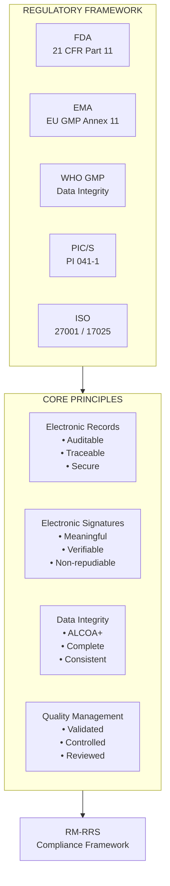

### 2.1 Applicable Regulations

| Regulation | Jurisdiction | Applicability | Status |
|------------|--------------|---------------|--------|
| **21 CFR Part 11** | USA (FDA) | Electronic records and signatures | Full compliance target |
| **EU GMP Annex 11** | EU (EMA) | Computerised systems in GMP | Full compliance target |
| **ALCOA+** | Global (WHO/PIC/S) | Data integrity principles | Full adherence target |
| **GDPR** | EU | Personal data protection | Partial (employee data) |
| **ISO 27001** | International | Information security framework | Informative reference |
| **ISO/IEC 17025** | International | Testing and calibration | COA generation reference |

### 2.2 Regulatory Risk Classification

| System Component | GMP Impact | Regulatory Risk Level |
|------------------|------------|----------------------|
| Material Registration | High | Critical |
| Sampling Process | High | Critical |
| COA Creation | High | Critical |
| QC Release | High | Critical |
| Audit Trail | High | Critical |
| Electronic Signatures | High | Critical |
| Employee Management | Medium | High |
| Notifications | Low | Low |
| Label Printing | Medium | Medium |

---

## 3. 21 CFR Part 11 Compliance

### 3.1 Part 11 Overview

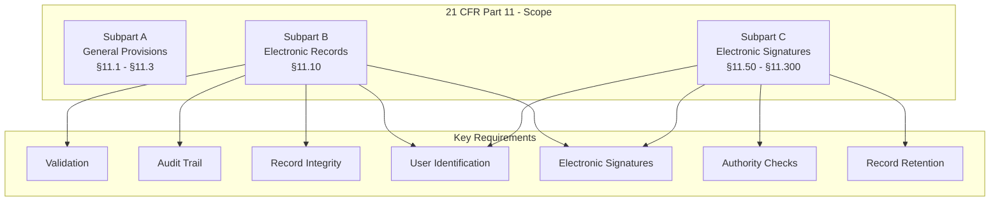

### 3.2 Part 11 Requirements Mapping

| Requirement | Section | RM-RRS Implementation | Status |
|-------------|---------|----------------------|--------|
| **Validation** | §11.10(a) | IQ/OQ/PQ documentation; validation plan | TBS |
| **Record Integrity** | §11.10(b) | Audit logs; immutable records; checksums | Confirmed |
| **Record Protection** | §11.10(c) | TLS; encryption; access control | Confirmed |
| **User Identification** | §11.10(d) | Unique employee accounts; authentication | Confirmed |
| **Electronic Signatures** | §11.10(e) | ESIG table; cryptographic hashing | Confirmed |
| **Authority Checks** | §11.10(f) | RBAC; API permission checks | Confirmed |
| **Audit Trail** | §11.10(g) | AuditLog table; complete history | Confirmed |
| **Authority Checks** | §11.10(h) | Signed record approval flow | Confirmed |
| **Record Retention** | §11.10(i) | 7-year retention policy | Confirmed |
| **Data Backup** | §11.10(j) | Daily backups; WAL archiving | TBS |
| **Signature Content** | §11.50(a) | Meaning, timestamp, signer, hash | Confirmed |
| **Signature Integrity** | §11.50(b) | Cryptographic binding | Confirmed |
| **Linking to Records** | §11.70 | Record_hash in ESIG table | Confirmed |

### 3.3 Part 11 Compliance Evidence

| Evidence Artifact | Description | Status |
|-------------------|-------------|--------|
| **Validation Plan** | IQ/OQ/PQ approach and acceptance criteria | TBS |
| **Audit Trail Review** | Complete audit trail testing | TBS |
| **Signature Verification** | E-signature integrity testing | TBS |
| **Access Control Test** | RBAC enforcement testing | TBS |
| **Record Retention Test** | Data retention verification | TBS |
| **Backup/Restore Test** | Backup integrity and recovery | TBS |

---

## 4. EU GMP Annex 11 Compliance

### 4.1 Annex 11 Overview

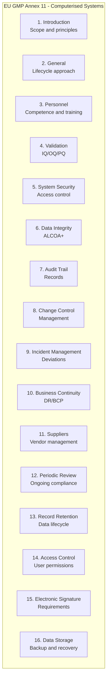

### 4.2 Annex 11 Requirements Mapping

| Requirement | Section | RM-RRS Implementation | Status |
|-------------|---------|----------------------|--------|
| **Validation** | 4.1 | IQ/OQ/PQ documentation | TBS |
| **Risk Assessment** | 4.2 | Security risk assessment; GMP risk assessment | TBS |
| **Data Integrity** | 6 | ALCOA+ principles; audit trails | Confirmed |
| **Record Retention** | 6 | 7+ years retention | Confirmed |
| **Audit Trail** | 7 | AuditLog table | Confirmed |
| **Change Control** | 8 | Migration policy; change log | TBS |
| **Security** | 9 | RBAC; authentication; encryption | Confirmed |
| **Incident Management** | 9 | Incident response plan | TBS |
| **Business Continuity** | 10 | DR plan (RTO/RPO) | TBS |
| **Periodic Review** | 12 | Security assessments; compliance reviews | TBS |
| **Access Control** | 14 | Role-based access; permissions matrix | Confirmed |
| **Electronic Signature** | 15 | ESIG table | Confirmed |
| **Data Storage** | 16 | Encryption; backups; archival | TBS |

### 4.3 Annex 11 Data Integrity Requirements

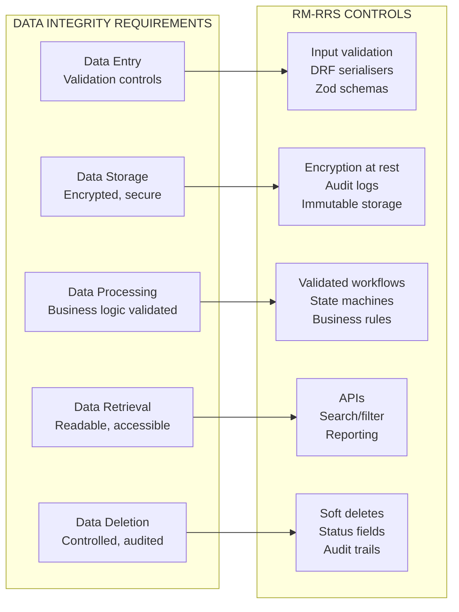

---

## 5. ALCOA+ Data Integrity

### 5.1 ALCOA+ Principles

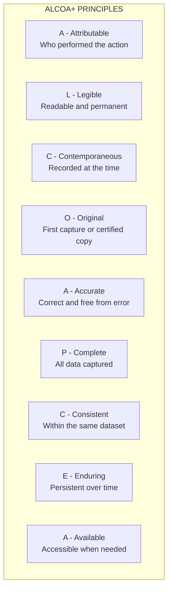

### 5.2 ALCOA+ Implementation

| Principle | RM-RRS Implementation | Evidence |
|-----------|----------------------|----------|
| **Attributable** | User authentication; audit logging; `created_by`, `updated_by` | AuditLog table, model fields |
| **Legible** | UI design; formatted dates; clear labels | Print labels, UI standards |
| **Contemporaneous** | `created_at`, `updated_at` timestamps; default `NOW()` | All tables with timestamps |
| **Original** | First capture stored; no overwrites (status changes only) | Immutable audit logs |
| **Accurate** | Input validation; check constraints; business rules | Zod, DRF serialisers, constraints |
| **Complete** | All required fields; comprehensive audit trail | Full audit records |
| **Consistent** | Standardised formats; controlled vocabularies | Dropdowns, enumerations |
| **Enduring** | Long-term storage; backup strategy | 7+ year retention |
| **Available** | APIs; search/filter; reporting | Queryable data |

### 5.3 ALCOA+ Verification

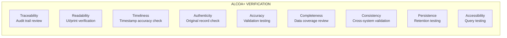

---

## 6. Data Protection and Privacy

### 6.1 Personal Data Inventory

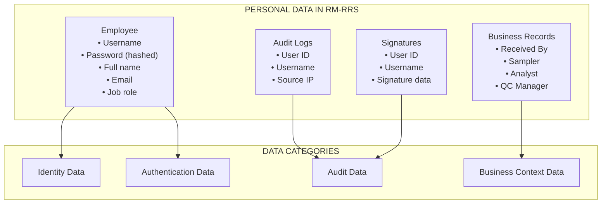

### 6.2 GDPR Compliance

| GDPR Requirement | RM-RRS Implementation | Status |
|------------------|----------------------|--------|
| **Lawful Basis** | Employment/performance of contract | TBS |
| **Data Minimisation** | Only essential personal data collected | Confirmed |
| **Purpose Limitation** | Data used only for system operation | Confirmed |
| **Storage Limitation** | 7-year retention policy | Confirmed |
| **Security** | Encryption, access control, audit trails | Confirmed |
| **Data Subject Rights** | Access, rectification, deletion (TBS) | TBS |
| **Data Protection Impact Assessment** | DPIA required | TBS |
| **Data Breach Notification** | Incident response plan includes breach | TBS |

### 6.3 Data Subject Rights Implementation

| Right | Implementation | Status |
|-------|----------------|--------|
| **Access** | Employee can view their own data | TBS |
| **Rectification** | Admin can update employee data | Confirmed |
| **Erasure** | Soft deactivation (not hard delete) | TBS |
| **Restriction** | Controlled by access control | TBS |
| **Portability** | Data export functionality | TBS |
| **Objection** | Not applicable (employment context) | N/A |

---

## 7. GMP Validation Framework

### 7.1 Validation Lifecycle

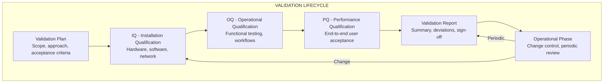

### 7.2 Validation Deliverables

| Deliverable | Description | Status |
|-------------|-------------|--------|
| **Validation Plan (VP)** | Scope, approach, resources, timeline | TBS |
| **Requirements Traceability Matrix (RTM)** | Requirements → Test cases | TBS |
| **Installation Qualification (IQ)** | Hardware, software, network verification | TBS |
| **Operational Qualification (OQ)** | Functional testing, boundary testing | TBS |
| **Performance Qualification (PQ)** | End-to-end user acceptance testing | TBS |
| **Validation Report (VR)** | Summary, deviations, conclusions | TBS |
| **Risk Assessment** | GMP risk analysis | TBS |
| **Change Control Log** | All changes tracked | TBS |
| **Training Records** | User training documentation | TBS |

### 7.3 IQ/OQ/PQ Approach

```mermaid
flowchart LR
    subgraph IQ["INSTALLATION QUALIFICATION"]
        IQ1["Hardware verification"]
        IQ2["Software installation"]
        IQ3["Network configuration"]
        IQ4["Database setup"]
        IQ5["Security configuration"]
    end

    subgraph OQ["OPERATIONAL QUALIFICATION"]
        OQ1["Login/authentication"]
        OQ2["CRUD operations"]
        OQ3["Workflow steps"]
        OQ4["Audit logging"]
        OQ5["E-signature"]
        OQ6["Error handling"]
        OQ7["Performance"]
    end

    subgraph PQ["PERFORMANCE QUALIFICATION"]
        PQ1["End-to-end workflows"]
        PQ2["Multi-user concurrency"]
        PQ3["Data integrity"]
        PQ4["Backup/recovery"]
        PQ5["Security testing"]
        PQ6["User acceptance"]
    end

    IQ --> OQ --> PQ
```

### 7.4 Test Categories

| Test Category | Covered By | Count (Estimated) |
|---------------|------------|-------------------|
| **Unit Tests** | Backend business logic | 150+ |
| **Integration Tests** | API endpoints, workflows | 50+ |
| **UI Tests** | Frontend components | 100+ |
| **Security Tests** | SAST, DAST, penetration | 20+ |
| **IQ/OQ Tests** | Installation, operational | 80+ |
| **PQ Tests** | End-to-end, UAT | 30+ |
| **Performance Tests** | Load, stress | 10+ |

---

## 8. Quality Management System Integration

### 8.1 Change Control

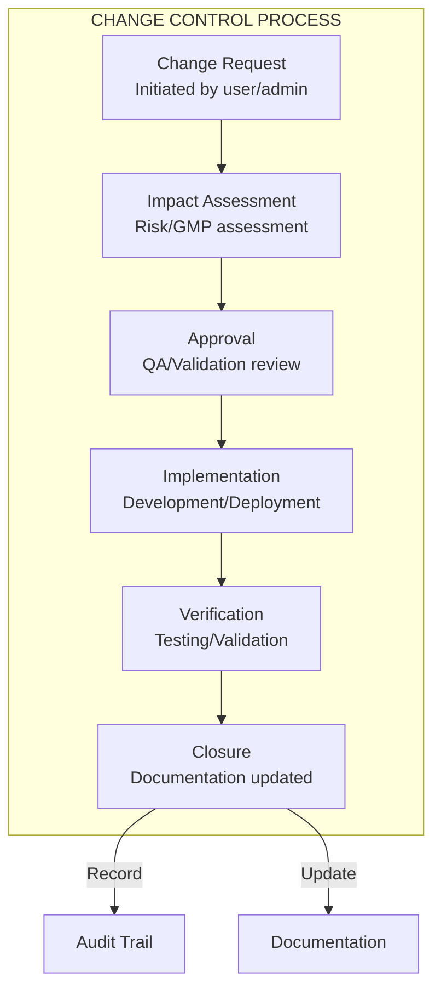

### 8.2 Deviation Management

| Deviation Type | Examples | Action |
|----------------|----------|--------|
| **Minor** | UI glitch, minor data issue | Correct and document |
| **Major** | Workflow error, data integrity issue | CAPA required |
| **Critical** | Data loss, security breach | Immediate response, CAPA, notification |

### 8.3 Periodic Review

| Review Area | Frequency | Responsible |
|-------------|-----------|-------------|
| **Security Compliance** | Quarterly | Security Officer |
| **System Performance** | Monthly | System Administrator |
| **User Access Review** | Quarterly | Quality Assurance |
| **Validation Status** | Annual | Quality Assurance |
| **Documentation Review** | Annual | Document Controller |

### 8.4 Training and Competence

| Training Type | Audience | Frequency |
|---------------|----------|-----------|
| **System Introduction** | All users | Initial only |
| **Role-Specific Training** | Per job role | Initial only |
| **SOP Training** | All users | Annual |
| **Refresher Training** | All users | Annual or as needed |
| **Change Training** | Affected users | On change deployment |

---

## 9. Risk Assessment

### 9.1 GMP Risk Matrix

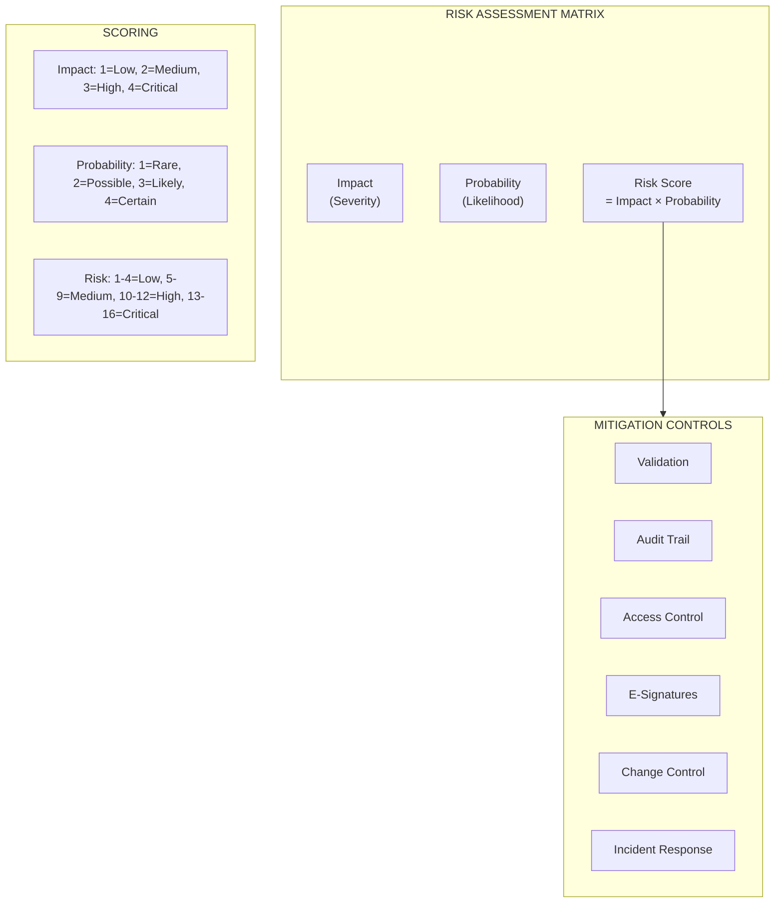

### 9.2 GMP Risk Assessment

| Risk Area | Scenario | Impact | Probability | Score | Mitigation |
|-----------|----------|--------|-------------|-------|------------|
| **Data Loss** | Database failure | 4 | 2 | 8 | Daily backups, WAL archiving |
| **Data Integrity** | Unauthorised modification | 4 | 2 | 8 | Audit logs, access control |
| **Security Breach** | Unauthorised access | 4 | 2 | 8 | Authentication, encryption |
| **System Downtime** | Application failure | 3 | 2 | 6 | Redundancy, monitoring |
| **Human Error** | User enters wrong data | 3 | 3 | 9 | Validation, approvals |
| **Regulatory Non-compliance** | Missing audit trail | 4 | 1 | 4 | Audit by design |

### 9.3 Security Risk Assessment

| Risk Area | Scenario | Impact | Probability | Score | Mitigation |
|-----------|----------|--------|-------------|-------|------------|
| **Authentication Bypass** | Weak credentials | 4 | 2 | 8 | Strong passwords, MFA |
| **Data Breach** | Data exposure | 4 | 2 | 8 | Encryption, access control |
| **Session Hijacking** | Token theft | 4 | 2 | 8 | HTTP-only cookies, TLS |
| **Privilege Escalation** | User gains higher access | 4 | 2 | 8 | RBAC, API permissions |
| **Denial of Service** | System unavailable | 3 | 2 | 6 | Rate limiting, WAF |
| **Injection Attack** | SQL/XSS injection | 4 | 2 | 8 | Input validation, ORM |

---

## 10. Compliance Checklist

### 10.1 21 CFR Part 11 Checklist

| Check | Description | Status |
|-------|-------------|--------|
| ☐ | Validation Plan documented | TBS |
| ☐ | IQ/OQ/PQ completed | TBS |
| ☐ | Audit Trail implemented and verified | ✅ |
| ☐ | Electronic Signature implemented and verified | ✅ |
| ☐ | User Access Control implemented | ✅ |
| ☐ | Authority Checks implemented | ✅ |
| ☐ | Record Retention policy defined | ✅ |
| ☐ | Backup and Recovery tested | TBS |
| ☐ | Password policy defined | TBS |
| ☐ | Security controls implemented | ✅ |
| ☐ | Change Control process defined | TBS |
| ☐ | Incident Response plan defined | TBS |

### 10.2 EU GMP Annex 11 Checklist

| Check | Description | Status |
|-------|-------------|--------|
| ☐ | Validation Plan documented | TBS |
| ☐ | Risk Assessment completed | TBS |
| ☐ | Data Integrity controls implemented | ✅ |
| ☐ | Audit Trail implemented | ✅ |
| ☐ | Access Control implemented | ✅ |
| ☐ | Electronic Signature implemented | ✅ |
| ☐ | Business Continuity defined | TBS |
| ☐ | Change Control process defined | TBS |
| ☐ | Incident Management defined | TBS |
| ☐ | Periodic Review defined | TBS |
| ☐ | Training records maintained | TBS |

### 10.3 ALCOA+ Checklist

| Check | Description | Status |
|-------|-------------|--------|
| ☐ | Attributable: All actions have user identity | ✅ |
| ☐ | Legible: Data is readable and permanent | ✅ |
| ☐ | Contemporaneous: Timestamps on all data | ✅ |
| ☐ | Original: First capture is retained | ✅ |
| ☐ | Accurate: Validation and checks | ✅ |
| ☐ | Complete: All data is captured | ✅ |
| ☐ | Consistent: Standardised formats | ✅ |
| ☐ | Enduring: Long-term storage | ✅ |
| ☐ | Available: Data is accessible | ✅ |

### 10.4 Data Protection Checklist

| Check | Description | Status |
|-------|-------------|--------|
| ☐ | Data Protection Impact Assessment | TBS |
| ☐ | Data Processing Agreement (if applicable) | TBS |
| ☐ | Data Subject Rights process | TBS |
| ☐ | Data Breach Response plan | TBS |
| ☐ | Data Retention policy implemented | ✅ |
| ☐ | Data Security controls implemented | ✅ |

---

## 11. Appendices

### A. Compliance Traceability Matrix

| Regulatory Requirement | RM-RRS Feature | Design Doc | Test Case |
|------------------------|----------------|------------|-----------|
| §11.10(a) Validation | Validation Plan | SAS §9 | TBS |
| §11.10(b) Record Integrity | AuditLog table | DB §4.8 | TBS |
| §11.10(c) Record Protection | TLS, Encryption | SEC §5 | TBS |
| §11.10(d) User Identification | Employee model, Auth | DB §4.1, SEC §3 | TBS |
| §11.10(e) Electronic Signatures | ESIG table | DB §4.9, SEC §7 | TBS |
| §11.10(f) Authority Checks | RBAC | SEC §4 | TBS |
| §11.10(g) Audit Trail | AuditLog table | DB §4.8, SEC §6 | TBS |
| §11.50(a) Signature Content | ESIG fields | DB §4.9 | TBS |
| §11.50(b) Signature Integrity | Hash fields | DB §4.9 | TBS |
| §11.70 Linking to Records | record_hash | DB §4.9 | TBS |
| Annex 11 - Validation | Validation Plan | SAS §9 | TBS |
| Annex 11 - Data Integrity | ALCOA+ | COMP §5 | TBS |
| Annex 11 - Audit Trail | AuditLog table | DB §4.8 | TBS |
| Annex 11 - Access Control | RBAC, Auth | SEC §4 | TBS |
| Annex 11 - E-Signature | ESIG table | DB §4.9 | TBS |

### B. Documentation Requirements

| Document | Responsible | Frequency |
|----------|-------------|-----------|
| **SOPs** | Quality Assurance | As needed |
| **Validation Plan** | Validation Lead | Per project |
| **Change Control Log** | System Admin | Continuous |
| **Incident Log** | System Admin | Continuous |
| **User Access Review** | Quality Assurance | Quarterly |
| **Backup Verification** | System Admin | Monthly |
| **Disaster Recovery Test** | System Admin | Quarterly |
| **Periodic Review Report** | Quality Assurance | Annual |

### C. Common Inspection Questions

| Question | RM-RRS Answer |
|----------|---------------|
| **How is data integrity ensured?** | ALCOA+ through audit trails, validation, and controls |
| **How are electronic signatures implemented?** | Structured ESIG table with cryptographic hashing |
| **How is access controlled?** | RBAC with role-based permissions at UI/API |
| **How are audit trails reviewed?** | Admin console with search/filter capabilities |
| **How is the system validated?** | IQ/OQ/PQ with documented evidence |
| **How is change controlled?** | Change control process with QA approval |
| **How is backup and recovery handled?** | Daily backups, WAL archiving, RTO/RPO defined |
| **How is user training managed?** | Role-based training with records maintained |
| **How are deviations managed?** | Incident response plan with CAPA |

### D. Key Compliance Dates

| Milestone | Date | Responsible |
|-----------|------|-------------|
| Validation Plan Complete | TBS | Validation Lead |
| IQ Complete | TBS | Validation Lead |
| OQ Complete | TBS | Validation Lead |
| PQ Complete | TBS | Validation Lead |
| Validation Report Complete | TBS | Validation Lead |
| First Periodic Review | TBS | Quality Assurance |
| Annual Compliance Review | TBS | Quality Assurance |

---

**Document Approval**

| Role | Name | Date |
|------|------|------|
| Author | [Name] | [Date] |
| Reviewer (Quality Assurance) | [Name] | [Date] |
| Reviewer (Compliance) | [Name] | [Date] |
| Approver | [Name] | [Date] |

---

**Change History**

| Version | Date | Author | Description |
|---------|------|--------|-------------|
| 1.0 | [Date] | [Author] | Initial baseline compliance specification |
