# 16 — Test Design and Development (TDD)

**Document Identifier:** RM-RRS-TDD-001
**Version:** 1.0
**Status:** Baseline
**Traces to:** Project Charter, SRS, NFR, SAS, Design Specification, Database Specification, API Specification, Security Specification, Compliance Specification
**Compliance Reference:** IEEE Std 829-2008 (Software and System Test Documentation), ISO/IEC/IEEE 29119, GAMP 5, FDA General Principles of Software Validation

---

## Table of Contents

1. [Introduction](#1-introduction)
2. [Test Strategy](#2-test-strategy)
3. [Test Levels](#3-test-levels)
4. [Test Environment](#4-test-environment)
5. [Test Data](#5-test-data)
6. [Test Execution](#6-test-execution)
7. [Test Automation](#7-test-automation)
8. [Defect Management](#8-defect-management)
9. [Test Reporting](#9-test-reporting)
10. [Test Schedule](#10-test-schedule)
11. [Test Cases](#11-test-cases)
12. [Appendices](#12-appendices)

---

## 1. Introduction

### 1.1 Purpose
This document defines the **Test Design and Development (TDD)** strategy for the **Raw Material Receiving & Release System (RM-RRS)** . It establishes the comprehensive testing approach required to validate that the system meets all functional, non-functional, security, and compliance requirements. This document serves as the authoritative reference for all testing activities, including unit testing, integration testing, system testing, user acceptance testing, and GMP validation testing.

### 1.2 Scope
This TDD covers testing of all RM-RRS components:
- **Access Control Layer**: Authentication, authorisation, audit trail, e-signature
- **Four Business Applications**: Storekeeper, Sampler, Analyst, QC Manager
- **Administrator Console**: Employee and role management
- **Backend Services**: All REST APIs and business logic
- **Frontend Applications**: All React components and user interfaces
- **Database**: Data integrity, performance, migration
- **Infrastructure**: Deployment, security, performance

### 1.3 Test Objectives

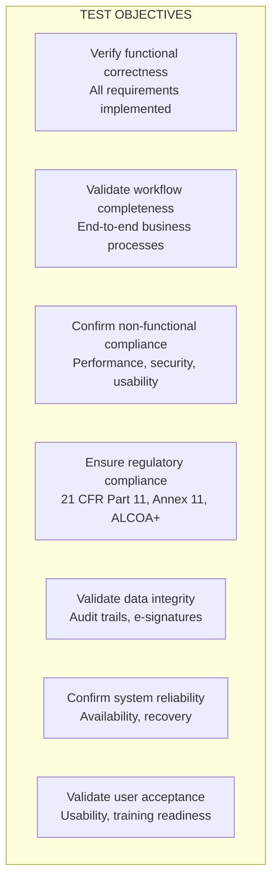

### 1.4 References

| Document | Reference |
|----------|-----------|
| 00_Project_Charter.md | Charter |
| 06_SRS.md | Software Requirements Specification |
| 07_NFR.md | Non-Functional Requirements |
| 08_SAS.md | Software Architecture Specification |
| 09_Design.md | Design Specification |
| 10_Database.md | Database Specification |
| 11_API.md | API Specification |
| 12_Security.md | Security Specification |
| 13_Compliance.md | Compliance Specification |
| IEEE Std 829-2008 | Software and System Test Documentation |
| ISO/IEC/IEEE 29119 | Software Testing |
| GAMP 5 | Good Automated Manufacturing Practice |
| FDA General Principles of Software Validation | Software Validation Guidance |

---

## 2. Test Strategy

### 2.1 Testing Pyramid

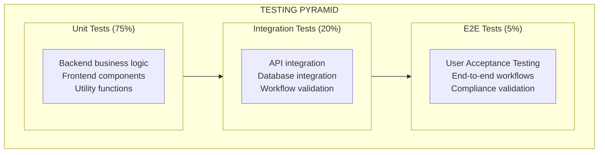

### 2.2 Test Strategy Components

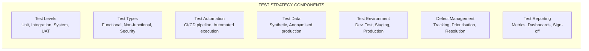

### 2.3 Testing Principles

| Principle | Description | Application |
|-----------|-------------|-------------|
| **Traceability** | Each test traces to a requirement | RTM maintained |
| **Automation First** | Automate where practical | Unit, integration, UI |
| **Risk-Based Testing** | Focus on critical areas | GMP-impacting features |
| **Continuous Testing** | Test early, test often | CI/CD pipeline |
| **Independent Testing** | Testers separate from developers | QA team involvement |
| **Defect Prevention** | Find issues early | Shift-left approach |

### 2.4 Requirements Traceability Matrix (RTM)

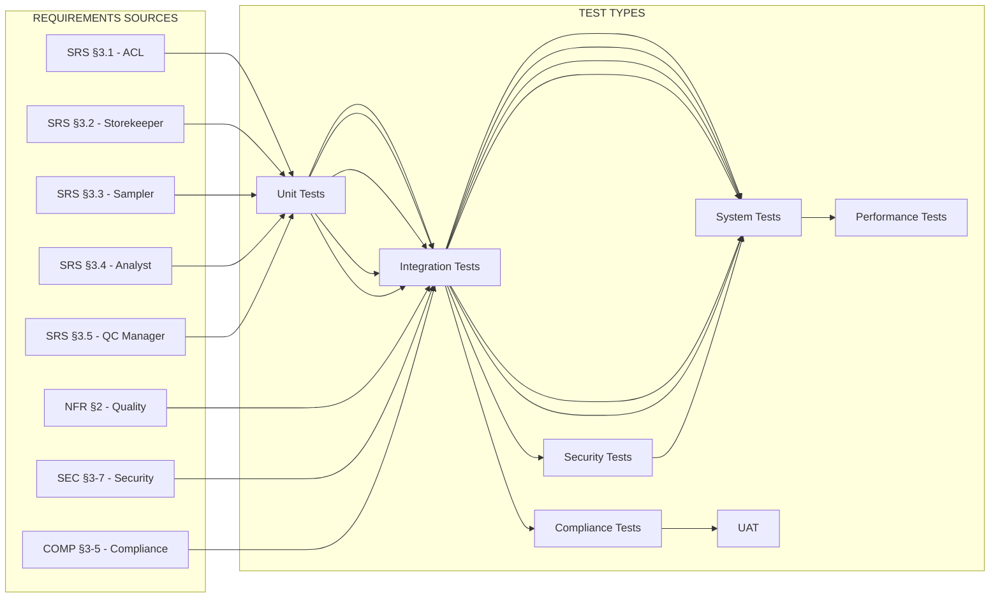

---

## 3. Test Levels

### 3.1 Unit Testing

| Attribute | Specification |
|-----------|---------------|
| **Scope** | Individual components, functions, classes |
| **Approach** | Automated with pytest (backend), Jest (frontend) |
| **Coverage Target** | ≥ 80% code coverage |
| **Responsible** | Developers (TDD approach) |
| **Tools** | pytest, pytest-cov, Jest, React Testing Library |
| **When** | During development, in CI pipeline |

**Unit Test Focus Areas:**
- Model methods and properties
- Service layer business logic
- Validation functions (Zod, DRF serialisers)
- Utility functions
- Frontend component rendering and interactions

### 3.2 Integration Testing

| Attribute | Specification |
|-----------|---------------|
| **Scope** | Component interactions, APIs, database |
| **Approach** | Automated with pytest-django, API testing |
| **Coverage Target** | All critical workflows |
| **Responsible** | Developers + QA |
| **Tools** | pytest-django, DRF test client, Postman/Newman |
| **When** | During development, in CI pipeline |

**Integration Test Focus Areas:**
- API endpoint correctness
- Database operations and integrity
- Authentication and authorisation flows
- Workflow transitions (material → sampling → COA → release)
- Audit trail creation
- Electronic signature recording

### 3.3 System Testing

| Attribute | Specification |
|-----------|---------------|
| **Scope** | End-to-end system behaviour |
| **Approach** | Manual + Automated (Cypress) |
| **Responsible** | QA Team |
| **Tools** | Cypress, Selenium, manual testing |
| **When** | Before release, in staging environment |

**System Test Focus Areas:**
- End-to-end business workflows
- UI navigation and interaction
- Error handling and edge cases
- System-wide consistency
- Search, filter, pagination functionality
- Label printing

### 3.4 Performance Testing

| Attribute | Specification |
|-----------|---------------|
| **Scope** | System performance under load |
| **Approach** | Automated with k6 |
| **Metrics** | Response time, throughput, resource utilisation |
| **Responsible** | QA + DevOps |
| **Tools** | k6, JMeter, Locust |
| **When** | Before release |

**Performance Test Scenarios:**

| Scenario | Users | Duration | Key Metrics |
|----------|-------|----------|-------------|
| **Normal Load** | 10 concurrent | 1 hour | Response time < 500ms |
| **Peak Load** | 50 concurrent | 30 minutes | Response time < 1s |
| **Stress** | 100 concurrent | 15 minutes | System stable |
| **Endurance** | 20 concurrent | 4 hours | No degradation |

### 3.5 Security Testing

| Attribute | Specification |
|-----------|---------------|
| **Scope** | Security vulnerabilities, compliance |
| **Approach** | Automated + Manual |
| **Responsible** | Security Team + External pentesters |
| **Tools** | OWASP ZAP, Burp Suite, SonarQube |
| **When** | Quarterly + before release |

**Security Test Focus Areas:**
- Authentication bypass attempts
- Authorisation bypass attempts
- SQL injection vulnerabilities
- XSS vulnerabilities
- CSRF vulnerabilities
- Session management vulnerabilities
- JWT token security
- API security

### 3.6 Compliance Testing

| Attribute | Specification |
|-----------|---------------|
| **Scope** | 21 CFR Part 11, Annex 11, ALCOA+ |
| **Approach** | Manual validation testing |
| **Responsible** | Quality Assurance + Compliance |
| **When** | During validation, before release |

**Compliance Test Focus Areas:**
- Audit trail completeness and immutability
- Electronic signature integrity
- Access control effectiveness
- Record retention capabilities
- ALCOA+ verification
- Workflow validation

### 3.7 User Acceptance Testing (UAT)

| Attribute | Specification |
|-----------|---------------|
| **Scope** | Business user validation |
| **Approach** | Manual testing by business users |
| **Responsible** | Business Users + QA Support |
| **Tools** | Defined test scripts |
| **When** | Before production deployment |

**UAT Focus Areas:**
- End-to-end business workflows
- User interface usability
- Role-based access validation
- Business rule validation
- Report and label accuracy

---

## 4. Test Environment

### 4.1 Environment Architecture

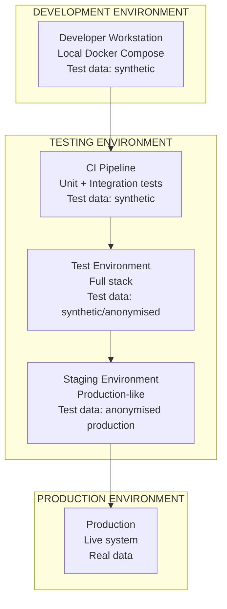

### 4.2 Environment Specifications

| Environment | Purpose | Configuration | Data |
|-------------|---------|---------------|------|
| **Development** | Developer testing | Docker Compose, debug | Synthetic |
| **CI** | Automated tests | Ephemeral containers | Synthetic |
| **Test** | QA system testing | Full stack, debug | Synthetic |
| **Staging** | UAT, Performance | Production-like | Anonymised prod |
| **Production** | Live operation | Production config | Real data |

### 4.3 Environment Configuration

| Component | Development | Test | Staging | Production |
|-----------|-------------|------|---------|------------|
| **Backend** | Django dev server | Django + Gunicorn | Gunicorn + Nginx | Gunicorn + Nginx |
| **Database** | PostgreSQL (local) | PostgreSQL | PostgreSQL (replica) | PostgreSQL (HA) |
| **Redis** | Local | Redis | Redis (cluster) | Redis (cluster) |
| **Frontend** | Vite dev server | Static build | Static build | Static build + CDN |

---

## 5. Test Data

### 5.1 Test Data Strategy

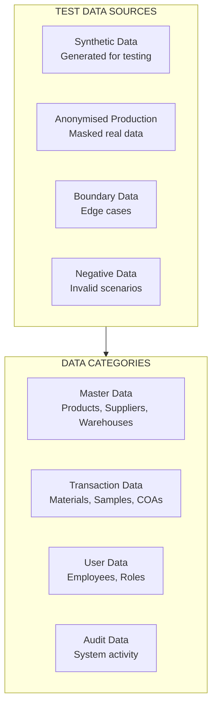

### 5.2 Test Data Sets

| Data Set | Purpose | Quantity | Source |
|----------|---------|----------|--------|
| **Master Data** | Reference lists | 50+ products, 20 suppliers, 10 warehouses | Synthetic |
| **Material Data** | RM registrations | 100+ materials | Synthetic |
| **Sample Data** | Sampling records | 50+ samples | Synthetic |
| **COA Data** | Certificate records | 30+ COAs | Synthetic |
| **User Data** | Employee accounts | 20+ users (all roles) | Synthetic |
| **Audit Data** | Historical audits | 500+ records | Synthetic |
| **Production-like** | Realistic testing | 1000+ records | Anonymised (future) |

### 5.3 Test Data Management

| Practice | Description |
|----------|-------------|
| **Data Generation** | Automated script for synthetic data |
| **Data Refresh** | Test database refreshed before test runs |
| **Data Isolation** | Each test run uses isolated data |
| **Data Cleanup** | Automated cleanup after tests |
| **Data Masking** | Anonymisation scripts for production data |

---

## 6. Test Execution

### 6.1 Execution Process

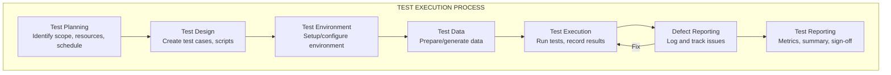

### 6.2 Test Execution Phases

| Phase | Timing | Duration | Tests Executed |
|-------|--------|----------|----------------|
| **Unit Testing** | Continuous | Ongoing | All unit tests |
| **Integration Testing** | Per PR | < 30 min | API + integration tests |
| **System Testing** | Sprint end | 2-5 days | Full system tests |
| **Performance Testing** | Pre-release | 2 days | Performance suite |
| **Security Testing** | Quarterly | 3 days | Security suite |
| **UAT** | Pre-release | 5-10 days | Business user tests |
| **Validation** | Pre-release | 5-10 days | Compliance tests |

---

## 7. Test Automation

### 7.1 Automation Framework

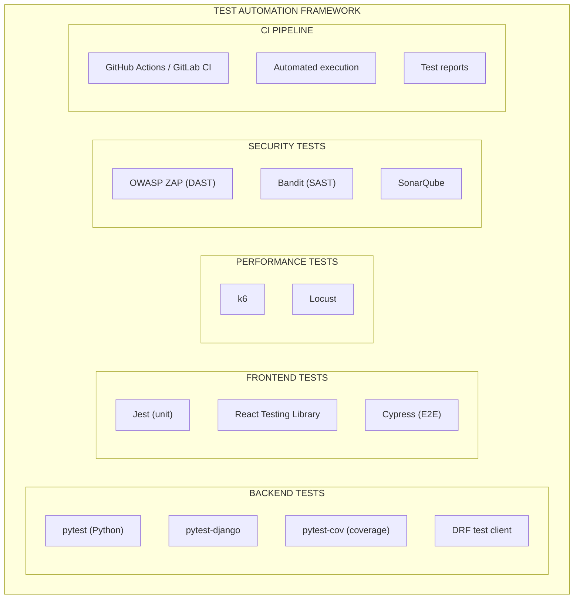

### 7.2 CI/CD Integration

```yaml
# Example GitHub Actions workflow
name: CI Pipeline
on:
  push:
    branches: [main, develop]
  pull_request:

jobs:
  backend-tests:
    runs-on: ubuntu-latest
    steps:
      - uses: actions/checkout@v3
      - name: Setup Python
        uses: actions/setup-python@v4
        with: { python-version: '3.11' }
      - name: Install dependencies
        run: pip install -r requirements/dev.txt
      - name: Run Django tests
        run: pytest --cov=apps --cov-report=xml
      - name: Upload coverage
        uses: codecov/codecov-action@v3

  frontend-tests:
    runs-on: ubuntu-latest
    steps:
      - uses: actions/checkout@v3
      - name: Setup Node
        uses: actions/setup-node@v3
        with: { node-version: '18' }
      - name: Install dependencies
        run: pnpm install
      - name: Run Jest tests
        run: pnpm test --coverage
      - name: Run Cypress
        run: pnpm cypress run

  security-scan:
    runs-on: ubuntu-latest
    steps:
      - name: Security scanning
        uses: aquasecurity/trivy-action@master
```

### 7.3 Test Automation Schedule

| Test Type | Trigger | Execution |
|-----------|---------|-----------|
| **Unit Tests** | Every commit | CI pipeline |
| **Integration Tests** | Every PR | CI pipeline |
| **UI Tests** | Every PR | CI pipeline (Cypress) |
| **Security Tests** | Daily | Scheduled job |
| **Performance Tests** | Weekly | Scheduled job |
| **Compliance Tests** | Monthly | Manual + automated |

---

## 8. Defect Management

### 8.1 Defect Lifecycle

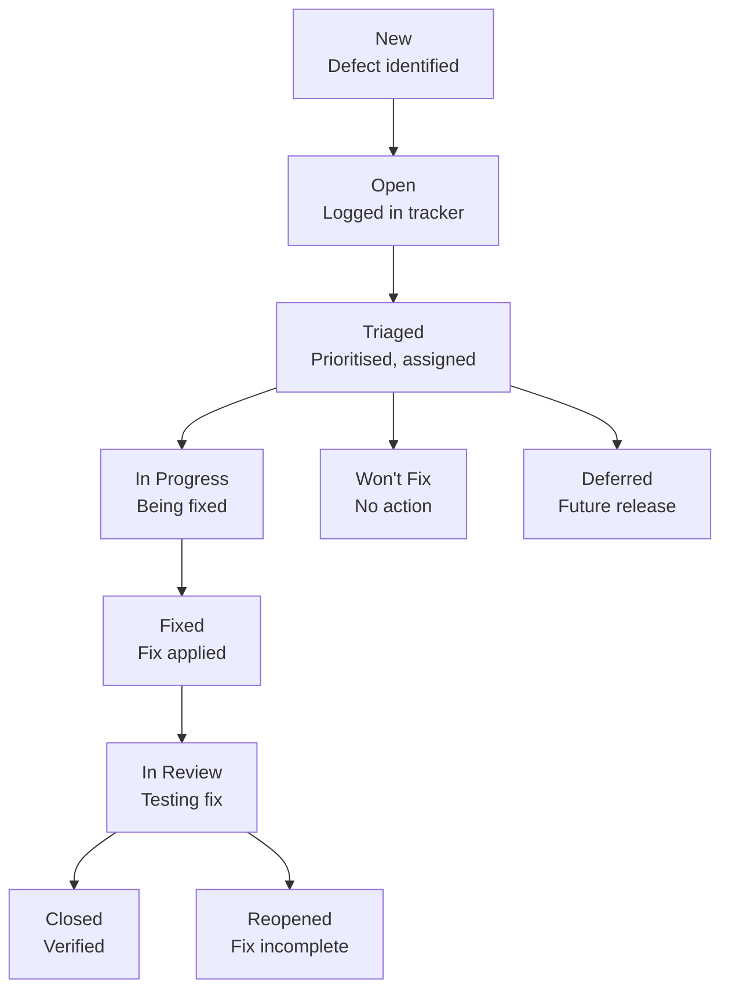

### 8.2 Defect Severity and Priority

| Severity | Description | Response | Example |
|----------|-------------|----------|---------|
| **Critical** | System unusable, data loss | Fix immediately | Login broken, data corruption |
| **High** | Major functionality broken | Fix within 24h | Material registration fails |
| **Medium** | Functionality impaired | Fix within sprint | UI display issue |
| **Low** | Minor issue | Fix when convenient | Typo, cosmetic issue |

### 8.3 Defect Tracking Tools

| Tool | Purpose |
|------|---------|
| **Jira** | Defect tracking, workflow, reporting |
| **GitHub Issues** | Code-related defects |
| **Sentry** | Production error tracking |
| **Datadog** | Performance and operational issues |

---

## 9. Test Reporting

### 9.1 Test Metrics

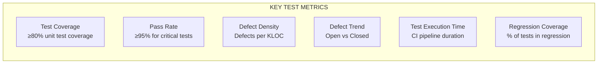

### 9.2 Test Reports

| Report | Audience | Frequency | Content |
|--------|----------|-----------|---------|
| **Daily Status Report** | QA Lead, PM | Daily | Tests run, pass/fail, blockers |
| **Test Execution Report** | QA Team | Per test cycle | Results, defects, coverage |
| **Coverage Report** | Developers | Per build | Code coverage metrics |
| **Defect Report** | QA Lead, Dev Lead | Weekly | Open/closed, severity trends |
| **Compliance Report** | QA, Compliance | Per validation | Part 11, Annex 11 status |
| **Validation Report** | QA, Regulatory | Release | Summary, sign-off |

### 9.3 Test Dashboard

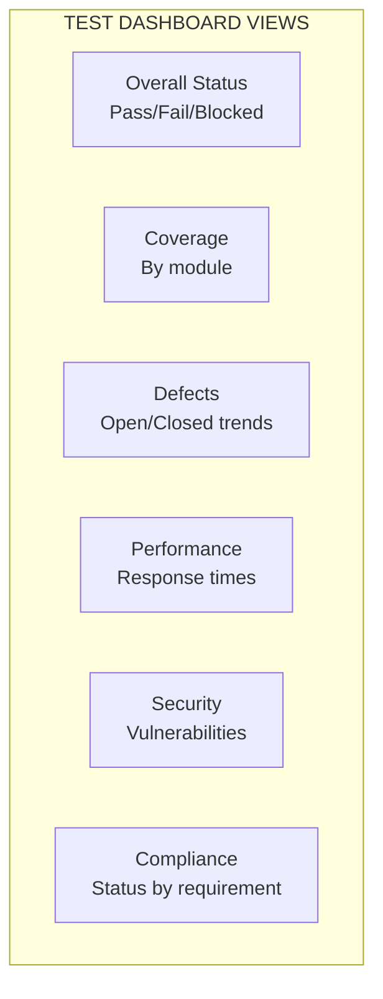

---

## 10. Test Schedule

### 10.1 Test Timeline

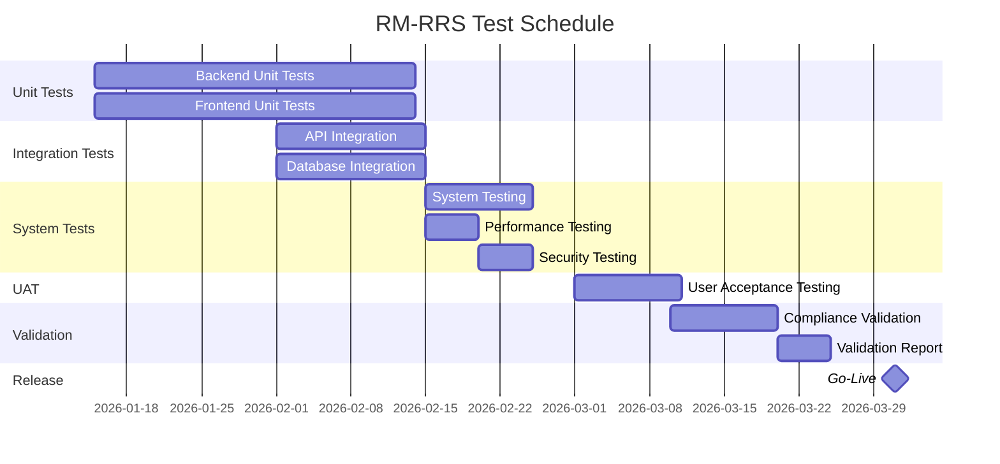

### 10.2 Milestones

| Milestone | Date | Deliverable | Responsible |
|-----------|------|-------------|-------------|
| **Unit Test Complete** | 2026-02-01 | Test reports, coverage | Developers |
| **Integration Test Complete** | 2026-02-15 | API test results | QA + Dev |
| **System Test Complete** | 2026-02-25 | System test report | QA |
| **Performance Test Complete** | 2026-02-20 | Performance report | QA + DevOps |
| **Security Test Complete** | 2026-02-25 | Security assessment | Security |
| **UAT Complete** | 2026-03-10 | UAT sign-off | Business Users |
| **Validation Complete** | 2026-03-25 | Validation report | QA + Compliance |
| **Go-Live** | 2026-03-31 | Production deployment | DevOps |

---

## 11. Test Cases

### 11.1 Test Case Template

| Field | Description |
|-------|-------------|
| **Test Case ID** | Unique identifier (e.g., TC-001) |
| **Requirement** | Trace to SRS/BRD |
| **Title** | Brief description |
| **Priority** | High/Medium/Low |
| **Preconditions** | Setup required |
| **Test Steps** | Sequential actions |
| **Expected Results** | Expected outcomes |
| **Postconditions** | State after test |
| **Pass/Fail Criteria** | How to assess |

### 11.2 Test Case Inventory

| ID | Module | Test Case | Priority | Type |
|----|--------|-----------|----------|------|
| **TC-001** | Auth | Login with valid credentials | High | Functional |
| **TC-002** | Auth | Login with invalid credentials | High | Functional |
| **TC-003** | Auth | Session timeout | High | Security |
| **TC-004** | Auth | Token refresh | High | Functional |
| **TC-005** | Auth | Role-based routing | High | Functional |
| **TC-006** | Auth | Permission enforcement | High | Security |
| **TC-007** | Materials | Register material with valid data | High | Functional |
| **TC-008** | Materials | Register material with missing required fields | High | Functional |
| **TC-009** | Materials | View materials table | High | Functional |
| **TC-010** | Materials | Search materials | Medium | Functional |
| **TC-011** | Materials | Filter materials by status | Medium | Functional |
| **TC-012** | Materials | View material detail | High | Functional |
| **TC-013** | Materials | Request sampling | High | Functional |
| **TC-014** | Materials | Request sampling - already requested | Medium | Functional |
| **TC-015** | Materials | Release label for released material | High | Functional |
| **TC-016** | Materials | Release label for non-released material | Medium | Functional |
| **TC-017** | Materials | Register packaging | High | Functional |
| **TC-018** | Materials | View packaging table | High | Functional |
| **TC-019** | Packaging | Request sampling on packaging | High | Functional |
| **TC-020** | Sampling | View sampling requests | High | Functional |
| **TC-021** | Sampling | Record sample with valid data | High | Functional |
| **TC-022** | Sampling | Record sample with missing required fields | High | Functional |
| **TC-023** | Sampling | Label preview after sampling | High | Functional |
| **TC-024** | Sampling | Print labels | Medium | Functional |
| **TC-025** | Sampling | View sample history | High | Functional |
| **TC-026** | Sampling | Reprint labels from history | Medium | Functional |
| **TC-027** | Product Samples | Register Finished Product | High | Functional |
| **TC-028** | Product Samples | Register Semi-Finished Product | High | Functional |
| **TC-029** | Product Samples | Register Bulk | High | Functional |
| **TC-030** | Product Samples | Stage checkboxes with conditional text | Medium | Functional |
| **TC-031** | Product Samples | View product history | High | Functional |
| **TC-032** | COA | View combined samples worklist | High | Functional |
| **TC-033** | COA | Create COA from sample | High | Functional |
| **TC-034** | COA | Create COA with missing required fields | High | Functional |
| **TC-035** | COA | Submit COA (Draft → In Progress) | High | Functional |
| **TC-036** | COA | Complete COA (In Progress → Completed) | High | Functional |
| **TC-037** | COA | Approve COA | High | Functional |
| **TC-038** | COA | Reject COA | High | Functional |
| **TC-039** | COA | Release material after approval | High | Functional |
| **TC-040** | COA | COA status transitions validation | High | Functional |
| **TC-041** | COA | View certificates list | High | Functional |
| **TC-042** | Notifications | Notification bell indicator | High | Functional |
| **TC-043** | Notifications | View notifications | High | Functional |
| **TC-044** | Notifications | Dismiss notification | High | Functional |
| **TC-045** | Admin | Create employee | High | Functional |
| **TC-046** | Admin | Assign role to employee | High | Functional |
| **TC-047** | Admin | Deactivate employee | High | Functional |
| **TC-048** | Admin | View audit trail | High | Functional |
| **TC-049** | Admin | Search audit trail | Medium | Functional |
| **TC-050** | Audit | Verify audit log creation | High | Compliance |
| **TC-051** | Audit | Verify audit log immutability | High | Compliance |
| **TC-052** | E-Signature | Verify signature creation | High | Compliance |
| **TC-053** | E-Signature | Verify signature integrity | High | Compliance |
| **TC-054** | Performance | API response time under load | Medium | Performance |
| **TC-055** | Performance | Concurrent user handling | Medium | Performance |
| **TC-056** | Security | Authentication bypass attempt | High | Security |
| **TC-057** | Security | Authorisation bypass attempt | High | Security |
| **TC-058** | Security | SQL injection attempt | High | Security |
| **TC-059** | Security | XSS attempt | High | Security |

### 11.3 Test Case Details (Sample)

#### TC-007: Register Material with Valid Data

| Field | Detail |
|-------|--------|
| **Test Case ID** | TC-007 |
| **Requirement** | SRS FR-SK-001 |
| **Title** | Register material with valid data |
| **Priority** | High |
| **Preconditions** | Storekeeper is authenticated |
| **Test Steps** | 1. Navigate to Materials tab<br/>2. Click "Register Material"<br/>3. Fill all required fields with valid data<br/>4. Click "Register Material" |
| **Expected Results** | Material is created with receipt ID (RCV-YYYY-####)<br/>Status = Quarantine<br/>Sampling Status = Not Sampled<br/>Success message displayed |
| **Postconditions** | Material appears in Materials table |
| **Pass/Fail Criteria** | All fields populated correctly, statuses set correctly |

#### TC-013: Request Sampling

| Field | Detail |
|-------|--------|
| **Test Case ID** | TC-013 |
| **Requirement** | SRS FR-SK-005 |
| **Title** | Request sampling |
| **Priority** | High |
| **Preconditions** | Material exists with samplingStatus = Not Sampled |
| **Test Steps** | 1. Navigate to Materials table<br/>2. Find material with Not Sampled status<br/>3. Click "View"<br/>4. Click "Request Sampling"<br/>5. Confirm in dialog |
| **Expected Results** | samplingStatus = Sampling Requested<br/>Success message displayed |
| **Postconditions** | Material appears in Sampler's pending queue |
| **Pass/Fail Criteria** | Status updated correctly |

#### TC-033: Create COA from Sample

| Field | Detail |
|-------|--------|
| **Test Case ID** | TC-033 |
| **Requirement** | SRS FR-AN-003 |
| **Title** | Create COA from sample |
| **Priority** | High |
| **Preconditions** | Sample exists with testingStatus = Not Tested |
| **Test Steps** | 1. Navigate to Analyst Samples view<br/>2. Find sample with Not Tested status<br/>3. Click "Start Testing"<br/>4. Enter Specs Code, Reference, Analyst Name<br/>5. Click "Create & Open COA" |
| **Expected Results** | COA created with ID COA-YYYY-####<br/>Status = Draft<br/>Sample testingStatus = Completed<br/>COA opens in view |
| **Postconditions** | COA appears in Certificates list |
| **Pass/Fail Criteria** | COA created correctly, statuses updated |

---

## 12. Appendices

### A. Test Environment Setup

```bash
# Development environment setup
docker-compose up -d
python manage.py migrate
python manage.py loaddata test_data.json
python manage.py runserver

# Test environment setup
docker-compose -f docker-compose.test.yml up -d
python manage.py migrate
python manage.py loaddata test_data.json
python manage.py test --settings=config.settings.test
```

### B. Running Tests

```bash
# Backend unit tests
pytest apps/ --cov=apps --cov-report=html

# Backend integration tests
pytest tests/integration/

# Frontend tests
pnpm test
pnpm test:coverage

# E2E tests
pnpm cypress run

# Security scan
bandit -r apps/
```

### C. Test Coverage Report Template

| Module | Lines | Covered | Coverage |
|--------|-------|---------|----------|
| apps/users | 500 | 450 | 90% |
| apps/materials | 400 | 360 | 90% |
| apps/sampling | 350 | 310 | 89% |
| apps/coa | 450 | 400 | 89% |
| apps/audit | 200 | 180 | 90% |
| frontend/shared | 800 | 720 | 90% |
| frontend/storekeeper | 600 | 540 | 90% |

### D. Test Data Scripts

```python
# Sample data generation script
def generate_test_data():
    # Create employees
    storekeeper = Employee.objects.create(username="storekeeper1")
    sampler = Employee.objects.create(username="sampler1")
    analyst = Employee.objects.create(username="analyst1")
    qcmanager = Employee.objects.create(username="qcmanager1")
    admin = Employee.objects.create(username="admin1")

    # Create materials
    for i in range(20):
        Material.objects.create(
            receipt_id=f"RCV-2026-{i:04d}",
            material_name=f"Test Material {i}",
            supplier="Test Supplier",
            supplier_batch=f"BATCH-{i:04d}",
            exp_date=date.today() + timedelta(days=365),
            receipt_date=date.today(),
            received_by="Test Receiver",
            status="Quarantine",
            sampling_status="Not Sampled"
        )
```

### E. Compliance Test Matrix

| Test Case ID | Part 11 Reference | Annex 11 Reference | ALCOA+ |
|--------------|-------------------|-------------------|--------|
| TC-050 | §11.10(g) | 7 | A,L,C,O,A |
| TC-051 | §11.10(b) | 6 | A,C,E,A |
| TC-052 | §11.50(a) | 15 | A,L,C,A |
| TC-053 | §11.50(b) | 15 | A,L,C,A |
| TC-006 | §11.10(d) | 14 | A |

---

**Document Approval**

| Role | Name | Date |
|------|------|------|
| Author | [Name] | [Date] |
| Reviewer (QA) | [Name] | [Date] |
| Reviewer (Dev) | [Name] | [Date] |
| Reviewer (Compliance) | [Name] | [Date] |
| Approver | [Name] | [Date] |

---

**Change History**

| Version | Date | Author | Description |
|---------|------|--------|-------------|
| 1.0 | [Date] | [Author] | Initial baseline test design and development specification |

