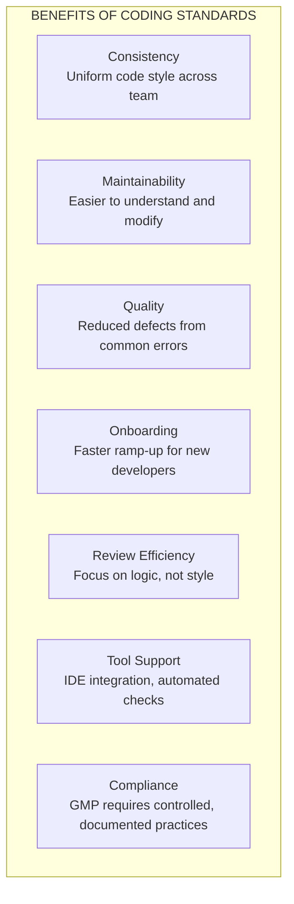
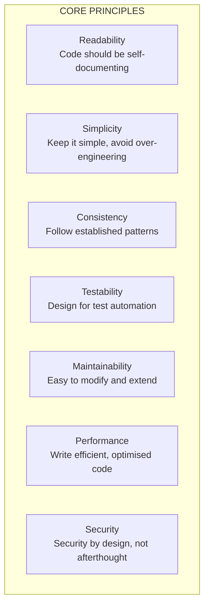
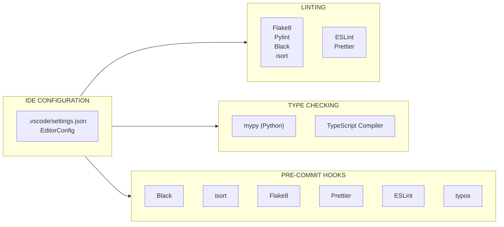

# 19 — Coding Standards

**Document Identifier:** RM-RRS-CS-001
**Version:** 1.0
**Status:** Baseline
**Traces to:** Project Charter, SRS, NFR, SAS, Design Specification, Security Specification
**Compliance Reference:** PEP 8, PEP 257, Google TypeScript Style Guide, Airbnb React/JSX Style Guide, Python Type Hints (PEP 484), Django Best Practices

---

## Table of Contents

1. [Introduction](#1-introduction)
2. [General Principles](#2-general-principles)
3. [Python/Django Backend Standards](#3-pythondjango-backend-standards)
4. [TypeScript/React Frontend Standards](#4-typescriptreact-frontend-standards)
5. [Documentation Standards](#5-documentation-standards)
6. [Testing Standards](#6-testing-standards)
7. [Security Standards](#7-security-standards)
8. [Database Standards](#8-database-standards)
9. [API Standards](#9-api-standards)
10. [Appendices](#10-appendices)

---

## 1. Introduction

### 1.1 Purpose
This document defines the **Coding Standards** for the **Raw Material Receiving & Release System (RM-RRS)** . These standards ensure code consistency, maintainability, readability, and quality across all development activities. Adherence to these standards is mandatory for all code contributed to the project.

### 1.2 Scope
These standards apply to:
- **Backend**: Python 3.11+ with Django 4.2+ and Django REST Framework
- **Frontend**: TypeScript 5.0+ with React 18+
- **Infrastructure**: Docker, Docker Compose configuration files
- **Documentation**: All project documentation, docstrings, and comments

### 1.3 Benefits of Coding Standards



### 1.4 References

| Document | Reference |
|----------|-----------|
| PEP 8 | Style Guide for Python Code |
| PEP 257 | Docstring Conventions |
| PEP 484 | Type Hints |
| Google Python Style Guide | Python Style Guide |
| Airbnb React/JSX Style Guide | React Style Guide |
| Google TypeScript Style Guide | TypeScript Style Guide |
| Django Best Practices | Official Django Documentation |
| DRF Best Practices | Django REST Framework Documentation |

---

## 2. General Principles

### 2.1 Code Quality Principles



### 2.2 Code Review Checklist

| Check | Backend | Frontend |
|-------|---------|----------|
| ✅ Code follows style guide | Python | TypeScript |
| ✅ Tests written and passing | pytest | Jest |
| ✅ Documentation updated | Docstrings | JSDoc |
| ✅ No commented-out code | All | All |
| ✅ No debugging code | All | All |
| ✅ Security best practices | Security | Security |
| ✅ Performance considerations | NFR | NFR |
| ✅ Traceability to requirements | SRS | SRS |

### 2.3 Tooling Configuration



---

## 3. Python/Django Backend Standards

### 3.1 Naming Conventions

| Element | Convention | Example |
|---------|------------|---------|
| **Packages/Modules** | `snake_case`, plural | `apps/materials` |
| **Classes** | `PascalCase` | `class MaterialService` |
| **Functions/Methods** | `snake_case` | `def get_material()` |
| **Variables** | `snake_case` | `material_name` |
| **Constants** | `SCREAMING_SNAKE_CASE` | `MAX_RETRY_COUNT` |
| **Private/Protected** | `_leading_underscore` | `_internal_method()` |
| **Database Models** | `PascalCase`, singular | `class Material` |
| **Model Fields** | `snake_case` | `receipt_id = models.CharField()` |
| **Serializers** | `PascalCase` + `Serializer` | `MaterialSerializer` |
| **Services** | `PascalCase` + `Service` | `MaterialService` |
| **Views/ViewSets** | `PascalCase` + `ViewSet` | `MaterialViewSet` |

### 3.2 Code Formatting

```python
# ✅ Good - Follows Black formatting
def calculate_total_quantity(num_packages: int, package_size: Decimal) -> Decimal:
    """
    Calculate total quantity from number of packages and package size.

    Args:
        num_packages: Number of packages
        package_size: Size of each package

    Returns:
        Total quantity as Decimal
    """
    if not num_packages or not package_size:
        return Decimal('0.00')
    return num_packages * package_size

# ❌ Bad - Inconsistent spacing, no type hints
def calc_total(num_pkgs,pkg_sz):
    if num_pkgs is None or pkg_sz is None:
        return 0
    return num_pkgs*pkg_sz
```

**Formatting Rules:**
- **Line Length**: 88 characters (Black default)
- **Indentation**: 4 spaces (no tabs)
- **String Quotes**: Double quotes for natural language, single for code identifiers
- **Imports**: Grouped as standard library, third-party, local; alphabetical
- **Whitespace**: Around operators, after commas, no trailing whitespace

### 3.3 Import Ordering

```python
# ✅ Good - Proper import ordering
import json
import uuid
from datetime import date, datetime, timedelta
from decimal import Decimal
from typing import List, Optional, Dict, Any

from django.core.exceptions import ValidationError
from django.db import models, transaction
from django.utils import timezone

from rest_framework import serializers, status
from rest_framework.response import Response
from rest_framework.viewsets import ModelViewSet

from apps.common.exceptions import BusinessRuleError, NotFoundError
from apps.materials.models import Material
from apps.materials.services import MaterialService
```

### 3.4 Type Hints (PEP 484)

```python
# ✅ Good - With type hints
from typing import Optional, List, Dict, Any, Union
from decimal import Decimal

def get_material_by_receipt_id(
    receipt_id: str,
    include_deleted: bool = False
) -> Optional[Material]:
    """
    Retrieve a material by its receipt ID.

    Args:
        receipt_id: The receipt ID to look up
        include_deleted: Whether to include soft-deleted records

    Returns:
        Material instance or None if not found
    """
    queryset = Material.objects.all()
    if not include_deleted:
        queryset = queryset.filter(is_deleted=False)
    try:
        return queryset.get(receipt_id=receipt_id)
    except Material.DoesNotExist:
        return None

# ❌ Bad - No type hints
def get_material_by_receipt_id(receipt_id, include_deleted=False):
    queryset = Material.objects.all()
    if not include_deleted:
        queryset = queryset.filter(is_deleted=False)
    try:
        return queryset.get(receipt_id=receipt_id)
    except Material.DoesNotExist:
        return None
```

### 3.5 Docstrings (PEP 257)

```python
# ✅ Good - Comprehensive docstring
class MaterialService:
    """
    Service layer for Material operations.

    This service handles all business logic related to materials including
    creation, updates, sampling requests, and release workflow.

    Attributes:
        user: The employee performing the operation
        audit_service: Service for audit trail logging
        signature_service: Service for electronic signatures
    """

    def __init__(self, user: Employee):
        """Initialize service with the current user."""
        self.user = user
        self.audit_service = AuditService(user)
        self.signature_service = SignatureService(user)

    def create_material(self, data: Dict[str, Any]) -> Material:
        """
        Create a new material record.

        Validates input data, creates the material with default statuses,
        and logs the creation in the audit trail.

        Args:
            data: Dictionary containing material fields

        Returns:
            The created Material instance

        Raises:
            ValidationError: If input data is invalid
            BusinessRuleError: If business rules are violated

        Example:
            >>> service = MaterialService(user)
            >>> material = service.create_material({
            ...     'material_name': 'Paracetamol',
            ...     'supplier': 'PharmaChem Ltd',
            ...     'supplier_batch': 'BATCH-2024-001'
            ... })
        """
        # Implementation...
```

### 3.6 Django Model Standards

```python
# ✅ Good - Model with proper meta and methods
from django.db import models
from django.core.exceptions import ValidationError
from django.utils.translation import gettext_lazy as _
from apps.common.models import BaseModel


class Material(BaseModel):
    """
    Raw Material registration model.

    Tracks material from goods receipt through QC release.
    """

    class Status(models.TextChoices):
        QUARANTINE = 'Quarantine', _('Quarantine')
        RELEASED = 'Released', _('Released')
        REJECTED = 'Rejected', _('Rejected')

    class SamplingStatus(models.TextChoices):
        NOT_SAMPLED = 'Not Sampled', _('Not Sampled')
        SAMPLING_REQUESTED = 'Sampling Requested', _('Sampling Requested')
        SAMPLED = 'Sampled', _('Sampled')

    # Business identifiers
    receipt_id = models.CharField(
        max_length=20,
        unique=True,
        db_index=True,
        help_text="Auto-generated receipt ID (RCV-YYYY-####)"
    )
    material_name = models.CharField(
        max_length=100,
        db_index=True,
        help_text="Name of the material"
    )
    category = models.CharField(
        max_length=50,
        blank=True,
        help_text="Material category (API, Excipient, etc.)"
    )

    # Supplier information
    supplier = models.CharField(
        max_length=100,
        db_index=True,
        help_text="Supplier name"
    )
    manufacturer = models.CharField(
        max_length=100,
        blank=True,
        help_text="Manufacturer name"
    )
    supplier_batch = models.CharField(
        max_length=50,
        db_index=True,
        help_text="Supplier's batch/lot number"
    )

    # Dates
    mfg_date = models.DateField(
        null=True,
        blank=True,
        help_text="Manufacturing date"
    )
    exp_date = models.DateField(
        db_index=True,
        help_text="Expiry date"
    )
    receipt_date = models.DateField(
        db_index=True,
        help_text="Date received"
    )

    # Quantity
    batch_size = models.DecimalField(
        max_digits=10,
        decimal_places=2,
        null=True,
        blank=True,
        help_text="Batch size"
    )
    unit = models.CharField(
        max_length=20,
        blank=True,
        help_text="Unit of measure"
    )

    # Statuses
    status = models.CharField(
        max_length=20,
        choices=Status.choices,
        default=Status.QUARANTINE,
        db_index=True,
        help_text="Material status"
    )
    sampling_status = models.CharField(
        max_length=20,
        choices=SamplingStatus.choices,
        default=SamplingStatus.NOT_SAMPLED,
        db_index=True,
        help_text="Sampling status"
    )

    # QC release data
    qc_number = models.CharField(
        max_length=20,
        blank=True,
        help_text="QC release number (QC-YYYY-####)"
    )
    qc_sign = models.CharField(
        max_length=100,
        blank=True,
        help_text="QC Manager signature"
    )
    retest_date = models.DateField(
        null=True,
        blank=True,
        help_text="Retest date (release date + 1 year)"
    )
    released_date = models.DateField(
        null=True,
        blank=True,
        help_text="Date of release"
    )
    storage_condition = models.CharField(
        max_length=50,
        blank=True,
        help_text="Storage condition from sampling"
    )

    class Meta:
        db_table = 'materials'
        ordering = ['-created_at']
        indexes = [
            models.Index(fields=['status', 'created_at']),
            models.Index(fields=['sampling_status', 'created_at']),
            models.Index(fields=['exp_date']),
        ]

    def __str__(self) -> str:
        """String representation of the material."""
        return f"{self.receipt_id} - {self.material_name}"

    def clean(self) -> None:
        """Model-level validation."""
        super().clean()
        if self.exp_date and self.receipt_date:
            if self.exp_date < self.receipt_date:
                raise ValidationError({
                    'exp_date': 'Expiry date must be after receipt date.'
                })

    def save(self, *args, **kwargs) -> None:
        """Override save to ensure total_qty is calculated."""
        if self.num_packages and self.package_size:
            self.total_qty = self.num_packages * self.package_size
        super().save(*args, **kwargs)
```

### 3.7 Django View/ViewSet Standards

```python
# ✅ Good - ViewSet with proper structure
from rest_framework import viewsets, status
from rest_framework.decorators import action
from rest_framework.response import Response
from rest_framework.permissions import IsAuthenticated
from django_filters.rest_framework import DjangoFilterBackend
from rest_framework.filters import SearchFilter, OrderingFilter

from apps.materials.models import Material
from apps.materials.serializers import (
    MaterialSerializer,
    MaterialListSerializer,
    MaterialDetailSerializer
)
from apps.materials.services import MaterialService
from apps.materials.permissions import HasMaterialPermission
from apps.common.pagination import StandardResultsSetPagination


class MaterialViewSet(viewsets.ModelViewSet):
    """
    API endpoint for Material management.

    Provides CRUD operations and custom actions for sampling requests
    and release label generation.
    """

    queryset = Material.objects.all()
    serializer_class = MaterialSerializer
    permission_classes = [IsAuthenticated, HasMaterialPermission]
    pagination_class = StandardResultsSetPagination
    filter_backends = [DjangoFilterBackend, SearchFilter, OrderingFilter]
    filterset_fields = ['status', 'sampling_status']
    search_fields = ['receipt_id', 'material_name', 'supplier_batch', 'supplier']
    ordering_fields = ['receipt_id', 'created_at', 'material_name', 'exp_date']
    ordering = ['-created_at']

    def get_serializer_class(self):
        """
        Return appropriate serializer based on action.

        - list: Lightweight list serializer
        - retrieve: Detailed serializer with all fields
        - default: Standard serializer
        """
        if self.action == 'list':
            return MaterialListSerializer
        if self.action == 'retrieve':
            return MaterialDetailSerializer
        return MaterialSerializer

    def get_service(self) -> MaterialService:
        """Get MaterialService instance with current user."""
        return MaterialService(self.request.user)

    def perform_create(self, serializer) -> None:
        """Create material using service layer."""
        service = self.get_service()
        material = service.create_material(serializer.validated_data)
        serializer.instance = material

    @action(detail=True, methods=['post'], url_path='request-sampling')
    def request_sampling(self, request, pk=None):
        """
        Request sampling on a material.

        Changes sampling_status to 'Sampling Requested'.

        Returns:
            200 OK with updated material data
            409 Conflict if sampling already requested
        """
        service = self.get_service()
        try:
            material = service.request_sampling(pk)
            serializer = self.get_serializer(material)
            return Response(serializer.data, status=status.HTTP_200_OK)
        except ConflictError as e:
            return Response(
                {'errors': [{'code': 'CONFLICT', 'message': str(e)}]},
                status=status.HTTP_409_CONFLICT
            )
```

### 3.8 Django Serializer Standards

```python
# ✅ Good - Serializer with validation
from rest_framework import serializers
from decimal import Decimal
from datetime import date

from apps.materials.models import Material
from apps.common.validators import validate_receipt_id


class MaterialSerializer(serializers.ModelSerializer):
    """Serializer for Material model with validation."""

    total_qty = serializers.DecimalField(
        max_digits=10,
        decimal_places=2,
        read_only=True,
        help_text="Auto-calculated total quantity"
    )

    class Meta:
        model = Material
        fields = [
            'id', 'receipt_id', 'material_name', 'category',
            'supplier', 'manufacturer', 'supplier_batch',
            'mfg_date', 'exp_date', 'batch_size', 'unit',
            'package_type', 'num_packages', 'package_size', 'total_qty',
            'warehouse', 'location', 'po_no', 'inv_no',
            'receipt_date', 'received_by',
            'status', 'sampling_status',
            'qc_number', 'qc_sign', 'retest_date', 'released_date',
            'storage_condition',
            'created_at', 'updated_at', 'created_by', 'updated_by'
        ]
        read_only_fields = [
            'id', 'receipt_id', 'status', 'sampling_status',
            'qc_number', 'qc_sign', 'retest_date', 'released_date',
            'storage_condition', 'created_at', 'updated_at',
            'created_by', 'updated_by'
        ]

    def validate_receipt_id(self, value):
        """Validate receipt ID format."""
        if not validate_receipt_id(value):
            raise serializers.ValidationError(
                "Receipt ID must be in format RCV-YYYY-####"
            )
        return value

    def validate(self, data):
        """Cross-field validation."""
        # Validate expiry date vs receipt date
        exp_date = data.get('exp_date')
        receipt_date = data.get('receipt_date')
        if exp_date and receipt_date and exp_date < receipt_date:
            raise serializers.ValidationError({
                'exp_date': 'Expiry date must be after receipt date.'
            })

        # Validate package fields
        num_packages = data.get('num_packages')
        package_size = data.get('package_size')
        if num_packages and package_size and (num_packages < 0 or package_size < 0):
            raise serializers.ValidationError({
                'num_packages': 'Package values must be positive.'
            })

        return data

    def create(self, validated_data):
        """Create material with default statuses."""
        validated_data['status'] = Material.Status.QUARANTINE
        validated_data['sampling_status'] = Material.SamplingStatus.NOT_SAMPLED
        return super().create(validated_data)
```

### 3.9 Service Layer Standards

```python
# ✅ Good - Service with transaction management
from django.db import transaction
from django.core.exceptions import ValidationError
from typing import Dict, Any, Optional, List
from decimal import Decimal

from apps.common.exceptions import BusinessRuleError, NotFoundError, ConflictError
from apps.materials.models import Material


class MaterialService:
    """
    Service layer for Material operations.

    Handles all business logic with proper transaction management
    and audit trail integration.
    """

    def __init__(self, user: Employee):
        """Initialize service with current user."""
        self.user = user
        self.audit_service = AuditService(user)
        self.notification_service = NotificationService()

    @transaction.atomic
    def create_material(self, data: Dict[str, Any]) -> Material:
        """
        Create a new material with audit trail.

        Args:
            data: Material field data

        Returns:
            Created Material instance

        Raises:
            ValidationError: If validation fails
        """
        # Generate receipt ID
        data['receipt_id'] = self._generate_receipt_id()

        # Create material
        material = Material.objects.create(
            **data,
            created_by=self.user,
            updated_by=self.user,
            status=Material.Status.QUARANTINE,
            sampling_status=Material.SamplingStatus.NOT_SAMPLED
        )

        # Log audit trail (async)
        self.audit_service.log_create(material)

        return material

    @transaction.atomic
    def request_sampling(self, material_id: str) -> Material:
        """
        Request sampling on a material.

        Args:
            material_id: UUID of the material

        Returns:
            Updated Material instance

        Raises:
            NotFoundError: If material not found
            ConflictError: If sampling already requested
        """
        material = self.get_material(material_id)

        if material.sampling_status != Material.SamplingStatus.NOT_SAMPLED:
            raise ConflictError(
                f"Sampling already {material.sampling_status.lower()}",
                details={'current_status': material.sampling_status}
            )

        material.sampling_status = Material.SamplingStatus.SAMPLING_REQUESTED
        material.updated_by = self.user
        material.save(update_fields=['sampling_status', 'updated_by'])

        self.audit_service.log_update(
            material,
            field_name='sampling_status',
            old_value=Material.SamplingStatus.NOT_SAMPLED,
            new_value=Material.SamplingStatus.SAMPLING_REQUESTED
        )

        return material

    def get_material(self, material_id: str) -> Material:
        """
        Get material by UUID.

        Args:
            material_id: UUID of the material

        Returns:
            Material instance

        Raises:
            NotFoundError: If material not found
        """
        try:
            return Material.objects.get(id=material_id)
        except Material.DoesNotExist:
            raise NotFoundError(f"Material with ID '{material_id}' not found")

    def _generate_receipt_id(self) -> str:
        """Generate a new receipt ID."""
        year = date.today().year
        count = Material.objects.filter(
            receipt_id__startswith=f'RCV-{year}'
        ).count() + 1
        return f'RCV-{year}-{count:04d}'
```

### 3.10 Error Handling

```python
# ✅ Good - Custom exception handling
from rest_framework.views import exception_handler
from rest_framework.response import Response
from rest_framework import status

from apps.common.exceptions import BusinessRuleError, ConflictError, NotFoundError


def custom_exception_handler(exc, context):
    """
    Custom DRF exception handler for consistent error responses.

    Transforms exceptions into standard error response format.
    """
    # Get default DRF response
    response = exception_handler(exc, context)

    # If no response from DRF, it's an internal error
    if response is None:
        return Response(
            {
                'errors': [{
                    'code': 'INTERNAL_ERROR',
                    'message': 'An unexpected error occurred.'
                }]
            },
            status=status.HTTP_500_INTERNAL_SERVER_ERROR
        )

    # Format conflict errors
    if isinstance(exc, ConflictError):
        return Response(
            {
                'errors': [{
                    'code': 'CONFLICT',
                    'message': str(exc),
                    'details': getattr(exc, 'details', None)
                }]
            },
            status=status.HTTP_409_CONFLICT
        )

    # Format not found errors
    if isinstance(exc, NotFoundError):
        return Response(
            {
                'errors': [{
                    'code': 'NOT_FOUND',
                    'message': str(exc)
                }]
            },
            status=status.HTTP_404_NOT_FOUND
        )

    # Format validation errors
    if response.status_code == status.HTTP_400_BAD_REQUEST:
        errors = []
        for field, messages in response.data.items():
            if isinstance(messages, list):
                for msg in messages:
                    errors.append({
                        'code': 'VALIDATION_ERROR',
                        'message': str(msg),
                        'field': field
                    })
            else:
                errors.append({
                    'code': 'VALIDATION_ERROR',
                    'message': str(messages),
                    'field': field
                })
        return Response(
            {'errors': errors},
            status=status.HTTP_400_BAD_REQUEST
        )

    return response
```

---

## 4. TypeScript/React Frontend Standards

### 4.1 Naming Conventions

| Element | Convention | Example |
|---------|------------|---------|
| **Files/Directories** | `kebab-case` | `material-form.tsx` |
| **Components** | `PascalCase` | `MaterialForm` |
| **Custom Hooks** | `camelCase` prefixed `use` | `useMaterials` |
| **Functions** | `camelCase` | `formatDate` |
| **Variables** | `camelCase` | `materialName` |
| **Constants** | `SCREAMING_SNAKE_CASE` | `MAX_RETRY_COUNT` |
| **Types/Interfaces** | `PascalCase` | `Material` |
| **Enums** | `PascalCase` | `MaterialStatus` |
| **CSS Modules** | `camelCase` | `materialForm.module.css` |
| **Test Files** | `*.test.tsx` | `material-form.test.tsx` |

### 4.2 TypeScript Configuration

```json
// tsconfig.json
{
  "compilerOptions": {
    "target": "ES2020",
    "useDefineForClassFields": true,
    "lib": ["ES2020", "DOM", "DOM.Iterable"],
    "module": "ESNext",
    "skipLibCheck": true,
    "moduleResolution": "bundler",
    "allowImportingTsExtensions": true,
    "resolveJsonModule": true,
    "isolatedModules": true,
    "noEmit": true,
    "jsx": "react-jsx",

    "strict": true,
    "noUnusedLocals": true,
    "noUnusedParameters": true,
    "noFallthroughCasesInSwitch": true,

    "baseUrl": ".",
    "paths": {
      "@/*": ["src/*"],
      "@shared/*": ["../shared/*"],
      "@api/*": ["../shared/api/src/*"]
    }
  },
  "include": ["src"],
  "references": [{ "path": "./tsconfig.node.json" }]
}
```

### 4.3 Component Structure

```tsx
// ✅ Good - Component with proper structure
// apps/storekeeper/src/components/MaterialForm/MaterialForm.tsx

import React, { useState, useCallback, useEffect } from 'react';
import { useNavigate } from 'react-router-dom';
import { useForm, Controller } from 'react-hook-form';
import { zodResolver } from '@hookform/resolvers/zod';
import { z } from 'zod';

import { Button } from '@shared/ui/Button';
import { Input } from '@shared/ui/Form/Input';
import { Select } from '@shared/ui/Form/Select';
import { DatePicker } from '@shared/ui/Form/DatePicker';
import { useCreateMaterial } from '../../hooks/useMaterials';
import { useToast } from '@shared/hooks/useToast';

import styles from './MaterialForm.module.css';

// Type definitions
interface MaterialFormProps {
  onSuccess?: () => void;
  onCancel?: () => void;
  initialData?: Partial<Material>;
}

// Validation schema
const materialSchema = z.object({
  materialName: z.string().min(1, 'Material name is required'),
  supplier: z.string().min(1, 'Supplier is required'),
  supplierBatch: z.string().min(1, 'Supplier batch is required'),
  expDate: z.string().min(1, 'Expiry date is required'),
  receiptDate: z.string().min(1, 'Receipt date is required'),
  receivedBy: z.string().min(1, 'Received by is required'),
  category: z.string().optional(),
  manufacturer: z.string().optional(),
  // ... other fields
});

type MaterialFormData = z.infer<typeof materialSchema>;

export const MaterialForm: React.FC<MaterialFormProps> = ({
  onSuccess,
  onCancel,
  initialData,
}) => {
  const navigate = useNavigate();
  const { showToast } = useToast();
  const [isSubmitting, setIsSubmitting] = useState(false);

  // React Hook Form setup
  const {
    control,
    handleSubmit,
    formState: { errors },
    reset,
    watch,
  } = useForm<MaterialFormData>({
    resolver: zodResolver(materialSchema),
    defaultValues: {
      receiptDate: new Date().toISOString().split('T')[0],
      ...initialData,
    },
  });

  // Mutations
  const createMaterial = useCreateMaterial();

  // Watch for auto-calculation
  const numPackages = watch('numPackages');
  const packageSize = watch('packageSize');

  // Handlers
  const onSubmit = useCallback(
    async (data: MaterialFormData) => {
      setIsSubmitting(true);
      try {
        const result = await createMaterial.mutateAsync(data);
        showToast('Material registered successfully!', 'success');
        reset();
        if (onSuccess) {
          onSuccess();
        } else {
          navigate(`/materials/${result.id}`);
        }
      } catch (error) {
        showToast('Failed to register material.', 'error');
      } finally {
        setIsSubmitting(false);
      }
    },
    [createMaterial, navigate, onSuccess, reset, showToast]
  );

  return (
    <form onSubmit={handleSubmit(onSubmit)} className={styles.form}>
      <div className={styles.section}>
        <h3 className={styles.sectionTitle}>Material Information</h3>
        <div className={styles.grid}>
          <Controller
            name="materialName"
            control={control}
            render={({ field }) => (
              <Select
                {...field}
                label="Material Name *"
                options={[]}
                error={errors.materialName?.message}
                required
              />
            )}
          />
          <Controller
            name="supplier"
            control={control}
            render={({ field }) => (
              <Select
                {...field}
                label="Supplier *"
                options={[]}
                error={errors.supplier?.message}
                required
              />
            )}
          />
          {/* ... other fields */}
        </div>
      </div>

      <div className={styles.actions}>
        <Button variant="secondary" onClick={onCancel}>
          Cancel
        </Button>
        <Button type="submit" isLoading={isSubmitting}>
          Register Material
        </Button>
      </div>
    </form>
  );
};

export default MaterialForm;
```

### 4.4 Custom Hook Standards

```tsx
// ✅ Good - Custom hook with React Query
// apps/storekeeper/src/hooks/useMaterials.ts

import { useQuery, useMutation, useQueryClient } from '@tanstack/react-query';
import { api } from '@api/client';
import type { Material, MaterialFilters, CreateMaterialData } from '@api/types';

export const materialKeys = {
  all: ['materials'] as const,
  lists: () => [...materialKeys.all, 'list'] as const,
  list: (filters: MaterialFilters) => [...materialKeys.lists(), filters] as const,
  details: () => [...materialKeys.all, 'detail'] as const,
  detail: (id: string) => [...materialKeys.details(), id] as const,
};

export function useMaterials(filters: MaterialFilters = {}) {
  return useQuery({
    queryKey: materialKeys.list(filters),
    queryFn: () => api.materials.list(filters),
    staleTime: 30000,
  });
}

export function useMaterial(id: string) {
  return useQuery({
    queryKey: materialKeys.detail(id),
    queryFn: () => api.materials.get(id),
    enabled: !!id,
  });
}

export function useCreateMaterial() {
  const queryClient = useQueryClient();

  return useMutation({
    mutationFn: (data: CreateMaterialData) => api.materials.create(data),
    onSuccess: () => {
      queryClient.invalidateQueries({ queryKey: materialKeys.lists() });
    },
  });
}

export function useRequestSampling() {
  const queryClient = useQueryClient();

  return useMutation({
    mutationFn: (id: string) => api.materials.requestSampling(id),
    onSuccess: (_, id) => {
      queryClient.invalidateQueries({ queryKey: materialKeys.detail(id) });
      queryClient.invalidateQueries({ queryKey: materialKeys.lists() });
    },
  });
}
```

### 4.5 State Management (Zustand)

```tsx
// ✅ Good - Zustand store with typed state
// apps/storekeeper/src/stores/useAppStore.ts

import { create } from 'zustand';
import { persist } from 'zustand/middleware';

interface Notification {
  id: string;
  title: string;
  message: string;
  read: boolean;
  createdAt: string;
}

interface AppState {
  // Notifications
  notifications: Notification[];
  unreadCount: number;
  addNotification: (notification: Omit<Notification, 'id' | 'read' | 'createdAt'>) => void;
  markAsRead: (id: string) => void;
  markAllAsRead: () => void;
  dismissNotification: (id: string) => void;
  clearNotifications: () => void;

  // UI State
  isLoading: boolean;
  setLoading: (loading: boolean) => void;

  // Filters
  materialFilters: MaterialFilters;
  setMaterialFilters: (filters: MaterialFilters) => void;
  resetMaterialFilters: () => void;
}

const initialFilters: MaterialFilters = {
  status: '',
  samplingStatus: '',
  search: '',
  page: 1,
  limit: 20,
};

export const useAppStore = create<AppState>()(
  persist(
    (set, get) => ({
      // Notifications
      notifications: [],
      unreadCount: 0,

      addNotification: (notification) => {
        const newNotification: Notification = {
          id: crypto.randomUUID(),
          ...notification,
          read: false,
          createdAt: new Date().toISOString(),
        };
        set((state) => ({
          notifications: [newNotification, ...state.notifications],
          unreadCount: state.unreadCount + 1,
        }));
      },

      markAsRead: (id) => {
        set((state) => {
          const notifications = state.notifications.map((n) =>
            n.id === id ? { ...n, read: true } : n
          );
          const unreadCount = notifications.filter((n) => !n.read).length;
          return { notifications, unreadCount };
        });
      },

      markAllAsRead: () => {
        set((state) => ({
          notifications: state.notifications.map((n) => ({ ...n, read: true })),
          unreadCount: 0,
        }));
      },

      dismissNotification: (id) => {
        set((state) => ({
          notifications: state.notifications.filter((n) => n.id !== id),
          unreadCount: state.notifications.filter((n) => n.id === id && !n.read).length
            ? state.unreadCount - 1
            : state.unreadCount,
        }));
      },

      clearNotifications: () => {
        set({ notifications: [], unreadCount: 0 });
      },

      // UI State
      isLoading: false,
      setLoading: (loading) => set({ isLoading: loading }),

      // Filters
      materialFilters: initialFilters,
      setMaterialFilters: (filters) =>
        set((state) => ({
          materialFilters: { ...state.materialFilters, ...filters },
        })),
      resetMaterialFilters: () => set({ materialFilters: initialFilters }),
    }),
    {
      name: 'app-store',
      partialize: (state) => ({
        notifications: state.notifications,
        unreadCount: state.unreadCount,
        materialFilters: state.materialFilters,
      }),
    }
  )
);
```

### 4.6 API Client Standards

```tsx
// ✅ Good - API client with interceptors
// shared/api/src/client.ts

import axios, { AxiosInstance, AxiosError, InternalAxiosRequestConfig } from 'axios';
import { ApiError, ApiResponse } from './types';

class ApiClient {
  private axios: AxiosInstance;
  private isRefreshing = false;
  private refreshSubscribers: ((token: string) => void)[] = [];

  constructor() {
    this.axios = axios.create({
      baseURL: import.meta.env.VITE_API_BASE_URL,
      timeout: 30000,
      withCredentials: true,
      headers: {
        'Content-Type': 'application/json',
        Accept: 'application/json',
      },
    });

    this.setupInterceptors();
  }

  private setupInterceptors(): void {
    // Request interceptor
    this.axios.interceptors.request.use(
      this.handleRequest.bind(this),
      (error) => Promise.reject(error)
    );

    // Response interceptor
    this.axios.interceptors.response.use(
      this.handleResponse.bind(this),
      this.handleError.bind(this)
    );
  }

  private handleRequest(config: InternalAxiosRequestConfig): InternalAxiosRequestConfig {
    // Add correlation ID
    config.headers['X-Correlation-ID'] = this.generateCorrelationId();

    // Add CSRF token if available
    const csrfToken = this.getCsrfToken();
    if (csrfToken) {
      config.headers['X-CSRFToken'] = csrfToken;
    }

    return config;
  }

  private handleResponse(response: any): any {
    // Extract data from envelope
    return response.data?.data ?? response.data;
  }

  private async handleError(error: AxiosError): Promise<any> {
    const originalRequest = error.config as any;

    // Handle 401 Unauthorized
    if (error.response?.status === 401 && !originalRequest._retry) {
      originalRequest._retry = true;
      return this.handleTokenRefresh(originalRequest);
    }

    // Format error response
    const apiError: ApiError = {
      errors: (error.response?.data as any)?.errors || [
        {
          code: 'NETWORK_ERROR',
          message: error.message || 'Network error occurred',
        },
      ],
    };

    return Promise.reject(apiError);
  }

  private async handleTokenRefresh(originalRequest: any): Promise<any> {
    if (!this.isRefreshing) {
      this.isRefreshing = true;
      try {
        await this.axios.post('/auth/refresh/');
        this.isRefreshing = false;
        this.refreshSubscribers.forEach((cb) => cb('token'));
        this.refreshSubscribers = [];
      } catch (error) {
        this.isRefreshing = false;
        this.refreshSubscribers = [];
        // Redirect to login
        window.location.href = '/login';
        return Promise.reject(error);
      }
    }

    return new Promise((resolve) => {
      this.refreshSubscribers.push(() => {
        resolve(this.axios(originalRequest));
      });
    });
  }

  private generateCorrelationId(): string {
    return crypto.randomUUID();
  }

  private getCsrfToken(): string | null {
    const name = 'csrftoken';
    const value = `; ${document.cookie}`;
    const parts = value.split(`; ${name}=`);
    if (parts.length === 2) {
      return parts.pop()?.split(';').shift() || null;
    }
    return null;
  }

  // API methods
  public materials = {
    list: (params?: MaterialFilters) =>
      this.axios.get('/materials/', { params }),
    create: (data: CreateMaterialData) =>
      this.axios.post('/materials/', data),
    get: (id: string) =>
      this.axios.get(`/materials/${id}/`),
    update: (id: string, data: UpdateMaterialData) =>
      this.axios.patch(`/materials/${id}/`, data),
    requestSampling: (id: string) =>
      this.axios.post(`/materials/${id}/request-sampling/`),
    getLabel: (id: string) =>
      this.axios.get(`/materials/${id}/label/`),
  };

  // ... other API methods
}

export const api = new ApiClient();
```

### 4.7 CSS Standards

```css
/* ✅ Good - CSS Modules with BEM-like naming */
/* apps/storekeeper/src/components/MaterialForm/MaterialForm.module.css */

.form {
  display: flex;
  flex-direction: column;
  gap: var(--spacing-24, 24px);
  max-width: 900px;
  margin: 0 auto;
  padding: var(--spacing-24, 24px);
}

.section {
  display: flex;
  flex-direction: column;
  gap: var(--spacing-12, 12px);
}

.section-title {
  font-size: var(--font-size-sm, 11px);
  font-weight: 600;
  color: var(--text-secondary, #5a5a55);
  text-transform: uppercase;
  letter-spacing: 0.06em;
  padding-bottom: var(--spacing-8, 8px);
  border-bottom: 1px solid var(--border, #e8e8e5);
}

.grid {
  display: grid;
  grid-template-columns: 1fr 1fr;
  gap: var(--spacing-14, 14px) var(--spacing-20, 20px);
}

/* Responsive */
@media (max-width: 768px) {
  .grid {
    grid-template-columns: 1fr;
  }
}

.actions {
  display: flex;
  justify-content: flex-end;
  gap: var(--spacing-10, 10px);
  padding-top: var(--spacing-14, 14px);
  border-top: 1px solid var(--border, #e8e8e5);
}

.field-error {
  font-size: var(--font-size-xs, 11px);
  color: var(--danger, #c0392b);
  margin-top: var(--spacing-4, 4px);
}
```

---

## 5. Documentation Standards

### 5.1 Backend Documentation

```python
# ✅ Good - Module-level docstring
"""
Materials Module

This module provides the Material domain model, API views, serializers,
and business logic for raw material management in the RM-RRS system.

Key components:
- Material: Django model for raw material records
- MaterialViewSet: DRF viewset for API endpoints
- MaterialService: Business logic layer
- MaterialSerializer: DRF serializers for API input/output

Dependencies:
- apps.common: Shared utilities and mixins
- apps.users: Employee and authentication
- apps.audit: Audit trail logging
"""

# ✅ Good - Class docstring
class MaterialService:
    """
    Service layer for Material operations.

    This service encapsulates all business logic related to material
    management, including creation, updates, sampling requests, and
    QC release workflow. It integrates with audit and notification
    services for compliance.

    Attributes:
        user (Employee): The employee performing the operation
        audit_service (AuditService): Service for audit trail logging
        notification_service (NotificationService): Service for notifications

    Example:
        ```python
        service = MaterialService(user)
        material = service.create_material({'material_name': 'Paracetamol'})
        ```
    """
```

### 5.2 Frontend Documentation

```tsx
// ✅ Good - JSDoc comment
/**
 * MaterialForm component for registering new raw materials.
 *
 * This form handles all material registration fields with validation,
 * auto-calculation of total quantity, and integration with React Query
 * for API calls.
 *
 * @component
 * @param {MaterialFormProps} props - Component props
 * @param {function} props.onSuccess - Called on successful submission
 * @param {function} props.onCancel - Called on cancel
 * @param {Partial<Material>} props.initialData - Data for editing mode
 *
 * @example
 * ```tsx
 * <MaterialForm
 *   onSuccess={() => navigate('/materials')}
 *   onCancel={() => navigate('/materials')}
 * />
 * ```
 */
export const MaterialForm: React.FC<MaterialFormProps> = ({
  onSuccess,
  onCancel,
  initialData,
}) => {
  // Implementation...
};
```

---

## 6. Testing Standards

### 6.1 Backend Test Standards

```python
# ✅ Good - Comprehensive test with fixtures
import pytest
from django.test import TestCase
from django.urls import reverse
from rest_framework.test import APIClient

from apps.materials.models import Material
from apps.materials.services import MaterialService
from apps.users.models import Employee


@pytest.mark.django_db
class TestMaterialService:
    """Tests for MaterialService."""

    def setup_method(self):
        """Set up test data."""
        self.user = Employee.objects.create(
            username='storekeeper1',
            job_role='storekeeper',
            is_active=True
        )
        self.service = MaterialService(self.user)

    def test_create_material_success(self):
        """Test successful material creation."""
        data = {
            'material_name': 'Paracetamol',
            'supplier': 'PharmaChem Ltd',
            'supplier_batch': 'BATCH-2024-001',
            'exp_date': '2027-01-15',
            'receipt_date': '2026-01-15',
            'received_by': 'John Storekeeper',
        }

        material = self.service.create_material(data)

        assert material is not None
        assert material.material_name == 'Paracetamol'
        assert material.status == Material.Status.QUARANTINE
        assert material.sampling_status == Material.SamplingStatus.NOT_SAMPLED
        assert material.receipt_id.startswith('RCV-2026-')

    def test_request_sampling_success(self):
        """Test successful sampling request."""
        material = Material.objects.create(
            receipt_id='RCV-2026-0001',
            material_name='Paracetamol',
            supplier='PharmaChem Ltd',
            supplier_batch='BATCH-2024-001',
            exp_date='2027-01-15',
            receipt_date='2026-01-15',
            received_by='John Storekeeper',
            created_by=self.user,
            updated_by=self.user,
        )

        updated = self.service.request_sampling(material.id)

        assert updated.sampling_status == Material.SamplingStatus.SAMPLING_REQUESTED

    def test_request_sampling_already_requested(self):
        """Test conflict when sampling already requested."""
        material = Material.objects.create(
            receipt_id='RCV-2026-0002',
            material_name='Ibuprofen',
            supplier='BioSource Inc',
            supplier_batch='BATCH-2024-002',
            exp_date='2027-01-15',
            receipt_date='2026-01-15',
            received_by='John Storekeeper',
            sampling_status=Material.SamplingStatus.SAMPLING_REQUESTED,
            created_by=self.user,
            updated_by=self.user,
        )

        with pytest.raises(ConflictError):
            self.service.request_sampling(material.id)


@pytest.mark.django_db
class TestMaterialAPI:
    """Tests for Material API endpoints."""

    def setup_method(self):
        """Set up test data and client."""
        self.client = APIClient()
        self.user = Employee.objects.create(
            username='storekeeper1',
            job_role='storekeeper',
            is_active=True
        )
        self.client.force_authenticate(user=self.user)

    def test_list_materials(self):
        """Test listing materials."""
        url = reverse('material-list')
        response = self.client.get(url)

        assert response.status_code == 200
        assert 'data' in response.data
        assert 'meta' in response.data

    def test_create_material(self):
        """Test creating material via API."""
        url = reverse('material-list')
        data = {
            'material_name': 'Paracetamol',
            'supplier': 'PharmaChem Ltd',
            'supplier_batch': 'BATCH-2024-001',
            'exp_date': '2027-01-15',
            'receipt_date': '2026-01-15',
            'received_by': 'John Storekeeper',
        }
        response = self.client.post(url, data)

        assert response.status_code == 201
        assert response.data['data']['material_name'] == 'Paracetamol'
```

### 6.2 Frontend Test Standards

```tsx
// ✅ Good - Component test with React Testing Library
import React from 'react';
import { render, screen, fireEvent, waitFor } from '@testing-library/react';
import { BrowserRouter } from 'react-router-dom';
import { QueryClient, QueryClientProvider } from '@tanstack/react-query';
import { MaterialForm } from './MaterialForm';
import { useCreateMaterial } from '../../hooks/useMaterials';

// Mock the hook
jest.mock('../../hooks/useMaterials');

const queryClient = new QueryClient({
  defaultOptions: { queries: { retry: false } },
});

const renderWithProviders = (component: React.ReactElement) => {
  return render(
    <QueryClientProvider client={queryClient}>
      <BrowserRouter>
        {component}
      </BrowserRouter>
    </QueryClientProvider>
  );
};

describe('MaterialForm', () => {
  const mockMutate = jest.fn();
  const mockMutateAsync = jest.fn().mockResolvedValue({ id: 'mat-123' });

  beforeEach(() => {
    (useCreateMaterial as jest.Mock).mockReturnValue({
      mutate: mockMutate,
      mutateAsync: mockMutateAsync,
      isLoading: false,
    });
  });

  it('renders all required fields', () => {
    renderWithProviders(<MaterialForm />);

    expect(screen.getByLabelText(/Material Name/i)).toBeInTheDocument();
    expect(screen.getByLabelText(/Supplier/i)).toBeInTheDocument();
    expect(screen.getByLabelText(/Supplier Batch/i)).toBeInTheDocument();
    expect(screen.getByLabelText(/Expiry Date/i)).toBeInTheDocument();
    expect(screen.getByLabelText(/Receipt Date/i)).toBeInTheDocument();
    expect(screen.getByLabelText(/Received By/i)).toBeInTheDocument();
  });

  it('submits form with valid data', async () => {
    renderWithProviders(<MaterialForm />);

    fireEvent.change(screen.getByLabelText(/Material Name/i), {
      target: { value: 'Paracetamol' },
    });
    fireEvent.change(screen.getByLabelText(/Supplier/i), {
      target: { value: 'PharmaChem Ltd' },
    });
    fireEvent.change(screen.getByLabelText(/Supplier Batch/i), {
      target: { value: 'BATCH-2024-001' },
    });
    fireEvent.change(screen.getByLabelText(/Expiry Date/i), {
      target: { value: '2027-01-15' },
    });
    fireEvent.change(screen.getByLabelText(/Receipt Date/i), {
      target: { value: '2026-01-15' },
    });
    fireEvent.change(screen.getByLabelText(/Received By/i), {
      target: { value: 'John Storekeeper' },
    });

    fireEvent.click(screen.getByText(/Register Material/i));

    await waitFor(() => {
      expect(mockMutateAsync).toHaveBeenCalled();
    });
  });

  it('shows validation errors for empty required fields', async () => {
    renderWithProviders(<MaterialForm />);

    fireEvent.click(screen.getByText(/Register Material/i));

    await waitFor(() => {
      expect(screen.getByText(/Material name is required/i)).toBeInTheDocument();
    });
  });
});
```

---

## 7. Security Standards

### 7.1 Backend Security

```python
# ✅ Good - Security-conscious code
from django.core.exceptions import ValidationError
from django.contrib.auth.hashers import make_password, check_password
from django.views.decorators.csrf import csrf_exempt  # ❌ Avoid unless necessary


class SecurityService:
    """Security-related utilities."""

    @staticmethod
    def hash_password(password: str) -> str:
        """
        Hash a password using Django's default hasher (bcrypt/PBKDF2).

        Args:
            password: Plain text password

        Returns:
            Hashed password string
        """
        return make_password(password)

    @staticmethod
    def verify_password(plain_password: str, hashed_password: str) -> bool:
        """
        Verify a password against its hash.

        Args:
            plain_password: Plain text password to check
            hashed_password: Stored hash

        Returns:
            True if password matches, False otherwise
        """
        return check_password(plain_password, hashed_password)

    @staticmethod
    def validate_password_strength(password: str) -> bool:
        """
        Validate password meets complexity requirements.

        Requirements:
        - At least 12 characters
        - At least one uppercase letter
        - At least one lowercase letter
        - At least one digit
        - At least one special character
        """
        if len(password) < 12:
            return False
        if not any(c.isupper() for c in password):
            return False
        if not any(c.islower() for c in password):
            return False
        if not any(c.isdigit() for c in password):
            return False
        if not any(c in '!@#$%^&*()_+-=[]{}|;:,.<>?/~' for c in password):
            return False
        return True

    @staticmethod
    def sanitize_input(value: str) -> str:
        """
        Sanitise user input to prevent injection attacks.

        Args:
            value: User-provided string

        Returns:
            Sanitised string
        """
        # Remove potential script tags and other dangerous content
        import re
        return re.sub(r'<[^>]*>', '', value)
```

### 7.2 Frontend Security

```tsx
// ✅ Good - Security-conscious React code
import DOMPurify from 'dompurify';

// ❌ Bad - Using dangerouslySetInnerHTML without sanitization
<div dangerouslySetInnerHTML={{ __html: userProvidedContent }} />

// ✅ Good - Using sanitized content
<div dangerouslySetInnerHTML={{
  __html: DOMPurify.sanitize(userProvidedContent, {
    ALLOWED_TAGS: ['b', 'i', 'em', 'strong', 'p', 'br'],
    ALLOWED_ATTR: []
  })
}} />

// ✅ Good - XSS protection with React's built-in escaping
<div>{userProvidedContent}</div>

// ✅ Good - CSP headers in meta tag
<meta
  httpEquiv="Content-Security-Policy"
  content="
    default-src 'self';
    script-src 'self' 'unsafe-inline' https://cdn.jsdelivr.net;
    style-src 'self' 'unsafe-inline' https://fonts.googleapis.com;
    font-src 'self' https://fonts.gstatic.com;
    img-src 'self' data:;
  "
/>
```

---

## 8. Database Standards

### 8.1 Migration Standards

```python
# ✅ Good - Migration with data migration
from django.db import migrations, models


def set_default_receipt_dates(apps, schema_editor):
    """Set default receipt dates for existing records."""
    Material = apps.get_model('materials', 'Material')
    Material.objects.filter(receipt_date__isnull=True).update(
        receipt_date=schema_editor.connection.ops.today()
    )


class Migration(migrations.Migration):

    dependencies = [
        ('materials', '0001_initial'),
    ]

    operations = [
        migrations.AddField(
            model_name='material',
            name='receipt_date',
            field=models.DateField(
                default='2026-01-01',
                help_text='Date received'
            ),
            preserve_default=False,
        ),
        migrations.RunPython(
            set_default_receipt_dates,
            reverse_code=migrations.RunPython.noop
        ),
        migrations.AlterField(
            model_name='material',
            name='receipt_date',
            field=models.DateField(
                help_text='Date received',
                db_index=True
            ),
        ),
    ]
```

### 8.2 Query Performance Standards

```python
# ✅ Good - Efficient queries with select_related/prefetch_related
def get_materials_with_details():
    """Get materials with related data in single query."""
    return Material.objects.select_related(
        'created_by',
        'updated_by'
    ).prefetch_related(
        'samples',
        'coas'
    )

# ❌ Bad - N+1 queries
def get_materials_inefficient():
    materials = Material.objects.all()
    for material in materials:
        # This causes N+1 queries
        print(material.created_by.username)
        for sample in material.samples.all():
            print(sample.sample_id)

# ✅ Good - Using values/values_list for specific fields
def get_material_summary():
    return Material.objects.values(
        'receipt_id',
        'material_name',
        'status'
    ).order_by('-created_at')
```

---

## 9. API Standards

### 9.1 API Response Format

```python
# ✅ Good - Consistent API responses
{
    "data": {
        "id": "mat_abc123",
        "receipt_id": "RCV-2026-0001",
        "material_name": "Paracetamol"
    },
    "meta": {
        "page": 1,
        "per_page": 20,
        "total": 45,
        "total_pages": 3
    },
    "errors": null
}

# ✅ Good - Error response
{
    "data": null,
    "meta": {},
    "errors": [
        {
            "code": "VALIDATION_ERROR",
            "message": "Material name is required.",
            "field": "material_name",
            "details": null
        }
    ]
}
```

### 9.2 API Versioning

```python
# ✅ Good - Versioned URLs
# config/urls.py
urlpatterns = [
    path('api/v1/', include('apps.api_v1.urls')),
    # Future versions:
    # path('api/v2/', include('apps.api_v2.urls')),
]
```

---

## 10. Appendices

### A. Tools and Configuration Files

**.editorconfig:**
```ini
root = true

[*]
charset = utf-8
end_of_line = lf
insert_final_newline = true
trim_trailing_whitespace = true

[*.{py,js,ts,tsx,json,yml,yaml}]
indent_style = space
indent_size = 2

[*.py]
indent_size = 4

[*.{css,scss}]
indent_size = 2
```

**.pre-commit-config.yaml:**
```yaml
repos:
  - repo: https://github.com/psf/black
    rev: 23.11.0
    hooks:
      - id: black
        files: \.py$

  - repo: https://github.com/PyCQA/isort
    rev: 5.12.0
    hooks:
      - id: isort
        files: \.py$

  - repo: https://github.com/PyCQA/flake8
    rev: 6.1.0
    hooks:
      - id: flake8
        files: \.py$

  - repo: https://github.com/pre-commit/mirrors-eslint
    rev: v8.55.0
    hooks:
      - id: eslint
        files: \.(js|jsx|ts|tsx)$
        args: [--fix]

  - repo: https://github.com/pre-commit/mirrors-prettier
    rev: v3.1.0
    hooks:
      - id: prettier
        files: \.(js|jsx|ts|tsx|json|css|scss|md)$
```

### B. Quick Reference: Common Patterns

| Use Case | Backend | Frontend |
|----------|---------|----------|
| **Data Model** | Django Model | TypeScript Interface/Type |
| **API Client** | DRF ViewSet | Axios + React Query |
| **Validation** | DRF Serializer | Zod Schema |
| **State Management** | Django ORM | React Query + Zustand |
| **Async Tasks** | Celery | React Query (background) |
| **Error Handling** | Custom Exceptions | Error Boundaries + Toasts |
| **Audit Trail** | Django Signals + Celery | N/A |
| **Print Labels** | N/A | window.print() + PrintArea |

### C. Commit Message Format

```
<type>(<scope>): <subject>

<body>

<footer>
```

**Types:**
- `feat`: New feature
- `fix`: Bug fix
- `docs`: Documentation
- `style`: Code style (formatting, no logic change)
- `refactor`: Code refactoring
- `test`: Adding/updating tests
- `chore`: Build process, dependencies

**Example:**
```
feat(materials): add material registration form

- Create MaterialForm component with validation
- Integrate with React Query for API calls
- Add auto-calculation of total quantity
- Add Zod validation schema

Closes #123
```

---

**Document Approval**

| Role | Name | Date |
|------|------|------|
| Author | [Name] | [Date] |
| Reviewer (Backend Lead) | [Name] | [Date] |
| Reviewer (Frontend Lead) | [Name] | [Date] |
| Reviewer (QA) | [Name] | [Date] |
| Approver | [Name] | [Date] |

---

**Change History**

| Version | Date | Author | Description |
|---------|------|--------|-------------|
| 1.0 | [Date] | [Author] | Initial baseline coding standards |

