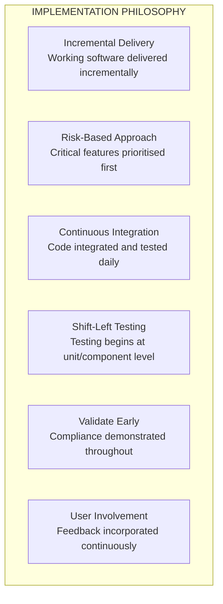
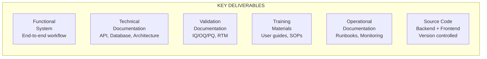
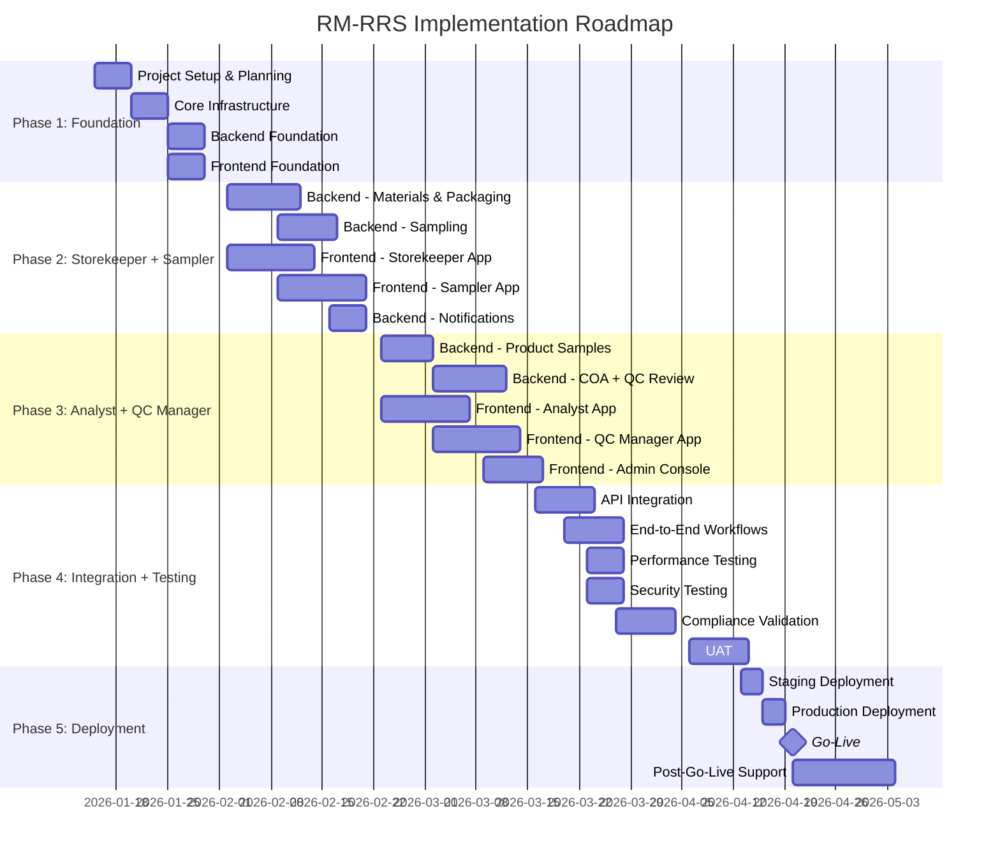
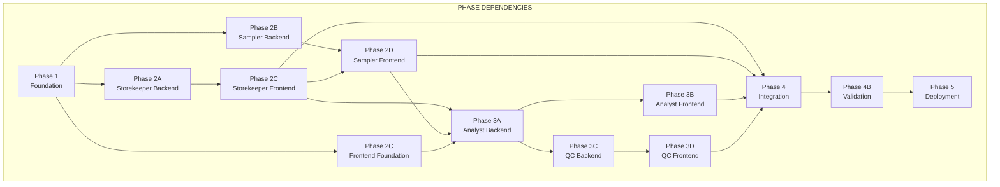
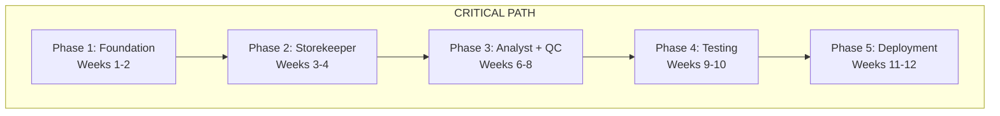
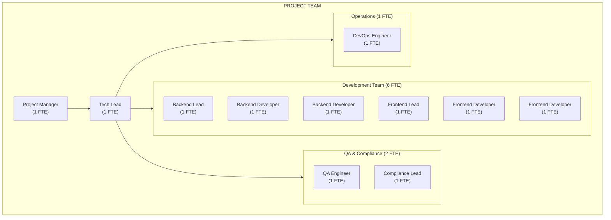
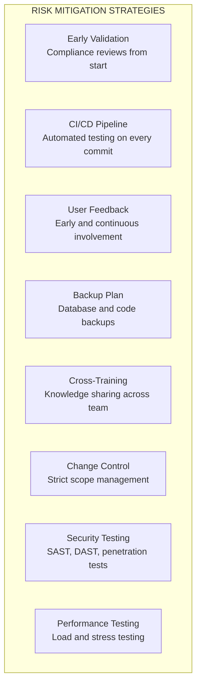
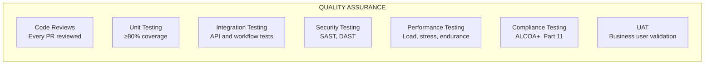
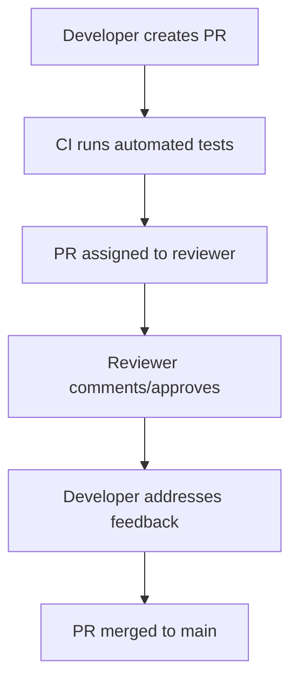
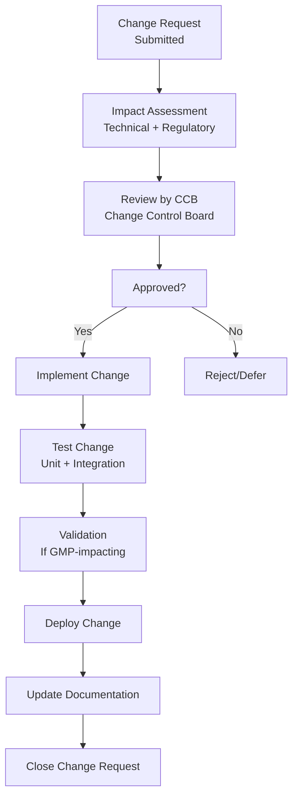

# 20 — Implementation Roadmap

**Document Identifier:** RM-RRS-ROADMAP-001
**Version:** 1.0
**Status:** Baseline
**Traces to:** Project Charter, SRS, NFR, SAS, Design Specification, Coding Standards, TDD
**Compliance Reference:** GAMP 5 (Project Planning Phase), PMI Project Management Body of Knowledge (PMBOK), Agile Development Best Practices

---

## Table of Contents

1. [Introduction](#1-introduction)
2. [Project Overview](#2-project-overview)
3. [Implementation Phases](#3-implementation-phases)
4. [Detailed Phase Breakdown](#4-detailed-phase-breakdown)
5. [Timeline and Milestones](#5-timeline-and-milestones)
6. [Resource Planning](#6-resource-planning)
7. [Risk Management](#7-risk-management)
8. [Quality Assurance](#8-quality-assurance)
9. [Change Management](#9-change-management)
10. [Success Criteria](#10-success-criteria)
11. [Appendices](#11-appendices)

---

## 1. Introduction

### 1.1 Purpose
This document defines the **Implementation Roadmap** for the **Raw Material Receiving & Release System (RM-RRS)** . It provides a comprehensive, phased plan for the development, testing, and deployment of the system, including timelines, milestones, resource allocation, risk management, and quality assurance activities. This roadmap serves as the primary project management tool for all implementation activities.

### 1.2 Scope
This roadmap covers the entire implementation lifecycle from project initiation through to production go-live and post-implementation support. It includes:
- **Development Phases**: Backend, frontend, integration, and testing
- **Validation Activities**: IQ/OQ/PQ and compliance verification
- **Deployment**: Staging and production deployment
- **Training**: End-user and administrator training
- **Change Management**: Communications, documentation, and transition

### 1.3 Implementation Philosophy

---

## 2. Project Overview

### 2.1 Project Summary

| Attribute | Value |
|-----------|-------|
| **Project Name** | Raw Material Receiving & Release System (RM-RRS) |
| **Project Type** | New Development (Greenfield) |
| **Development Methodology** | Agile (Scrum) with GMP compliance overlay |
| **Estimated Duration** | 12-14 weeks |
| **Team Size** | 6-8 developers + QA + Project Manager |
| **Key Technologies** | Python/Django, React/TypeScript, PostgreSQL, Docker |

### 2.2 Key Deliverables

### 2.3 Stakeholders and Responsibilities

| Role | Responsibility |
|------|----------------|
| **Project Manager** | Overall project coordination, timeline, budget |
| **Tech Lead** | Technical architecture, code quality, mentoring |
| **Backend Developers** | Django/DRF development, database design, API development |
| **Frontend Developers** | React development, UI/UX implementation, API integration |
| **QA Engineer** | Test planning, execution, automation, defect tracking |
| **DevOps Engineer** | CI/CD, deployment, infrastructure, monitoring |
| **Product Owner** | Requirements prioritisation, stakeholder communication |
| **Compliance Lead** | Validation documentation, regulatory compliance |

---

## 3. Implementation Phases

### 3.1 High-Level Phase Overview

### 3.2 Phase Dependencies

---

## 4. Detailed Phase Breakdown

### 4.1 Phase 1: Foundation (Weeks 1-2)

| Task ID | Task | Deliverable | Duration | Owner |
|---------|------|-------------|----------|-------|
| **P1-001** | Project Setup and Planning | Project plan, communication charter | 3d | PM |
| **P1-002** | Environment Setup | Development environment (Docker) | 2d | DevOps |
| **P1-003** | CI/CD Pipeline Setup | GitHub Actions workflow | 2d | DevOps |
| **P1-004** | Backend Project Structure | Django project skeleton | 3d | Backend Lead |
| **P1-005** | Common Module (utilities, constants, exceptions) | `apps/common` module | 2d | Backend Team |
| **P1-006** | Users Module (Employee + Auth) | `apps/users` with JWT auth | 5d | Backend Team |
| **P1-007** | Audit Module (AuditLog model + service) | `apps/audit` with Celery integration | 3d | Backend Team |
| **P1-008** | E-Signature Module | `apps/esignature` with hashing | 2d | Backend Team |
| **P1-009** | Frontend Monorepo Setup | pnpm workspaces, Vite config | 3d | Frontend Lead |
| **P1-010** | Shared UI Components | Button, Table, Modal, Badge | 5d | Frontend Team |
| **P1-011** | Shared API Client | Axios client with interceptors | 3d | Frontend Team |
| **P1-012** | Shared Hooks | `useAuth`, `useQuery`, `useToast` | 2d | Frontend Team |

**Phase 1 Acceptance Criteria:**
- ✅ Development environment runs with `docker-compose up`
- ✅ CI pipeline runs on every push
- ✅ User authentication works (login/logout/refresh)
- ✅ Audit logging captures actions (verified in database)
- ✅ E-signature module hashes and stores signatures
- ✅ Shared components render in Storybook (if used)
- ✅ API client can make authenticated requests

### 4.2 Phase 2: Storekeeper + Sampler (Weeks 3-5)

| Task ID | Task | Deliverable | Duration | Owner |
|---------|------|-------------|----------|-------|
| **P2-001** | Materials Module - Models | `Material` model | 2d | Backend |
| **P2-002** | Materials Module - Serializers | `MaterialSerializer` | 2d | Backend |
| **P2-003** | Materials Module - Views/API | `MaterialViewSet` | 3d | Backend |
| **P2-004** | Materials Module - Services | `MaterialService` | 3d | Backend |
| **P2-005** | Packaging Module - Models | `Packaging` model | 2d | Backend |
| **P2-006** | Packaging Module - Views/API | `PackagingViewSet` | 2d | Backend |
| **P2-007** | Sampling Module - Models | `Sample` model | 2d | Backend |
| **P2-008** | Sampling Module - Views/API | `SampleViewSet` | 3d | Backend |
| **P2-009** | Notifications Module | `Notification` model + API | 2d | Backend |
| **P2-010** | Storekeeper App - Routes/Layout | Materials + Packaging pages | 3d | Frontend |
| **P2-011** | Storekeeper App - MaterialTable | List/search/filter materials | 3d | Frontend |
| **P2-012** | Storekeeper App - MaterialForm | Register material | 2d | Frontend |
| **P2-013** | Storekeeper App - MaterialView | Detail view + request sampling | 2d | Frontend |
| **P2-014** | Storekeeper App - PackagingTable | List/search/filter packaging | 2d | Frontend |
| **P2-015** | Storekeeper App - PackagingForm | Register packaging | 2d | Frontend |
| **P2-016** | Storekeeper App - Release Label | Label generation + print | 2d | Frontend |
| **P2-017** | Storekeeper App - Notifications | Bell icon + notification list | 2d | Frontend |
| **P2-018** | Sampler App - Routes/Layout | Requests + History + Product pages | 2d | Frontend |
| **P2-019** | Sampler App - SamplingRequests | Pending queue + view | 2d | Frontend |
| **P2-020** | Sampler App - SamplingForm | Record sample | 2d | Frontend |
| **P2-021** | Sampler App - Label Preview | QC + Container labels | 2d | Frontend |
| **P2-022** | Sampler App - SampleHistory | List + reprint | 2d | Frontend |
| **P2-023** | Unit Tests - Materials/Packaging | Test coverage ≥80% | Throughout | Dev Team |
| **P2-024** | Integration Tests - Workflows | End-to-end workflows | Throughout | QA |

**Phase 2 Acceptance Criteria:**
- ✅ Storekeeper can register material (successful API call, UI feedback)
- ✅ Storekeeper can register packaging
- ✅ Storekeeper can request sampling (status update + Sampler view)
- ✅ Sampler can see pending requests
- ✅ Sampler can record sample (status update + Analyst view)
- ✅ Labels are displayed and printable
- ✅ Release label shows correct data for released materials
- ✅ Notifications are created on release

### 4.3 Phase 3: Analyst + QC Manager (Weeks 6-8)

| Task ID | Task | Deliverable | Duration | Owner |
|---------|------|-------------|----------|-------|
| **P3-001** | Product Samples Module - Models | `ProductSample` model | 2d | Backend |
| **P3-002** | Product Samples Module - API | `ProductSampleViewSet` | 3d | Backend |
| **P3-003** | COA Module - Models | `COA` model | 2d | Backend |
| **P3-004** | COA Module - Serializers | `COASerializer` | 2d | Backend |
| **P3-005** | COA Module - Views/API | `COAViewSet` | 3d | Backend |
| **P3-006** | COA Module - Services | `COAService` | 3d | Backend |
| **P3-007** | Release Workflow | Integration with Materials | 3d | Backend |
| **P3-008** | Analyst App - Routes/Layout | Home + Samples + Certificates | 2d | Frontend |
| **P3-009** | Analyst App - Launcher | Cards with badges | 1d | Frontend |
| **P3-010** | Analyst App - SampleWorklist | Combined samples table | 3d | Frontend |
| **P3-011** | Analyst App - COAForm | Auto-filled form | 3d | Frontend |
| **P3-012** | Analyst App - COAView | Detail view + status actions | 3d | Frontend |
| **P3-013** | Analyst App - CertificatesList | Filterable list | 2d | Frontend |
| **P3-014** | QC Manager App - Routes/Layout | COA Review dashboard | 2d | Frontend |
| **P3-015** | QC Manager App - COAList | Search/filter COAs | 2d | Frontend |
| **P3-016** | QC Manager App - COADetail | Full COA + approve/reject | 3d | Frontend |
| **P3-017** | QC Manager App - ReleaseModal | QC Number + Signature | 2d | Frontend |
| **P3-018** | Admin Console - Routes/Layout | Employee + Audit pages | 2d | Frontend |
| **P3-019** | Admin Console - Employee Management | List + Create/Edit | 3d | Frontend |
| **P3-020** | Admin Console - Audit View | Searchable audit log | 2d | Frontend |
| **P3-021** | Unit Tests - COA/Product | Test coverage ≥80% | Throughout | Dev Team |
| **P3-022** | Integration Tests - COA/QC | End-to-end COA workflows | Throughout | QA |

**Phase 3 Acceptance Criteria:**
- ✅ Sampler can register FP/SFP/Bulk samples
- ✅ Analyst sees combined samples worklist with all sample types
- ✅ Analyst can create COA from sample (auto-filled)
- ✅ COA status workflow works (Draft → In Progress → Completed)
- ✅ QC Manager sees COA list and can view details
- ✅ QC Manager can approve/reject COA (with comments)
- ✅ Approving a Raw Material COA triggers Release Modal
- ✅ Release Modal captures QC Number and Signature
- ✅ Storekeeper receives notification on release
- ✅ Admin can create and manage employees
- ✅ Admin can view audit trail

### 4.4 Phase 4: Integration and Testing (Weeks 9-10)

| Task ID | Task | Deliverable | Duration | Owner |
|---------|------|-------------|----------|-------|
| **P4-001** | API Integration Testing | All API endpoints tested | 3d | QA |
| **P4-002** | End-to-End Workflow Testing | Complete workflows (Materials → Release) | 3d | QA |
| **P4-003** | Performance Testing | Load testing with k6 | 3d | QA + DevOps |
| **P4-004** | Security Testing | OWASP ZAP, SAST | 3d | Security |
| **P4-005** | Usability Testing | UX review, accessibility | 2d | QA |
| **P4-006** | Database Performance | Query optimisation | 2d | Backend |
| **P4-007** | Cross-Browser Testing | Chrome, Firefox, Edge, Safari | 2d | QA |
| **P4-008** | Mobile Responsive Testing | Tablet, mobile views | 2d | QA |
| **P4-009** | Audit Trail Verification | All GMP actions logged | 2d | QA + Compliance |
| **P4-010** | E-Signature Verification | Integrity and linking | 2d | QA + Compliance |
| **P4-011** | Defect Resolution | All High/Critical defects closed | 5d | Dev Team |
| **P4-012** | User Acceptance Testing (UAT) | Business user testing | 5d | QA + Business |

**Phase 4 Acceptance Criteria:**
- ✅ All API endpoints return expected responses
- ✅ End-to-end workflows pass (Materials → Sampling → COA → Release)
- ✅ Performance: 95th percentile response time < 500ms
- ✅ Security: No critical vulnerabilities found
- ✅ Audit trail verified for all GMP actions
- ✅ E-signature verification passes
- ✅ UAT sign-off from business users

### 4.5 Phase 5: Deployment (Weeks 11-12)

| Task ID | Task | Deliverable | Duration | Owner |
|---------|------|-------------|----------|-------|
| **P5-001** | Validation Documentation | IQ/OQ/PQ documentation | 5d | Compliance + QA |
| **P5-002** | Training Materials | User guides, SOPs, video tutorials | 3d | PM + SME |
| **P5-003** | User Training | End-user training sessions | 2d | SME |
| **P5-004** | Staging Deployment | Deploy to staging environment | 2d | DevOps |
| **P5-005** | Staging Validation | Validation tests in staging | 2d | QA + Compliance |
| **P5-006** | Data Migration (if applicable) | Production data import | 1d | DevOps |
| **P5-007** | Production Deployment | Deploy to production environment | 3d | DevOps |
| **P5-008** | Go-Live Verification | Smoke test all critical workflows | 1d | QA + SME |
| **P5-009** | Post-Go-Live Support | Support for first 2 weeks | 14d | All Teams |
| **P5-010** | Go-Live Report | Project closure report | 2d | PM |

**Phase 5 Acceptance Criteria:**
- ✅ All IQ/OQ/PQ documents signed
- ✅ Users trained and signed off
- ✅ Staging deployment passes validation tests
- ✅ Production deployment verified by smoke tests
- ✅ Go-live is successful

---

## 5. Timeline and Milestones

### 5.1 Milestone Schedule

| Milestone | Date | Deliverable | Sign-off |
|-----------|------|-------------|----------|
| **M1: Foundation Complete** | 2026-01-31 | Project setup, auth, audit, e-sig | Tech Lead + PM |
| **M2: Storekeeper + Sampler MVP** | 2026-02-20 | Storekeeper and Sampler apps | Product Owner |
| **M3: Analyst + QC Manager MVP** | 2026-03-16 | Analyst and QC Manager apps | Product Owner |
| **M4: Testing Complete** | 2026-04-04 | All tests passed, UAT sign-off | QA + Business |
| **M5: Validation Complete** | 2026-04-13 | Validation documentation signed | Compliance |
| **M6: Go-Live** | 2026-04-20 | Production deployment | PM + Stakeholders |
| **M7: Post-Go-Live Review** | 2026-05-04 | Project closure report | PM |

### 5.2 Critical Path Activities

---

## 6. Resource Planning

### 6.1 Team Structure

### 6.2 Resource Allocation by Phase

| Role | Phase 1 | Phase 2 | Phase 3 | Phase 4 | Phase 5 |
|------|---------|---------|---------|---------|---------|
| PM | 1.0 | 0.8 | 0.8 | 0.8 | 1.0 |
| Tech Lead | 1.0 | 0.6 | 0.6 | 0.4 | 0.2 |
| Backend Lead | 1.0 | 1.0 | 1.0 | 0.8 | 0.5 |
| Backend Dev 1 | 1.0 | 1.0 | 1.0 | 0.8 | 0.5 |
| Backend Dev 2 | 0.5 | 1.0 | 1.0 | 0.8 | 0.5 |
| Frontend Lead | 1.0 | 1.0 | 1.0 | 0.8 | 0.5 |
| Frontend Dev 1 | 0.5 | 1.0 | 1.0 | 0.8 | 0.5 |
| Frontend Dev 2 | 0.0 | 1.0 | 1.0 | 0.8 | 0.5 |
| QA Engineer | 0.2 | 0.5 | 0.5 | 1.0 | 0.8 |
| Compliance Lead | 0.2 | 0.2 | 0.2 | 0.5 | 1.0 |
| DevOps Engineer | 0.5 | 0.2 | 0.2 | 0.5 | 1.0 |

### 6.3 Skills Required

| Role | Required Skills |
|------|-----------------|
| **Backend Developer** | Python 3.11+, Django 4.2+, Django REST Framework, PostgreSQL, Redis, Celery, pytest |
| **Frontend Developer** | TypeScript 5.0+, React 18+, React Router, TanStack Query, Zustand, Vite, CSS/Sass |
| **QA Engineer** | pytest, Jest, Cypress, k6, OWASP ZAP, API testing, manual testing |
| **DevOps Engineer** | Docker, Docker Compose, Nginx, GitHub Actions, Linux administration, Prometheus/Grafana |
| **Compliance Lead** | 21 CFR Part 11, EU GMP Annex 11, ALCOA+, GAMP 5, validation documentation |

---

## 7. Risk Management

### 7.1 Risk Register

| ID | Risk Category | Risk Description | Probability | Impact | Mitigation |
|----|---------------|------------------|-------------|--------|------------|
| **R-001** | Technical | Performance issues under load | Medium | High | Early performance testing; optimisation |
| **R-002** | Technical | Integration issues between frontend/backend | High | Medium | API-first design; early integration testing |
| **R-003** | Technical | Database migration issues | Medium | High | Test migrations in staging; backup before production |
| **R-004** | Resource | Developer availability/attrition | Medium | High | Cross-training; documentation; pair programming |
| **R-005** | Scope | Scope creep | High | High | Strict change control process; backlog prioritisation |
| **R-006** | Compliance | Validation documentation incomplete | Medium | Critical | Dedicated compliance resource; regular reviews |
| **R-007** | User Adoption | User resistance to new system | Medium | High | Early user involvement; comprehensive training |
| **R-008** | Infrastructure | Deployment environment issues | Low | High | Infrastructure as Code; staging environment |
| **R-009** | Security | Security vulnerability found late | Low | Critical | Security testing throughout; shift-left approach |
| **R-010** | Third-party | Dependency vulnerabilities | Medium | Medium | Regular dependency scanning; prompt updates |

### 7.2 Risk Mitigation Strategies

---

## 8. Quality Assurance

### 8.1 Quality Assurance Activities

### 8.2 Quality Metrics

| Metric | Target | Measurement |
|--------|--------|-------------|
| Unit Test Coverage | ≥ 80% | pytest-cov, Jest coverage |
| Integration Test Coverage | ≥ 70% of workflows | Pytest/DRF test client |
| Defect Escape Rate | < 5% to staging | Defect tracking |
| Defect Closure Rate | > 90% within 2 weeks | Jira metrics |
| API Response Time (95th) | < 500 ms | Performance testing |
| Security Vulnerabilities | 0 Critical/High | OWASP ZAP, SonarQube |
| Performance Test Pass | > 95% requests < 1s | k6 testing |
| UAT Sign-off | 100% | User acceptance |

### 8.3 Code Review Process

---

## 9. Change Management

### 9.1 Change Control Process

### 9.2 Documentation Management

| Document | Location | Version Control | Review Frequency |
|----------|----------|-----------------|------------------|
| Requirements (SRS, BRD, etc.) | GitHub / Confluence | Git versioning | As needed |
| Design Documents | GitHub / Confluence | Git versioning | After design changes |
| Source Code | GitHub | Git versioning | Every commit |
| API Documentation | OpenAPI / Swagger | Auto-generated | After API changes |
| Test Documentation | Jira / TestRail | Versioned | Per test cycle |
| SOPs | Document Management System | Formal version control | Annual + as needed |

### 9.3 Training Plan

| Training | Audience | Format | Duration | Timing |
|----------|----------|--------|----------|--------|
| System Overview | All Users | Presentation + Demo | 2 hours | Week 10 |
| Storekeeper Training | Storekeepers | Hands-on Workshop | 4 hours | Week 11 |
| Sampler Training | Samplers | Hands-on Workshop | 4 hours | Week 11 |
| Analyst Training | Analysts | Hands-on Workshop | 4 hours | Week 11 |
| QC Manager Training | QC Managers | Hands-on Workshop | 4 hours | Week 11 |
| Administrator Training | Admin Users | Hands-on Workshop | 3 hours | Week 11 |
| SOP Review | All Users | Self-study + Quiz | 1 hour | Week 11 |
| Refresher Training | All Users | Online / As-needed | 1 hour | Quarterly |

---

## 10. Success Criteria

### 10.1 Project Success Criteria

| Criteria | Description | Measurement |
|----------|-------------|-------------|
| **SC-01: Functional Completeness** | All MVP features implemented | Requirements coverage ≥ 95% |
| **SC-02: Quality** | Defects resolved and closed | ≤ 5 critical/high defects open at go-live |
| **SC-03: Performance** | System meets NFRs | API response time < 500ms (95th) |
| **SC-04: Compliance** | Audit trail and e-signatures verified | All compliance tests passed |
| **SC-05: User Acceptance** | Business users approve system | UAT sign-off from all user groups |
| **SC-06: Deployment** | System successfully deployed | Production environment operational |
| **SC-07: Training** | Users trained and competent | Training completion ≥ 95% |
| **SC-08: Timeline** | Project delivered on schedule | Within 10% of planned duration |

### 10.2 Business Success Criteria

| Criteria | Description | Measurement |
|----------|-------------|-------------|
| **SC-B1: Workflow Efficiency** | End-to-end workflows execute correctly | Manual tracking replaced |
| **SC-B2: Data Integrity** | ALCOA+ principles satisfied | No data integrity findings in audit |
| **SC-B3: Audit Readiness** | System ready for regulatory inspection | All audit trails complete |
| **SC-B4: User Efficiency** | Users can perform tasks faster | Time per task reduced ≥ 50% |

---

## 11. Appendices

### A. Detailed Task Dependencies

| Task ID | Depends On | Critical Path |
|---------|------------|---------------|
| P1-004 | P1-003 | Yes |
| P1-006 | P1-005 | Yes |
| P1-010 | P1-009 | Yes |
| P2-001 | P1-006 | Yes |
| P2-010 | P1-010, P1-011 | Yes |
| P2-018 | P1-010, P1-011 | Yes |
| P3-003 | P2-001, P2-007 | Yes |
| P3-008 | P2-010, P2-018 | Yes |
| P4-001 | P2-001, P3-003 | Yes |
| P5-007 | P4-012 | Yes |

### B. Tools and Infrastructure

| Category | Tools |
|----------|-------|
| **Development** | Python 3.11, Django 4.2, React 18, TypeScript 5 |
| **IDE** | VS Code, PyCharm (with extensions/plugins) |
| **Version Control** | GitHub (Git) |
| **CI/CD** | GitHub Actions |
| **Project Management** | Jira, Confluence |
| **Testing** | pytest, Jest, Cypress, k6, OWASP ZAP |
| **Monitoring** | Prometheus, Grafana, Sentry |
| **Collaboration** | Slack, Microsoft Teams |

### C. Checklist: Go-Live Readiness

| Check | Status |
|-------|--------|
| All MVP features implemented and tested | ☐ |
| All critical and high defects resolved | ☐ |
| Performance testing passed | ☐ |
| Security testing passed | ☐ |
| UAT sign-off received | ☐ |
| Validation documents complete | ☐ |
| Training completed for all users | ☐ |
| SOPs developed and approved | ☐ |
| Deployment runbook prepared | ☐ |
| Rollback plan in place | ☐ |
| Monitoring and alerting configured | ☐ |
| Backup and recovery tested | ☐ |

---

**Document Approval**

| Role | Name | Date |
|------|------|------|
| Author | [Name] | [Date] |
| Reviewer (Project Manager) | [Name] | [Date] |
| Reviewer (Technical Lead) | [Name] | [Date] |
| Reviewer (Compliance) | [Name] | [Date] |
| Approver | [Name] | [Date] |

---

**Change History**

| Version | Date | Author | Description |
|---------|------|--------|-------------|
| 1.0 | [Date] | [Author] | Initial baseline implementation roadmap |
