# 22 — Testing Strategy and Plan

**Document Identifier:** RM-RRS-TEST-001
**Version:** 1.0
**Status:** Baseline
**Traces to:** Project Charter, SRS, NFR, TDD, Coding Standards
**Compliance Reference:** IEEE Std 829-2008, ISO/IEC/IEEE 29119, GAMP 5, FDA General Principles of Software Validation

---

## Table of Contents

1. [Introduction](#1-introduction)
2. [Test Strategy Overview](#2-test-strategy-overview)
3. [Test Levels](#3-test-levels)
4. [Test Types](#4-test-types)
5. [Test Environment](#5-test-environment)
6. [Test Data Strategy](#6-test-data-strategy)
7. [Defect Management](#7-defect-management)
8. [Test Automation](#8-test-automation)
9. [Test Schedule](#9-test-schedule)
10. [Appendices](#10-appendices)

---

## 1. Introduction

### 1.1 Purpose
This document defines the **Testing Strategy and Plan** for the **Raw Material Receiving & Release System (RM-RRS)** . It provides a comprehensive framework for all testing activities, including test levels, test types, environment requirements, data strategy, automation approach, and scheduling. This document serves as the master test plan for the entire project.

### 1.2 Scope
This testing strategy covers all components of the RM-RRS:
- **Access Control Layer**: Authentication, authorisation, audit trail, e-signature
- **Four Business Applications**: Storekeeper, Sampler, Analyst, QC Manager
- **Administrator Console**: Employee and role management
- **Backend Services**: All REST APIs and business logic
- **Frontend Applications**: All React components and user interfaces
- **Database**: Data integrity, performance, migration
- **Infrastructure**: Deployment, security, performance

### 1.3 Testing Goals

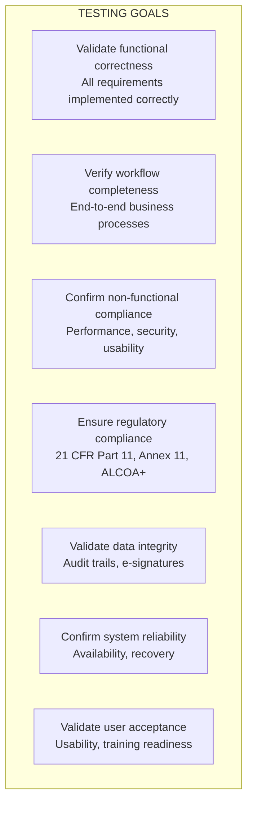

### 1.4 References

| Document | Reference |
|----------|-----------|
| 00_Project_Charter.md | Charter |
| 06_SRS.md | Software Requirements Specification |
| 07_NFR.md | Non-Functional Requirements |
| 16_TDD.md | Test Design and Development |
| 19_Coding Standards.md | Coding Standards |
| 21_Coding Roadmap.md | Coding Roadmap |
| IEEE Std 829-2008 | Software and System Test Documentation |
| ISO/IEC/IEEE 29119 | Software Testing |
| GAMP 5 | Good Automated Manufacturing Practice |

---

## 2. Test Strategy Overview

### 2.1 Testing Pyramid

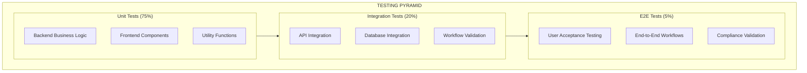

### 2.2 Testing Principles

| Principle | Description | Application |
|-----------|-------------|-------------|
| **Traceability** | Each test traces to a requirement | RTM maintained |
| **Automation First** | Automate where practical | Unit, integration, UI |
| **Risk-Based Testing** | Focus on critical areas | GMP-impacting features |
| **Continuous Testing** | Test early, test often | CI/CD pipeline |
| **Independent Testing** | Testers separate from developers | QA team involvement |
| **Shift-Left** | Find issues early | TDD approach |

### 2.3 Test Levels Overview

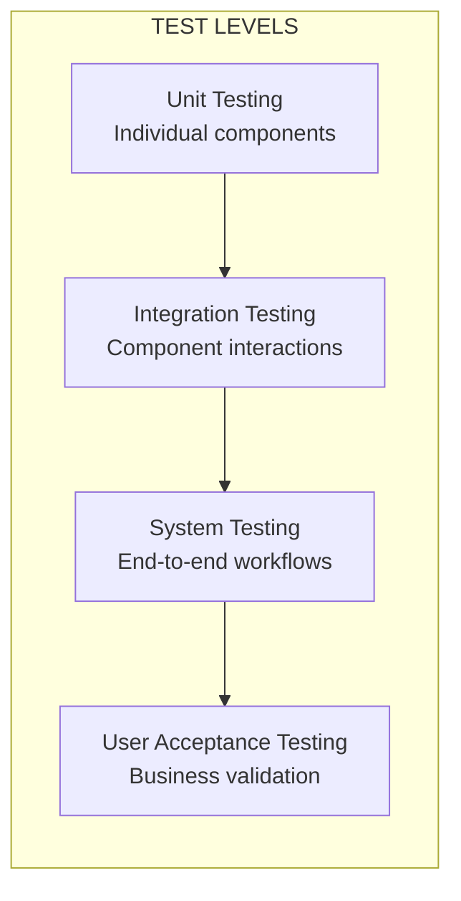

---

## 3. Test Levels

### 3.1 Unit Testing

| Attribute | Specification |
|-----------|---------------|
| **Scope** | Individual components, functions, classes |
| **Approach** | Automated with TDD |
| **Coverage Target** | ≥ 80% code coverage |
| **Responsible** | Developers |
| **Tools** | pytest (backend), Jest (frontend) |
| **When** | During development, in CI pipeline |

**Unit Test Focus Areas:**
- Model methods and properties
- Service layer business logic
- Validation functions (Zod, DRF serialisers)
- Utility functions
- Frontend component rendering and interactions

### 3.2 Integration Testing

| Attribute | Specification |
|-----------|---------------|
| **Scope** | Component interactions, APIs, database |
| **Approach** | Automated with API testing |
| **Responsible** | Developers + QA |
| **Tools** | pytest-django, DRF test client, Cypress |
| **When** | During development, in CI pipeline |

**Integration Test Focus Areas:**
- API endpoint correctness
- Database operations and integrity
- Authentication and authorisation flows
- Workflow transitions
- Audit trail creation
- Electronic signature recording

### 3.3 System Testing

| Attribute | Specification |
|-----------|---------------|
| **Scope** | End-to-end system behaviour |
| **Approach** | Manual + Automated |
| **Responsible** | QA Team |
| **Tools** | Cypress, manual testing |
| **When** | Before release, in staging environment |

**System Test Focus Areas:**
- End-to-end business workflows
- UI navigation and interaction
- Error handling and edge cases
- System-wide consistency
- Search, filter, pagination functionality
- Label printing

### 3.4 User Acceptance Testing (UAT)

| Attribute | Specification |
|-----------|---------------|
| **Scope** | Business user validation |
| **Approach** | Manual testing by business users |
| **Responsible** | Business Users + QA Support |
| **Tools** | Defined test scripts |
| **When** | Before production deployment |

**UAT Focus Areas:**
- End-to-end business workflows
- User interface usability
- Role-based access validation
- Business rule validation
- Report and label accuracy

---

## 4. Test Types

### 4.1 Functional Testing

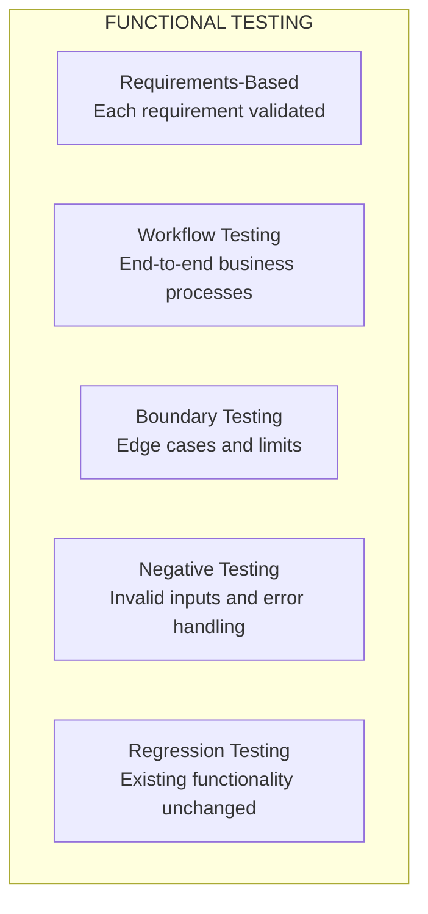

### 4.2 Non-Functional Testing

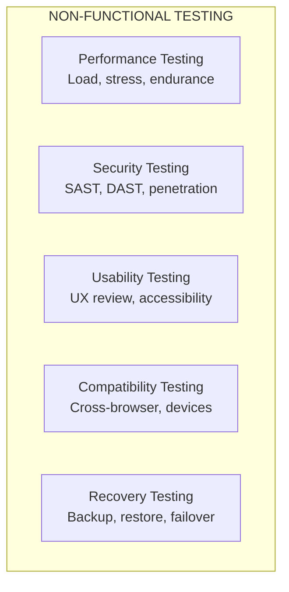

### 4.3 Compliance Testing

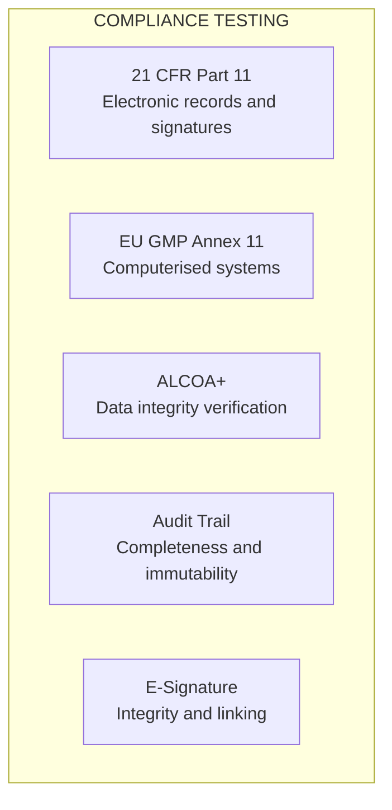

### 4.4 Performance Testing

| Scenario | Users | Duration | Key Metrics | Acceptable Threshold |
|----------|-------|----------|-------------|---------------------|
| **Normal Load** | 10 concurrent | 1 hour | Response time (95th) | < 500 ms |
| **Peak Load** | 50 concurrent | 30 minutes | Response time (95th) | < 1 s |
| **Stress** | 100 concurrent | 15 minutes | System stability | No crashes |
| **Endurance** | 20 concurrent | 4 hours | No degradation | Stable performance |

### 4.5 Security Testing

| Test Type | Tools | Frequency | Responsible |
|-----------|-------|-----------|-------------|
| **SAST** | Bandit, SonarQube | Every commit | Developers |
| **DAST** | OWASP ZAP | Weekly | Security Team |
| **Dependency Scanning** | Snyk, Dependabot | Every commit | Developers |
| **Penetration Testing** | Burp Suite | Quarterly | External |
| **Container Scanning** | Trivy | Every build | DevOps |

---

## 5. Test Environment

### 5.1 Environment Architecture

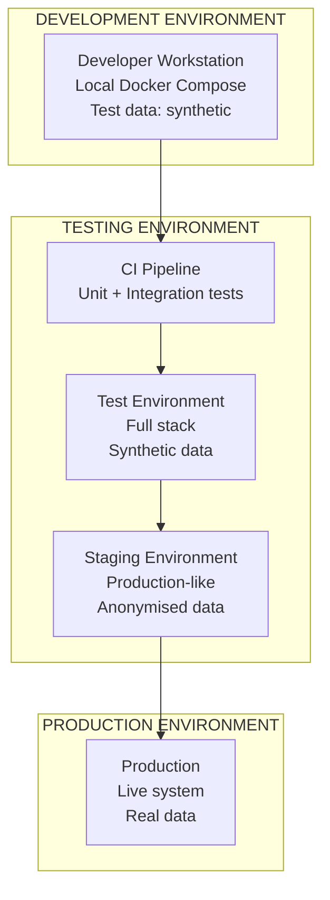

### 5.2 Environment Specifications

| Environment | Purpose | Configuration | Data | Access |
|-------------|---------|---------------|------|--------|
| **Development** | Developer testing | Docker Compose, debug | Synthetic | Dev Team |
| **CI** | Automated tests | Ephemeral containers | Synthetic | CI Pipeline |
| **Test** | QA system testing | Full stack, debug | Synthetic | QA Team |
| **Staging** | UAT, Performance | Production-like | Anonymised prod | QA + Business |
| **Production** | Live operation | Production config | Real data | Users |

### 5.3 Environment Configuration

| Component | Development | Test | Staging | Production |
|-----------|-------------|------|---------|------------|
| **Backend** | Django dev server | Django + Gunicorn | Gunicorn + Nginx | Gunicorn + Nginx |
| **Database** | PostgreSQL (local) | PostgreSQL | PostgreSQL (replica) | PostgreSQL (HA) |
| **Redis** | Local | Redis | Redis (cluster) | Redis (cluster) |
| **Frontend** | Vite dev server | Static build | Static build | Static build + CDN |

---

## 6. Test Data Strategy

### 6.1 Test Data Sources

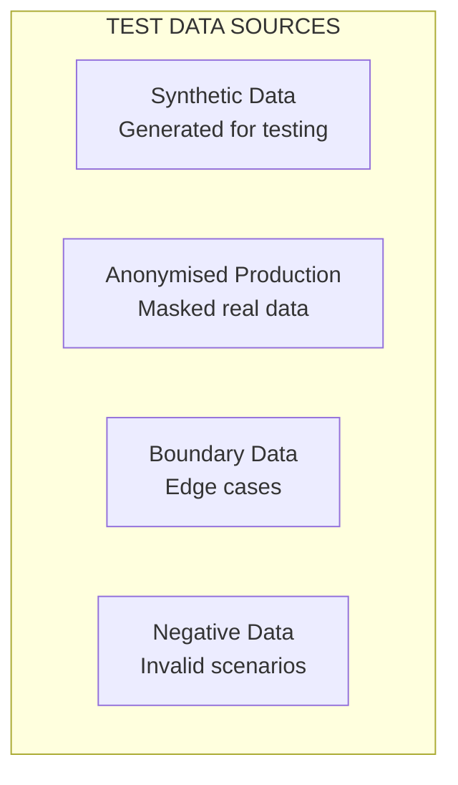

### 6.2 Test Data Sets

| Data Set | Purpose | Quantity | Source |
|----------|---------|----------|--------|
| **Master Data** | Reference lists | 50+ products, 20 suppliers | Synthetic |
| **Material Data** | RM registrations | 100+ materials | Synthetic |
| **Sample Data** | Sampling records | 50+ samples | Synthetic |
| **COA Data** | Certificate records | 30+ COAs | Synthetic |
| **User Data** | Employee accounts | 20+ users (all roles) | Synthetic |
| **Audit Data** | Historical audits | 500+ records | Synthetic |

### 6.3 Test Data Management

| Practice | Description |
|----------|-------------|
| **Data Generation** | Automated script for synthetic data |
| **Data Refresh** | Test database refreshed before test runs |
| **Data Isolation** | Each test run uses isolated data |
| **Data Cleanup** | Automated cleanup after tests |
| **Data Masking** | Anonymisation scripts for production data |

### 6.4 Test Data Script Example

```python
# scripts/test_data_generator.py
import random
from datetime import date, timedelta
from decimal import Decimal

from apps.materials.models import Material
from apps.users.models import Employee


def generate_test_data():
    """Generate test data for all modules."""
    
    # Create employees
    employees = []
    roles = ['storekeeper', 'sampler', 'analyst', 'qcmanager', 'admin']
    for role in roles:
        employee = Employee.objects.create(
            username=f"{role}1",
            password_hash="hashed_password",
            full_name=f"{role.title()} User",
            job_role=role,
            is_active=True
        )
        employees.append(employee)
    
    # Create materials
    material_names = ['Paracetamol', 'Ibuprofen', 'Amoxicillin', 'Metformin', 'Aspirin']
    suppliers = ['PharmaChem Ltd', 'BioSource Inc', 'EuroChem GmbH', 'AsiaMed Co.']
    
    for i in range(50):
        material = Material.objects.create(
            receipt_id=f"RCV-{date.today().year}-{i+1:04d}",
            material_name=random.choice(material_names),
            supplier=random.choice(suppliers),
            supplier_batch=f"BATCH-{i+1:04d}",
            exp_date=date.today() + timedelta(days=365),
            receipt_date=date.today(),
            received_by=employees[0].full_name,
            status=random.choice(['Quarantine', 'Released']),
            sampling_status=random.choice(['Not Sampled', 'Sampling Requested', 'Sampled']),
            created_by=employees[0],
            updated_by=employees[0]
        )
        material.save()
    
    print("Test data generated successfully!")
```

---

## 7. Defect Management

### 7.1 Defect Lifecycle

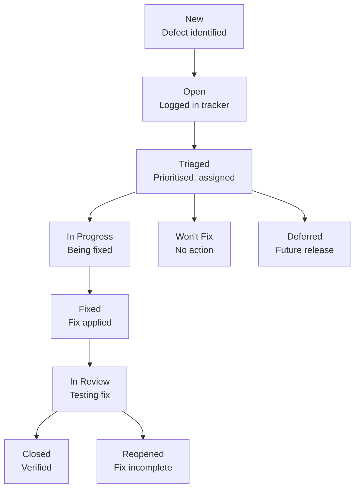

### 7.2 Defect Severity and Priority

| Severity | Description | Response | Example |
|----------|-------------|----------|---------|
| **Critical** | System unusable, data loss | Fix immediately | Login broken, data corruption |
| **High** | Major functionality broken | Fix within 24h | Material registration fails |
| **Medium** | Functionality impaired | Fix within sprint | UI display issue |
| **Low** | Minor issue | Fix when convenient | Typo, cosmetic issue |

### 7.3 Defect Tracking Tools

| Tool | Purpose |
|------|---------|
| **Jira** | Defect tracking, workflow, reporting |
| **GitHub Issues** | Code-related defects |
| **Sentry** | Production error tracking |
| **Datadog** | Performance and operational issues |

### 7.4 Defect Response Times

| Severity | Response Time | Fix Time | Escalation |
|----------|---------------|----------|------------|
| **Critical** | < 1 hour | < 4 hours | PM + Tech Lead |
| **High** | < 4 hours | < 24 hours | Tech Lead |
| **Medium** | < 24 hours | < 5 days | QA Lead |
| **Low** | < 5 days | < 10 days | Developer |

---

## 8. Test Automation

### 8.1 Automation Framework

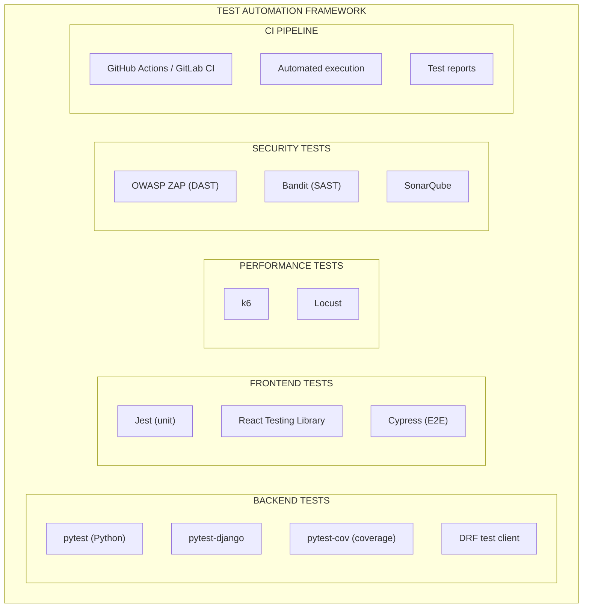

### 8.2 CI/CD Integration

```yaml
# .github/workflows/test.yml
name: Test Pipeline

on:
  push:
    branches: [main, develop]
  pull_request:

jobs:
  backend-tests:
    runs-on: ubuntu-latest
    services:
      postgres:
        image: postgres:15-alpine
        env:
          POSTGRES_DB: test_db
          POSTGRES_USER: test_user
          POSTGRES_PASSWORD: test_pass
        ports:
          - 5432:5432
      redis:
        image: redis:7-alpine
        ports:
          - 6379:6379
    steps:
      - uses: actions/checkout@v3
      - name: Setup Python
        uses: actions/setup-python@v4
        with:
          python-version: '3.11'
      - name: Install dependencies
        run: |
          pip install -r requirements/dev.txt
          pip install -r requirements/test.txt
      - name: Run migrations
        run: python manage.py migrate --settings=config.settings.testing
      - name: Run pytest
        run: pytest --cov=apps --cov-report=xml --cov-report=html
      - name: Upload coverage
        uses: codecov/codecov-action@v3
        with:
          file: ./coverage.xml
          flags: backend
          fail_ci_if_error: false

  frontend-tests:
    runs-on: ubuntu-latest
    steps:
      - uses: actions/checkout@v3
      - name: Setup Node
        uses: actions/setup-node@v3
        with:
          node-version: '18'
      - name: Install dependencies
        run: |
          cd rm-rrs-frontend
          pnpm install
      - name: Run Jest tests
        run: |
          cd rm-rrs-frontend
          pnpm test --coverage
      - name: Upload coverage
        uses: codecov/codecov-action@v3
        with:
          flags: frontend

  e2e-tests:
    runs-on: ubuntu-latest
    steps:
      - uses: actions/checkout@v3
      - name: Setup Node
        uses: actions/setup-node@v3
        with:
          node-version: '18'
      - name: Install dependencies
        run: |
          cd rm-rrs-frontend
          pnpm install
      - name: Run Cypress
        run: |
          cd rm-rrs-frontend
          pnpm cypress run

  security-scan:
    runs-on: ubuntu-latest
    steps:
      - uses: actions/checkout@v3
      - name: Run Trivy
        uses: aquasecurity/trivy-action@master
        with:
          scan-type: 'fs'
          scan-ref: '.'
          format: 'sarif'
          output: 'trivy-results.sarif'
      - name: Upload Trivy results
        uses: github/codeql-action/upload-sarif@v2
        with:
          sarif_file: 'trivy-results.sarif'
```

### 8.3 Test Automation Schedule

| Test Type | Trigger | Execution Time | Report |
|-----------|---------|----------------|--------|
| **Unit Tests** | Every commit | < 5 min | GitHub Actions |
| **Integration Tests** | Every PR | < 15 min | GitHub Actions |
| **UI Tests** | Every PR | < 15 min | GitHub Actions |
| **Security Tests** | Daily | < 30 min | Security Dashboard |
| **Performance Tests** | Weekly | < 1 hour | Performance Dashboard |

---

## 9. Test Schedule

### 9.1 Test Timeline

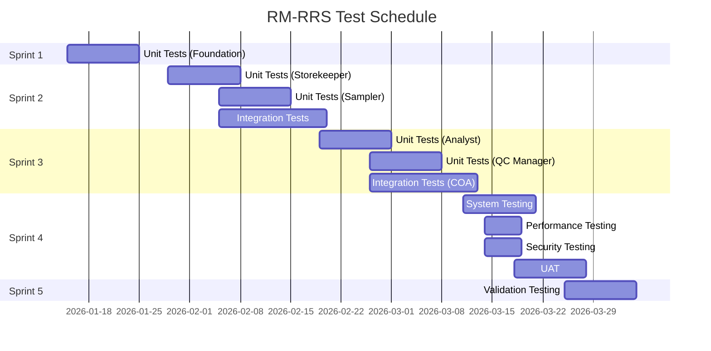

### 9.2 Test Milestones

| Milestone | Date | Deliverable | Responsible |
|-----------|------|-------------|-------------|
| **Unit Tests Complete** | 2026-03-10 | Test reports, coverage | Developers |
| **Integration Tests Complete** | 2026-03-10 | Integration test report | QA + Dev |
| **System Tests Complete** | 2026-03-24 | System test report | QA |
| **Performance Tests Complete** | 2026-03-18 | Performance report | QA + DevOps |
| **Security Tests Complete** | 2026-03-18 | Security assessment | Security |
| **UAT Complete** | 2026-03-27 | UAT sign-off | Business |
| **Validation Complete** | 2026-04-07 | Validation report | QA + Compliance |

### 9.3 Test Execution Phases

| Phase | Timing | Tests Executed | Responsible |
|-------|--------|----------------|-------------|
| **Phase 1: Unit Testing** | Ongoing (Sprints 1-3) | All unit tests | Developers |
| **Phase 2: Integration Testing** | Ongoing (Sprints 2-3) | API + integration tests | QA + Dev |
| **Phase 3: System Testing** | Sprint 4 | Full system tests | QA |
| **Phase 4: Performance Testing** | Sprint 4 | Performance suite | QA + DevOps |
| **Phase 5: Security Testing** | Sprint 4 | Security suite | Security |
| **Phase 6: UAT** | Sprint 4 | Business user tests | Business + QA |
| **Phase 7: Validation** | Sprint 5 | Compliance tests | QA + Compliance |

---

## 10. Appendices

### A. Test Environment Setup

```bash
# Setup test environment
docker-compose -f docker-compose.test.yml up -d

# Run migrations
python manage.py migrate --settings=config.settings.testing

# Load test data
python manage.py loaddata test_data.json

# Run tests
pytest --settings=config.settings.testing

# Generate coverage report
pytest --cov=apps --cov-report=html --settings=config.settings.testing
```

### B. Test Coverage Report Template

| Module | Lines | Covered | Coverage | Target |
|--------|-------|---------|----------|--------|
| apps/users | 500 | 460 | 92% | ≥80% |
| apps/materials | 400 | 370 | 93% | ≥80% |
| apps/packaging | 250 | 225 | 90% | ≥80% |
| apps/sampling | 350 | 315 | 90% | ≥80% |
| apps/products | 200 | 185 | 93% | ≥80% |
| apps/coa | 450 | 410 | 91% | ≥80% |
| apps/audit | 200 | 180 | 90% | ≥80% |
| apps/esignature | 150 | 140 | 93% | ≥80% |
| frontend/shared | 800 | 740 | 93% | ≥80% |
| frontend/storekeeper | 600 | 550 | 92% | ≥80% |
| frontend/sampler | 500 | 460 | 92% | ≥80% |
| frontend/analyst | 450 | 415 | 92% | ≥80% |
| frontend/qcmanager | 350 | 320 | 91% | ≥80% |
| frontend/admin | 250 | 230 | 92% | ≥80% |
| **Total** | **5,450** | **5,000** | **92%** | **≥80%** |

### C. Test Metrics Dashboard

| Metric | Target | Current | Status |
|--------|--------|---------|--------|
| Unit Test Coverage | ≥80% | 92% | ✅ |
| Integration Test Pass Rate | ≥95% | 97% | ✅ |
| Critical Defects | 0 | 0 | ✅ |
| High Defects | 0 | 2 | ⚠️ |
| Medium Defects | ≤10 | 7 | ✅ |
| Performance (95th) | <500ms | 320ms | ✅ |
| Security Vulnerabilities (Critical) | 0 | 0 | ✅ |
| UAT Sign-off | 100% | 100% | ✅ |

### D. Test Exit Criteria

| Criteria | Status |
|----------|--------|
| All planned test cases executed | ☐ |
| All critical and high defects resolved | ☐ |
| Test coverage ≥ 80% | ☐ |
| All end-to-end workflows tested and passing | ☐ |
| Performance tests passing | ☐ |
| Security tests passing | ☐ |
| Compliance tests passing | ☐ |
| UAT sign-off received | ☐ |
| Validation report approved | ☐ |

---

**Document Approval**

| Role | Name | Date |
|------|------|------|
| Author | [Name] | [Date] |
| Reviewer (QA Lead) | [Name] | [Date] |
| Reviewer (Tech Lead) | [Name] | [Date] |
| Approver | [Name] | [Date] |

---

**Change History**

| Version | Date | Author | Description |
|---------|------|--------|-------------|
| 1.0 | [Date] | [Author] | Initial baseline testing strategy and plan |

