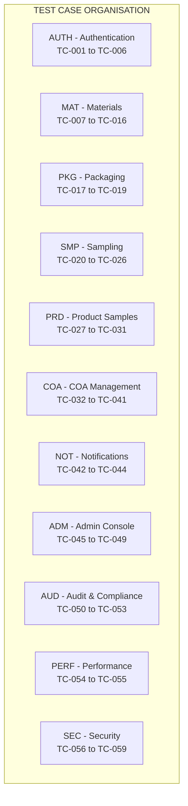
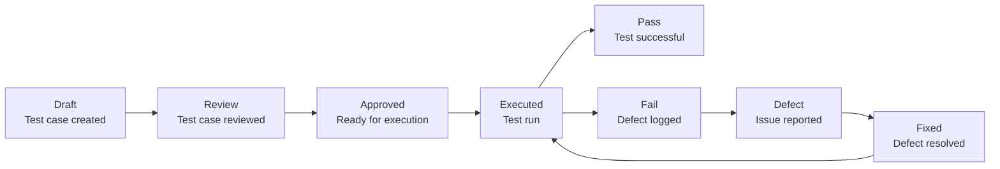
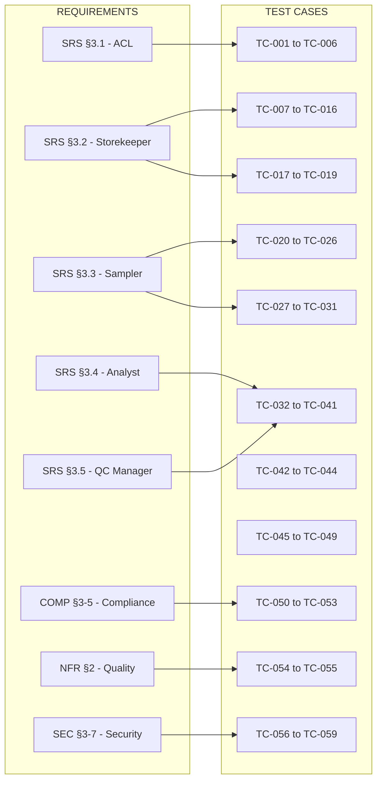
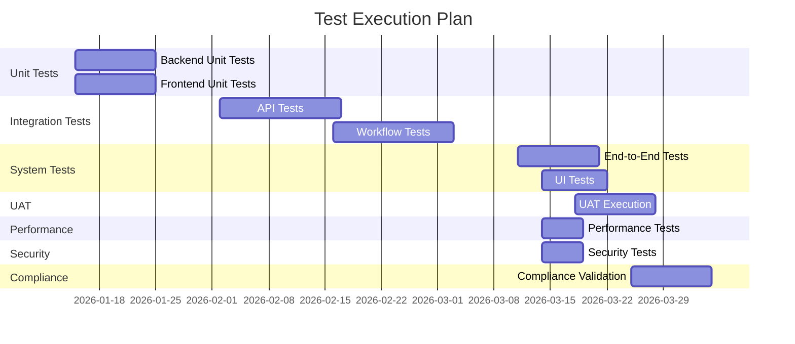
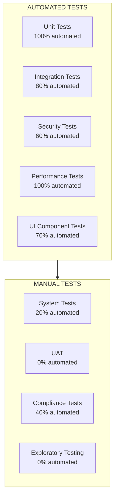

# 23 — Test Cases and Execution (RM-RRS-TEST-002)

**Document Identifier:** RM-RRS-TEST-002
**Version:** 1.0
**Status:** Baseline
**Traces to:** SRS, TDD, Testing Strategy (RM-RRS-TEST-001)
**Compliance Reference:** IEEE Std 829-2008, ISO/IEC/IEEE 29119, GAMP 5

---

## Table of Contents

1. [Introduction](#1-introduction)
2. [Test Case Management](#2-test-case-management)
3. [Test Case Inventory](#3-test-case-inventory)
4. [Detailed Test Cases](#4-detailed-test-cases)
5. [Test Execution](#5-test-execution)
6. [Test Automation Mapping](#6-test-automation-mapping)
7. [Appendices](#7-appendices)

---

## 1. Introduction

### 1.1 Purpose
This document provides the detailed **Test Cases and Execution** plan for the **Raw Material Receiving & Release System (RM-RRS)** . It contains all test case specifications, including preconditions, test steps, expected results, and postconditions. This document serves as the authoritative source for test execution activities.

### 1.2 Scope
This document covers all test cases for:
- **Unit Testing**: Individual components and functions
- **Integration Testing**: API endpoints and workflows
- **System Testing**: End-to-end business processes
- **User Acceptance Testing**: Business user validation
- **Performance Testing**: Load, stress, and endurance
- **Security Testing**: Vulnerability assessment
- **Compliance Testing**: 21 CFR Part 11, Annex 11, ALCOA+

### 1.3 Test Case Template

| Field | Description |
|-------|-------------|
| **Test Case ID** | Unique identifier (e.g., TC-001) |
| **Requirement** | Trace to SRS/BRD |
| **Title** | Brief description |
| **Priority** | High/Medium/Low |
| **Test Type** | Unit/Integration/System/UAT/Performance/Security/Compliance |
| **Preconditions** | Setup required |
| **Test Steps** | Sequential actions |
| **Expected Results** | Expected outcomes |
| **Postconditions** | State after test |
| **Pass/Fail Criteria** | How to assess |
| **Test Data** | Data required |

---

## 2. Test Case Management

### 2.1 Test Case Organisation



### 2.2 Test Case Prioritisation

| Priority | Definition | Count | Examples |
|----------|-------------|-------|----------|
| **Critical** | Must pass for compliance; core workflows | 15 | Login, Register Material, COA Approval |
| **High** | Essential features; major workflows | 25 | Sampling, Release, Notifications |
| **Medium** | Important but non-blocking | 12 | Search, Filters, History |
| **Low** | Nice-to-have; edge cases | 7 | Export, Advanced filtering |

### 2.3 Test Case Lifecycle



---

## 3. Test Case Inventory

### 3.1 Test Case Summary

| Module | Test Cases | Critical | High | Medium | Low | Automated |
|--------|------------|----------|------|--------|-----|-----------|
| Authentication | 6 | 3 | 2 | 1 | 0 | 6 |
| Materials | 10 | 4 | 4 | 1 | 1 | 8 |
| Packaging | 3 | 1 | 1 | 1 | 0 | 3 |
| Sampling | 7 | 3 | 3 | 1 | 0 | 5 |
| Product Samples | 5 | 1 | 2 | 2 | 0 | 4 |
| COA Management | 10 | 4 | 4 | 1 | 1 | 8 |
| Notifications | 3 | 1 | 1 | 1 | 0 | 3 |
| Admin Console | 5 | 2 | 2 | 1 | 0 | 4 |
| Audit & Compliance | 4 | 4 | 0 | 0 | 0 | 2 |
| Performance | 2 | 0 | 0 | 2 | 0 | 2 |
| Security | 4 | 2 | 2 | 0 | 0 | 2 |
| **Total** | **59** | **25** | **21** | **11** | **2** | **47** |

### 3.2 Test Case Traceability Matrix



---

## 4. Detailed Test Cases

### 4.1 Authentication Module

#### TC-001: Login with Valid Credentials

| Field | Detail |
|-------|--------|
| **Test Case ID** | TC-001 |
| **Requirement** | SRS FR-ACL-001 |
| **Title** | Login with valid credentials |
| **Priority** | Critical |
| **Test Type** | Unit/Integration |
| **Preconditions** | Employee exists with valid credentials |
| **Test Steps** | 1. Navigate to login page<br/>2. Enter valid username<br/>3. Enter valid password<br/>4. Click Login |
| **Expected Results** | JWT tokens generated<br/>User redirected to role dashboard<br/>HTTP-only cookies set |
| **Postconditions** | User is authenticated and session active |
| **Pass/Fail Criteria** | Dashboard loads; user sees role-specific content |
| **Test Data** | username: storekeeper1, password: TestPass123! |

**Automation Script:**

```python
# tests/api/test_auth.py
def test_login_success(client):
    """Test successful login."""
    response = client.post('/api/v1/auth/login/', {
        'username': 'storekeeper1',
        'password': 'TestPass123!'
    })
    
    assert response.status_code == 200
    assert 'access_token' in response.cookies
    assert response.data['data']['user']['job_role'] == 'storekeeper'
```

#### TC-002: Login with Invalid Credentials

| Field | Detail |
|-------|--------|
| **Test Case ID** | TC-002 |
| **Requirement** | SRS FR-ACL-001 |
| **Title** | Login with invalid credentials |
| **Priority** | Critical |
| **Test Type** | Unit/Integration |
| **Preconditions** | Login page is accessible |
| **Test Steps** | 1. Navigate to login page<br/>2. Enter invalid username<br/>3. Enter invalid password<br/>4. Click Login |
| **Expected Results** | Error message displayed<br/>No tokens generated<br/>No session created |
| **Postconditions** | User remains unauthenticated |
| **Pass/Fail Criteria** | Error message shown; no access granted |
| **Test Data** | username: invalid, password: invalid123 |

**Automation Script:**

```python
def test_login_invalid_credentials(client):
    """Test login with invalid credentials."""
    response = client.post('/api/v1/auth/login/', {
        'username': 'invalid',
        'password': 'invalid123'
    })
    
    assert response.status_code == 401
    assert response.data['errors'][0]['code'] == 'INVALID_CREDENTIALS'
```

#### TC-003: Role-Based Routing After Login

| Field | Detail |
|-------|--------|
| **Test Case ID** | TC-003 |
| **Requirement** | SRS FR-ACL-002 |
| **Title** | Role-based routing after login |
| **Priority** | Critical |
| **Test Type** | Integration |
| **Preconditions** | Employees exist for all roles |
| **Test Steps** | 1. Login as Storekeeper<br/>2. Check redirected URL<br/>3. Login as Sampler<br/>4. Check redirected URL<br/>5. Login as Analyst<br/>6. Check redirected URL<br/>7. Login as QC Manager<br/>8. Check redirected URL |
| **Expected Results** | Storekeeper → /storekeeper<br/>Sampler → /sampler<br/>Analyst → /analyst<br/>QC Manager → /qcmanager |
| **Postconditions** | User on correct dashboard |
| **Pass/Fail Criteria** | All redirects correct |
| **Test Data** | Employees for all roles |

**Automation Script:**

```python
def test_role_based_routing(client):
    """Test role-based routing after login."""
    roles = ['storekeeper', 'sampler', 'analyst', 'qcmanager']
    
    for role in roles:
        response = client.post('/api/v1/auth/login/', {
            'username': f'{role}1',
            'password': 'TestPass123!'
        })
        assert response.status_code == 200
        # Check redirect URL is set correctly
        assert response.data['data']['user']['job_role'] == role
```

#### TC-004: Session Timeout

| Field | Detail |
|-------|--------|
| **Test Case ID** | TC-004 |
| **Requirement** | NFR-SEC-003 |
| **Title** | Session timeout |
| **Priority** | High |
| **Test Type** | System |
| **Preconditions** | User logged in with session |
| **Test Steps** | 1. Login as any user<br/>2. Wait for 30 minutes of inactivity<br/>3. Attempt to access a protected resource |
| **Expected Results** | Access denied; redirected to login |
| **Postconditions** | Session terminated |
| **Pass/Fail Criteria** | User required to login again |
| **Test Data** | Valid user credentials |

#### TC-005: Token Refresh

| Field | Detail |
|-------|--------|
| **Test Case ID** | TC-005 |
| **Requirement** | SRS FR-ACL-001 |
| **Title** | Token refresh |
| **Priority** | High |
| **Test Type** | Integration |
| **Preconditions** | User logged in with valid session |
| **Test Steps** | 1. Login to get tokens<br/>2. Wait for access token to expire<br/>3. Call /auth/refresh/<br/>4. Attempt to access protected resource |
| **Expected Results** | New access token generated<br/>Protected resource accessible |
| **Postconditions** | Session continues with new token |
| **Pass/Fail Criteria** | Token refreshed; access restored |

**Automation Script:**

```python
def test_token_refresh(client):
    """Test token refresh functionality."""
    # Login
    login_response = client.post('/api/v1/auth/login/', {
        'username': 'storekeeper1',
        'password': 'TestPass123!'
    })
    assert login_response.status_code == 200
    
    # Force token expiration by modifying in test
    # (In practice, use time mocking or direct expiry)
    
    # Refresh
    refresh_response = client.post('/api/v1/auth/refresh/')
    assert refresh_response.status_code == 200
    
    # Access protected resource
    materials_response = client.get('/api/v1/materials/')
    assert materials_response.status_code == 200
```

#### TC-006: Permission Denied (Forbidden Access)

| Field | Detail |
|-------|--------|
| **Test Case ID** | TC-006 |
| **Requirement** | SRS FR-ACL-003 |
| **Title** | Permission denied for unauthorised access |
| **Priority** | Critical |
| **Test Type** | Integration |
| **Preconditions** | User logged in as Sampler |
| **Test Steps** | 1. Login as Sampler<br/>2. Attempt to access /api/v1/materials/ POST endpoint<br/>3. Attempt to access /api/v1/coas/ approve endpoint |
| **Expected Results** | HTTP 403 Forbidden for unauthorised actions |
| **Postconditions** | No changes made |
| **Pass/Fail Criteria** | 403 status returned for all unauthorised actions |
| **Test Data** | Sampler user credentials |

**Automation Script:**

```python
def test_permission_denied(client):
    """Test permission enforcement."""
    # Login as Sampler
    client.post('/api/v1/auth/login/', {
        'username': 'sampler1',
        'password': 'TestPass123!'
    })
    
    # Attempt to create material (should be forbidden)
    response = client.post('/api/v1/materials/', {
        'material_name': 'Test Material'
    })
    assert response.status_code == 403
    
    # Attempt to approve COA (should be forbidden)
    response = client.post('/api/v1/coas/COA-2026-0001/approve/')
    assert response.status_code == 403
```

---

### 4.2 Materials Module

#### TC-007: Register Material with Valid Data

| Field | Detail |
|-------|--------|
| **Test Case ID** | TC-007 |
| **Requirement** | SRS FR-SK-001 |
| **Title** | Register material with valid data |
| **Priority** | Critical |
| **Test Type** | Integration |
| **Preconditions** | Storekeeper is authenticated |
| **Test Steps** | 1. Navigate to Materials tab<br/>2. Click "Register Material"<br/>3. Fill all required fields with valid data<br/>4. Click "Register Material" |
| **Expected Results** | Material created with receipt ID (RCV-YYYY-####)<br/>Status = Quarantine<br/>Sampling Status = Not Sampled<br/>Success message displayed |
| **Postconditions** | Material appears in Materials table |
| **Pass/Fail Criteria** | All fields populated correctly; statuses set correctly |
| **Test Data** | material_name: "Paracetamol", supplier: "PharmaChem Ltd", supplier_batch: "BATCH-2024-001", exp_date: "2027-01-15", receipt_date: "2026-01-15", received_by: "John Storekeeper" |

**Automation Script:**

```python
# tests/integration/test_materials.py
def test_register_material_success(client):
    """Test successful material registration."""
    # Login as Storekeeper
    client.post('/api/v1/auth/login/', {
        'username': 'storekeeper1',
        'password': 'TestPass123!'
    })
    
    response = client.post('/api/v1/materials/', {
        'material_name': 'Paracetamol',
        'supplier': 'PharmaChem Ltd',
        'supplier_batch': 'BATCH-2024-001',
        'exp_date': '2027-01-15',
        'receipt_date': '2026-01-15',
        'received_by': 'John Storekeeper'
    })
    
    assert response.status_code == 201
    assert response.data['data']['receipt_id'].startswith('RCV-2026-')
    assert response.data['data']['status'] == 'Quarantine'
    assert response.data['data']['sampling_status'] == 'Not Sampled'
```

#### TC-008: Register Material with Missing Required Fields

| Field | Detail |
|-------|--------|
| **Test Case ID** | TC-008 |
| **Requirement** | SRS FR-SK-001 |
| **Title** | Register material with missing required fields |
| **Priority** | High |
| **Test Type** | Integration |
| **Preconditions** | Storekeeper is authenticated |
| **Test Steps** | 1. Navigate to Materials tab<br/>2. Click "Register Material"<br/>3. Leave "Material Name" blank<br/>4. Fill other fields<br/>5. Click "Register Material" |
| **Expected Results** | Validation error displayed<br/>Material not created |
| **Postconditions** | No material created |
| **Pass/Fail Criteria** | Error message shown for required field |
| **Test Data** | Missing material_name |

**Automation Script:**

```python
def test_register_material_missing_field(client):
    """Test material registration with missing required field."""
    client.post('/api/v1/auth/login/', {
        'username': 'storekeeper1',
        'password': 'TestPass123!'
    })
    
    response = client.post('/api/v1/materials/', {
        'material_name': '',  # Missing
        'supplier': 'PharmaChem Ltd',
        'supplier_batch': 'BATCH-2024-001',
        'exp_date': '2027-01-15',
        'receipt_date': '2026-01-15',
        'received_by': 'John Storekeeper'
    })
    
    assert response.status_code == 400
    assert response.data['errors'][0]['field'] == 'material_name'
```

#### TC-009: View Materials Table

| Field | Detail |
|-------|--------|
| **Test Case ID** | TC-009 |
| **Requirement** | SRS FR-SK-003 |
| **Title** | View materials table |
| **Priority** | High |
| **Test Type** | Integration |
| **Preconditions** | Storekeeper is authenticated; materials exist |
| **Test Steps** | 1. Login as Storekeeper<br/>2. Navigate to Materials tab<br/>3. View the materials table |
| **Expected Results** | Table displays all materials<br/>Columns: Receipt ID, Material Name, Supplier Batch, Receiving Date, Total Qty, Status, Sampling Status, Expire Date, Actions |
| **Postconditions** | Table data rendered |
| **Pass/Fail Criteria** | All columns present; data correct |
| **Test Data** | Multiple material records |

#### TC-010: Search Materials

| Field | Detail |
|-------|--------|
| **Test Case ID** | TC-010 |
| **Requirement** | SRS FR-SK-003 |
| **Title** | Search materials |
| **Priority** | Medium |
| **Test Type** | Integration |
| **Preconditions** | Storekeeper is authenticated; materials exist |
| **Test Steps** | 1. Login as Storekeeper<br/>2. Navigate to Materials tab<br/>3. Enter search term in search box<br/>4. Press Enter |
| **Expected Results** | Table filters to show only matching materials |
| **Postconditions** | Filtered results displayed |
| **Pass/Fail Criteria** | Only matching materials shown |
| **Test Data** | Search term: "Paracetamol" |

#### TC-011: Filter Materials by Status

| Field | Detail |
|-------|--------|
| **Test Case ID** | TC-011 |
| **Requirement** | SRS FR-SK-003 |
| **Title** | Filter materials by status |
| **Priority** | Medium |
| **Test Type** | Integration |
| **Preconditions** | Storekeeper is authenticated; materials with different statuses |
| **Test Steps** | 1. Login as Storekeeper<br/>2. Navigate to Materials tab<br/>3. Select "Quarantine" from status filter<br/>4. View results |
| **Expected Results** | Only materials with Quarantine status displayed |
| **Postconditions** | Filtered results displayed |
| **Pass/Fail Criteria** | Only Quarantine materials shown |

#### TC-012: View Material Detail

| Field | Detail |
|-------|--------|
| **Test Case ID** | TC-012 |
| **Requirement** | SRS FR-SK-003 |
| **Title** | View material detail |
| **Priority** | High |
| **Test Type** | Integration |
| **Preconditions** | Storekeeper is authenticated; material exists |
| **Test Steps** | 1. Login as Storekeeper<br/>2. Navigate to Materials tab<br/>3. Click "View" on a material row |
| **Expected Results** | Material detail modal opens<br/>All material data displayed |
| **Postconditions** | Modal visible with material data |
| **Pass/Fail Criteria** | All fields displayed correctly |
| **Test Data** | Existing material ID |

#### TC-013: Request Sampling

| Field | Detail |
|-------|--------|
| **Test Case ID** | TC-013 |
| **Requirement** | SRS FR-SK-005 |
| **Title** | Request sampling |
| **Priority** | Critical |
| **Test Type** | Integration |
| **Preconditions** | Material exists with samplingStatus = Not Sampled |
| **Test Steps** | 1. Login as Storekeeper<br/>2. Navigate to Materials tab<br/>3. Find material with Not Sampled status<br/>4. Click "View"<br/>5. Click "Request Sampling"<br/>6. Confirm in dialog |
| **Expected Results** | samplingStatus = Sampling Requested<br/>Success message displayed |
| **Postconditions** | Material appears in Sampler's pending queue |
| **Pass/Fail Criteria** | Status updated correctly |
| **Test Data** | Material with samplingStatus = Not Sampled |

**Automation Script:**

```python
def test_request_sampling(client):
    """Test sampling request."""
    client.post('/api/v1/auth/login/', {
        'username': 'storekeeper1',
        'password': 'TestPass123!'
    })
    
    # Create material first
    material = create_test_material()
    
    response = client.post(f'/api/v1/materials/{material.id}/request-sampling/')
    
    assert response.status_code == 200
    assert response.data['data']['sampling_status'] == 'Sampling Requested'
```

#### TC-014: Request Sampling Already Requested

| Field | Detail |
|-------|--------|
| **Test Case ID** | TC-014 |
| **Requirement** | SRS FR-SK-005 |
| **Title** | Request sampling when already requested |
| **Priority** | Medium |
| **Test Type** | Integration |
| **Preconditions** | Material exists with samplingStatus = Sampling Requested |
| **Test Steps** | 1. Login as Storekeeper<br/>2. Navigate to Materials tab<br/>3. Find material with Sampling Requested status<br/>4. Click "View"<br/>5. Click "Request Sampling" (if visible) |
| **Expected Results** | Error message displayed<br/>samplingStatus unchanged |
| **Postconditions** | No change to sampling status |
| **Pass/Fail Criteria** | Error shown; status unchanged |
| **Test Data** | Material with samplingStatus = Sampling Requested |

#### TC-015: Release Label for Released Material

| Field | Detail |
|-------|--------|
| **Test Case ID** | TC-015 |
| **Requirement** | SRS FR-SK-008 |
| **Title** | Release label for released material |
| **Priority** | High |
| **Test Type** | System |
| **Preconditions** | Material exists with status = Released |
| **Test Steps** | 1. Login as Storekeeper<br/>2. Navigate to Materials tab<br/>3. Find released material<br/>4. Click "Label" button |
| **Expected Results** | Label preview opens<br/>All label fields populated |
| **Postconditions** | Label preview displayed |
| **Pass/Fail Criteria** | All fields correct: Receipt ID, Material Name, Batch No., QC Number, etc. |
| **Test Data** | Material with status = Released |

#### TC-016: Release Label for Non-Released Material

| Field | Detail |
|-------|--------|
| **Test Case ID** | TC-016 |
| **Requirement** | SRS FR-SK-008 |
| **Title** | Release label for non-released material |
| **Priority** | Low |
| **Test Type** | System |
| **Preconditions** | Material exists with status = Quarantine |
| **Test Steps** | 1. Login as Storekeeper<br/>2. Navigate to Materials tab<br/>3. Find quarantined material<br/>4. Check if "Label" button is present |
| **Expected Results** | "Label" button is not displayed or is disabled |
| **Postconditions** | No label access |
| **Pass/Fail Criteria** | Label not accessible for non-released material |
| **Test Data** | Material with status = Quarantine |

---

### 4.3 Packaging Module

#### TC-017: Register Packaging with Valid Data

| Field | Detail |
|-------|--------|
| **Test Case ID** | TC-017 |
| **Requirement** | SRS FR-SK-002 |
| **Title** | Register packaging with valid data |
| **Priority** | High |
| **Test Type** | Integration |
| **Preconditions** | Storekeeper is authenticated |
| **Test Steps** | 1. Login as Storekeeper<br/>2. Navigate to Packaging tab<br/>3. Click "Register Packaging"<br/>4. Fill required fields<br/>5. Click "Register Packaging" |
| **Expected Results** | Packaging created with PKG-YYYY-#### ID |
| **Postconditions** | Packaging appears in Packaging table |
| **Pass/Fail Criteria** | Creation successful |
| **Test Data** | name: "Aluminium Blister Foil", type: "Primary", qty: 500, supplier: "PackCo Inc", receipt_date: "2026-01-15", recipient: "John Storekeeper" |

**Automation Script:**

```python
def test_register_packaging_success(client):
    """Test successful packaging registration."""
    client.post('/api/v1/auth/login/', {
        'username': 'storekeeper1',
        'password': 'TestPass123!'
    })
    
    response = client.post('/api/v1/packaging/', {
        'name': 'Aluminium Blister Foil',
        'type': 'Primary',
        'qty': '500.00',
        'supplier': 'PackCo Inc',
        'receipt_date': '2026-01-15',
        'recipient': 'John Storekeeper'
    })
    
    assert response.status_code == 201
    assert response.data['data']['receipt_id'].startswith('PKG-2026-')
    assert response.data['data']['sampling_status'] == 'Not Sampled'
```

#### TC-018: View Packaging Table

| Field | Detail |
|-------|--------|
| **Test Case ID** | TC-018 |
| **Requirement** | SRS FR-SK-004 |
| **Title** | View packaging table |
| **Priority** | High |
| **Test Type** | Integration |
| **Preconditions** | Storekeeper is authenticated; packaging exists |
| **Test Steps** | 1. Login as Storekeeper<br/>2. Navigate to Packaging tab<br/>3. View the packaging table |
| **Expected Results** | Table displays all packaging<br/>Columns: Receipt ID, Name, Type, Description, Qty, Unit, Supplier, Receipt Date, Recipient, Warehouse, Sampling Status, Actions |
| **Postconditions** | Table rendered |
| **Pass/Fail Criteria** | All columns present |

#### TC-019: Request Sampling on Packaging

| Field | Detail |
|-------|--------|
| **Test Case ID** | TC-019 |
| **Requirement** | SRS FR-SK-006 |
| **Title** | Request sampling on packaging |
| **Priority** | High |
| **Test Type** | Integration |
| **Preconditions** | Packaging exists with samplingStatus = Not Sampled |
| **Test Steps** | 1. Login as Storekeeper<br/>2. Navigate to Packaging tab<br/>3. Click "Request Sampling" on a packaging row |
| **Expected Results** | samplingStatus = Sampling Requested<br/>Packaging sample created |
| **Postconditions** | Packaging appears in Sampler's queue |
| **Pass/Fail Criteria** | Status updated; sample created |
| **Test Data** | Packaging with samplingStatus = Not Sampled |

---

### 4.4 Sampling Module

#### TC-020: View Sampling Requests

| Field | Detail |
|-------|--------|
| **Test Case ID** | TC-020 |
| **Requirement** | SRS FR-SM-001 |
| **Title** | View sampling requests |
| **Priority** | High |
| **Test Type** | Integration |
| **Preconditions** | Sampler is authenticated; materials with Sampling Requested status |
| **Test Steps** | 1. Login as Sampler<br/>2. Navigate to Sampling Requests tab<br/>3. View the pending requests |
| **Expected Results** | Pending counter shows correct count<br/>Table displays all pending requests |
| **Postconditions** | Requests displayed |
| **Pass/Fail Criteria** | Correct pending count; all requests shown |
| **Test Data** | Materials with Sampling Requested status |

**Automation Script:**

```python
def test_view_sampling_requests(client):
    """Test viewing sampling requests."""
    client.post('/api/v1/auth/login/', {
        'username': 'sampler1',
        'password': 'TestPass123!'
    })
    
    response = client.get('/api/v1/samples/requests/')
    
    assert response.status_code == 200
    assert 'data' in response.data
    assert response.data['meta']['total'] >= 0
```

#### TC-021: Record Sample with Valid Data

| Field | Detail |
|-------|--------|
| **Test Case ID** | TC-021 |
| **Requirement** | SRS FR-SM-002 |
| **Title** | Record sample with valid data |
| **Priority** | Critical |
| **Test Type** | Integration |
| **Preconditions** | Material exists with samplingStatus = Sampling Requested |
| **Test Steps** | 1. Login as Sampler<br/>2. Navigate to Sampling Requests tab<br/>3. Click "Sample" on a pending request<br/>4. Enter sample_size: 200, containers: 3, sampler: "John Smith", storage: "Ambient", sampling_date: "2026-01-15"<br/>5. Click "Save & Preview Labels" |
| **Expected Results** | Sample created<br/>samplingStatus = Sampled<br/>Sample has testingStatus = Not Tested<br/>Label preview opens |
| **Postconditions** | Sample appears in Analyst worklist |
| **Pass/Fail Criteria** | Sample created; labels previewed |
| **Test Data** | Material with samplingStatus = Sampling Requested |

**Automation Script:**

```python
def test_record_sample(client):
    """Test recording a sample."""
    client.post('/api/v1/auth/login/', {
        'username': 'sampler1',
        'password': 'TestPass123!'
    })
    
    # Create material with Sampling Requested status
    material = create_test_material_with_requested_sampling()
    
    response = client.post('/api/v1/samples/', {
        'material_id': material.id,
        'sample_size': '200.00',
        'containers': 3,
        'sampler': 'John Smith',
        'storage': 'Ambient (15–25°C)',
        'sampling_date': '2026-01-15'
    })
    
    assert response.status_code == 201
    assert response.data['data']['testing_status'] == 'Not Tested'
    
    # Verify material status updated
    material.refresh_from_db()
    assert material.sampling_status == 'Sampled'
```

#### TC-022: Record Sample with Missing Required Fields

| Field | Detail |
|-------|--------|
| **Test Case ID** | TC-022 |
| **Requirement** | SRS FR-SM-002 |
| **Title** | Record sample with missing required fields |
| **Priority** | High |
| **Test Type** | Integration |
| **Preconditions** | Material exists with samplingStatus = Sampling Requested |
| **Test Steps** | 1. Login as Sampler<br/>2. Navigate to Sampling Requests tab<br/>3. Click "Sample" on a pending request<br/>4. Leave "Sample Size" blank<br/>5. Fill other fields<br/>6. Click "Save & Preview Labels" |
| **Expected Results** | Validation error displayed<br/>Sample not created |
| **Postconditions** | No sample created |
| **Pass/Fail Criteria** | Error shown; no sample created |
| **Test Data** | Missing sample_size |

#### TC-023: Label Preview After Sampling

| Field | Detail |
|-------|--------|
| **Test Case ID** | TC-023 |
| **Requirement** | SRS FR-SM-003 |
| **Title** | Label preview after sampling |
| **Priority** | High |
| **Test Type** | System |
| **Preconditions** | Sample just recorded |
| **Test Steps** | 1. Record a sample as in TC-021<br/>2. Label preview opens automatically |
| **Expected Results** | Two labels displayed: QC Sample Label (green) and Sampled Container Label (blue)<br/>All sample data present |
| **Postconditions** | Labels visible |
| **Pass/Fail Criteria** | Both labels show correct data |
| **Test Data** | Sample data from TC-021 |

#### TC-024: Print Labels

| Field | Detail |
|-------|--------|
| **Test Case ID** | TC-024 |
| **Requirement** | SRS FR-SM-003 |
| **Title** | Print labels |
| **Priority** | Medium |
| **Test Type** | System |
| **Preconditions** | Label preview is open |
| **Test Steps** | 1. In label preview, click "Print Labels" |
| **Expected Results** | Print dialog opens<br/>Labels formatted for printing |
| **Postconditions** | Print dialog displayed |
| **Pass/Fail Criteria** | Print dialog opens with correct content |
| **Test Data** | Sample data from TC-021 |

#### TC-025: View Sample History

| Field | Detail |
|-------|--------|
| **Test Case ID** | TC-025 |
| **Requirement** | SRS FR-SM-004 |
| **Title** | View sample history |
| **Priority** | High |
| **Test Type** | Integration |
| **Preconditions** | Sampler is authenticated; samples exist |
| **Test Steps** | 1. Login as Sampler<br/>2. Navigate to Sample History tab<br/>3. View the history table |
| **Expected Results** | Table displays all samples<br/>Columns: Sample ID, Material Name, Receipt ID, Supplier Batch, Sample Size, Containers, Sampler, Sampling Date, Storage Condition, Actions |
| **Postconditions** | History displayed |
| **Pass/Fail Criteria** | All samples shown; data correct |
| **Test Data** | Existing sample records |

#### TC-026: Reprint Labels from History

| Field | Detail |
|-------|--------|
| **Test Case ID** | TC-026 |
| **Requirement** | SRS FR-SM-004 |
| **Title** | Reprint labels from history |
| **Priority** | Medium |
| **Test Type** | System |
| **Preconditions** | Sample history contains a sample |
| **Test Steps** | 1. Login as Sampler<br/>2. Navigate to Sample History tab<br/>3. Click "Print Labels" on a sample row |
| **Expected Results** | Label preview opens with correct sample data |
| **Postconditions** | Labels displayed |
| **Pass/Fail Criteria** | Labels match the original sample data |
| **Test Data** | Existing sample ID |

---

### 4.5 Product Samples Module

#### TC-027: Register Finished Product Sample

| Field | Detail |
|-------|--------|
| **Test Case ID** | TC-027 |
| **Requirement** | SRS FR-SM-005 |
| **Title** | Register Finished Product sample |
| **Priority** | High |
| **Test Type** | Integration |
| **Preconditions** | Sampler is authenticated |
| **Test Steps** | 1. Login as Sampler<br/>2. Navigate to Product Samples tab<br/>3. Click "Finished Product"<br/>4. Fill required fields<br/>5. Click "Register Sample" |
| **Expected Results** | Sample created with FP-YYYY-#### ID |
| **Postconditions** | Sample appears in Product History and Analyst worklist |
| **Pass/Fail Criteria** | Sample created; ID format correct |
| **Test Data** | product_name: "Paracetamol 500mg Tablet", batch_no: "BN-2026-001", batch_size: 100000, sample_size: 50, sampling_date: "2026-01-15", time_of_sampling: "10:30:00" |

**Automation Script:**

```python
def test_register_finished_product_sample(client):
    """Test registering a Finished Product sample."""
    client.post('/api/v1/auth/login/', {
        'username': 'sampler1',
        'password': 'TestPass123!'
    })
    
    response = client.post('/api/v1/product-samples/', {
        'product_name': 'Paracetamol 500mg Tablet',
        'product_type': 'Finished Product',
        'batch_no': 'BN-2026-001',
        'batch_size': '100000.00',
        'sample_size': '50.00',
        'time_of_sampling': '10:30:00',
        'sampling_date': '2026-01-15'
    })
    
    assert response.status_code == 201
    assert response.data['data']['sample_id'].startswith('FP-2026-')
    assert response.data['data']['testing_status'] == 'Not Tested'
```

#### TC-028: Register Semi-Finished Product Sample

| Field | Detail |
|-------|--------|
| **Test Case ID** | TC-028 |
| **Requirement** | SRS FR-SM-005 |
| **Title** | Register Semi-Finished Product sample |
| **Priority** | High |
| **Test Type** | Integration |
| **Preconditions** | Sampler is authenticated |
| **Test Steps** | 1. Login as Sampler<br/>2. Navigate to Product Samples tab<br/>3. Click "Semi-Finished Product"<br/>4. Fill required fields<br/>5. Click "Register Sample" |
| **Expected Results** | Sample created with SFP-YYYY-#### ID |
| **Postconditions** | Sample appears in Product History |
| **Pass/Fail Criteria** | Sample created; ID format correct |
| **Test Data** | product_name: "Paracetamol Granules", batch_no: "BN-2026-002", batch_size: 50000, sample_size: 30, sampling_date: "2026-01-15", time_of_sampling: "11:00:00" |

#### TC-029: Register Bulk Sample

| Field | Detail |
|-------|--------|
| **Test Case ID** | TC-029 |
| **Requirement** | SRS FR-SM-005 |
| **Title** | Register Bulk sample |
| **Priority** | High |
| **Test Type** | Integration |
| **Preconditions** | Sampler is authenticated |
| **Test Steps** | 1. Login as Sampler<br/>2. Navigate to Product Samples tab<br/>3. Click "Bulk"<br/>4. Fill required fields<br/>5. Click "Register Sample" |
| **Expected Results** | Sample created with BLK-YYYY-#### ID |
| **Postconditions** | Sample appears in Product History |
| **Pass/Fail Criteria** | Sample created; ID format correct |
| **Test Data** | product_name: "Paracetamol API", batch_no: "BN-2026-003", batch_size: 200000, sample_size: 100, sampling_date: "2026-01-15", time_of_sampling: "09:30:00" |

#### TC-030: Stage Checkboxes with Conditional Text

| Field | Detail |
|-------|--------|
| **Test Case ID** | TC-030 |
| **Requirement** | SRS FR-SM-005 |
| **Title** | Stage checkboxes with conditional text |
| **Priority** | Medium |
| **Test Type** | System |
| **Preconditions** | Product sample form is open |
| **Test Steps** | 1. Check "Export to:" checkbox<br/>2. Enter "USA" in the text field<br/>3. Check "For Toll" checkbox<br/>4. Enter "Contract Manufacturing Ltd" in the text field<br/>5. Complete form and submit |
| **Expected Results** | Stages saved as ["Export to: USA", "For Toll: Contract Manufacturing Ltd"] |
| **Postconditions** | Stages displayed in product history |
| **Pass/Fail Criteria** | Stages saved correctly |
| **Test Data** | product_name: "Paracetamol 500mg Tablet" |

#### TC-031: View Product History

| Field | Detail |
|-------|--------|
| **Test Case ID** | TC-031 |
| **Requirement** | SRS FR-SM-006 |
| **Title** | View product history |
| **Priority** | High |
| **Test Type** | Integration |
| **Preconditions** | Sampler is authenticated; product samples exist |
| **Test Steps** | 1. Login as Sampler<br/>2. Navigate to Product Sample History tab<br/>3. View the history table |
| **Expected Results** | Table displays all product samples<br/>Columns: Sample ID, Product Name, Type (badge), Batch No., Batch Size, Sample Qty, Mfg Date, Exp Date, Sampling Date, Sampler, Testing Status, Actions |
| **Postconditions** | History displayed |
| **Pass/Fail Criteria** | All samples shown; badges correct |
| **Test Data** | Product samples (FP, SFP, Bulk) |

---

### 4.6 COA Management Module

#### TC-032: View Combined Samples Worklist

| Field | Detail |
|-------|--------|
| **Test Case ID** | TC-032 |
| **Requirement** | SRS FR-AN-002 |
| **Title** | View combined samples worklist |
| **Priority** | High |
| **Test Type** | Integration |
| **Preconditions** | Analyst is authenticated; samples exist (RM, Packaging, Product) |
| **Test Steps** | 1. Login as Analyst<br/>2. Click "Samples" from launcher<br/>3. View the worklist |
| **Expected Results** | All sample types displayed in one table<br/>Type badges visible |
| **Postconditions** | Worklist rendered |
| **Pass/Fail Criteria** | All sample types shown; badges correct |
| **Test Data** | RM samples, Packaging samples, Product samples |

**Automation Script:**

```python
def test_combined_samples_worklist(client):
    """Test combined samples worklist."""
    client.post('/api/v1/auth/login/', {
        'username': 'analyst1',
        'password': 'TestPass123!'
    })
    
    response = client.get('/api/v1/samples/')
    
    assert response.status_code == 200
    assert 'data' in response.data
    # Should include different sample types
    sample_types = set(s.get('sample_type') for s in response.data['data'])
    assert 'RM' in sample_types or 'FP' in sample_types
```

#### TC-033: Create COA from Sample

| Field | Detail |
|-------|--------|
| **Test Case ID** | TC-033 |
| **Requirement** | SRS FR-AN-003 |
| **Title** | Create COA from sample |
| **Priority** | Critical |
| **Test Type** | Integration |
| **Preconditions** | Sample exists with testingStatus = Not Tested |
| **Test Steps** | 1. Login as Analyst<br/>2. Navigate to Samples worklist<br/>3. Find sample with Not Tested status<br/>4. Click "Start Testing"<br/>5. Enter Specs Code: "SPC-2024-001", Reference: "BP 2025", Analyst: "Jane Analyst"<br/>6. Click "Create & Open COA" |
| **Expected Results** | COA created with COA-YYYY-#### ID<br/>Status = Draft<br/>Sample testingStatus = Completed |
| **Postconditions** | COA appears in Certificates list |
| **Pass/Fail Criteria** | COA created; statuses updated |
| **Test Data** | Sample with testingStatus = Not Tested |

**Automation Script:**

```python
def test_create_coa(client):
    """Test COA creation from sample."""
    client.post('/api/v1/auth/login/', {
        'username': 'analyst1',
        'password': 'TestPass123!'
    })
    
    # Create a sample first
    sample = create_test_sample_with_status_not_tested()
    
    response = client.post('/api/v1/coas/', {
        'sample_id': sample.id,
        'sample_src': 'rm',
        'specs_code': 'SPC-2024-001',
        'reference': 'BP 2025',
        'analyst': 'Jane Analyst',
        'analysis_date': '2026-01-15'
    })
    
    assert response.status_code == 201
    assert response.data['data']['id'].startswith('COA-2026-')
    assert response.data['data']['status'] == 'Draft'
    
    # Verify sample status updated
    sample.refresh_from_db()
    assert sample.testing_status == 'Completed'
```

#### TC-034: Create COA with Missing Required Fields

| Field | Detail |
|-------|--------|
| **Test Case ID** | TC-034 |
| **Requirement** | SRS FR-AN-003 |
| **Title** | Create COA with missing required fields |
| **Priority** | High |
| **Test Type** | Integration |
| **Preconditions** | Sample exists with testingStatus = Not Tested |
| **Test Steps** | 1. Login as Analyst<br/>2. Navigate to Samples worklist<br/>3. Click "Start Testing"<br/>4. Leave "Specs Code" blank<br/>5. Fill other fields<br/>6. Click "Create & Open COA" |
| **Expected Results** | Validation error displayed<br/>COA not created |
| **Postconditions** | No COA created |
| **Pass/Fail Criteria** | Error shown; no COA created |
| **Test Data** | Missing specs_code |

#### TC-035: Submit COA (Draft → In Progress)

| Field | Detail |
|-------|--------|
| **Test Case ID** | TC-035 |
| **Requirement** | SRS FR-AN-004 |
| **Title** | Submit COA (Draft → In Progress) |
| **Priority** | Critical |
| **Test Type** | Integration |
| **Preconditions** | COA exists with status = Draft |
| **Test Steps** | 1. Login as Analyst<br/>2. Navigate to Certificates list<br/>3. Find COA with Draft status<br/>4. Click "View"<br/>5. Click "Submit for Review" |
| **Expected Results** | COA status = In Progress |
| **Postconditions** | Status updated |
| **Pass/Fail Criteria** | Status changed to In Progress |
| **Test Data** | COA with status = Draft |

**Automation Script:**

```python
def test_submit_coa(client):
    """Test submitting COA (Draft → In Progress)."""
    client.post('/api/v1/auth/login/', {
        'username': 'analyst1',
        'password': 'TestPass123!'
    })
    
    # Create a COA first
    coa = create_test_coa_with_status_draft()
    
    response = client.post(f'/api/v1/coas/{coa.id}/submit/')
    
    assert response.status_code == 200
    assert response.data['data']['status'] == 'In Progress'
```

#### TC-036: Complete COA (In Progress → Completed)

| Field | Detail |
|-------|--------|
| **Test Case ID** | TC-036 |
| **Requirement** | SRS FR-AN-004 |
| **Title** | Complete COA (In Progress → Completed) |
| **Priority** | Critical |
| **Test Type** | Integration |
| **Preconditions** | COA exists with status = In Progress |
| **Test Steps** | 1. Login as Analyst<br/>2. Navigate to Certificates list<br/>3. Find COA with In Progress status<br/>4. Click "View"<br/>5. Click "Mark Completed" |
| **Expected Results** | COA status = Completed |
| **Postconditions** | Status updated |
| **Pass/Fail Criteria** | Status changed to Completed |
| **Test Data** | COA with status = In Progress |

#### TC-037: Approve COA

| Field | Detail |
|-------|--------|
| **Test Case ID** | TC-037 |
| **Requirement** | SRS FR-QC-003 |
| **Title** | Approve COA |
| **Priority** | Critical |
| **Test Type** | Integration |
| **Preconditions** | COA exists with status = Completed; linked to Raw Material |
| **Test Steps** | 1. Login as QC Manager<br/>2. Navigate to COA Review dashboard<br/>3. Find COA with Completed status<br/>4. Click "View"<br/>5. Click "Approve COA"<br/>6. Add comment: "Approved - All specifications met."<br/>7. Confirm |
| **Expected Results** | COA status = Approved<br/>Release modal opens |
| **Postconditions** | Release modal displayed |
| **Pass/Fail Criteria** | COA approved; release modal opens |
| **Test Data** | COA with status = Completed; linked to material |

**Automation Script:**

```python
def test_approve_coa(client):
    """Test approving a COA."""
    client.post('/api/v1/auth/login/', {
        'username': 'qcmanager1',
        'password': 'TestPass123!'
    })
    
    # Create a completed COA
    coa = create_test_coa_with_status_completed()
    
    response = client.post(f'/api/v1/coas/{coa.id}/approve/', {
        'comment': 'Approved - All specifications met.'
    })
    
    assert response.status_code == 200
    assert response.data['data']['status'] == 'Approved'
    assert response.data['data']['qc_comment'] == 'Approved - All specifications met.'
```

#### TC-038: Reject COA

| Field | Detail |
|-------|--------|
| **Test Case ID** | TC-038 |
| **Requirement** | SRS FR-QC-004 |
| **Title** | Reject COA |
| **Priority** | Critical |
| **Test Type** | Integration |
| **Preconditions** | COA exists with status = Completed; linked to Raw Material |
| **Test Steps** | 1. Login as QC Manager<br/>2. Navigate to COA Review dashboard<br/>3. Find COA with Completed status<br/>4. Click "View"<br/>5. Click "Reject"<br/>6. Add comment: "Rejected - Failed specification test."<br/>7. Confirm |
| **Expected Results** | COA status = Rejected<br/>Material status = Rejected |
| **Postconditions** | COA and material rejected |
| **Pass/Fail Criteria** | COA rejected; material rejected |
| **Test Data** | COA with status = Completed; linked to material |

**Automation Script:**

```python
def test_reject_coa(client):
    """Test rejecting a COA."""
    client.post('/api/v1/auth/login/', {
        'username': 'qcmanager1',
        'password': 'TestPass123!'
    })
    
    # Create a completed COA
    coa = create_test_coa_with_status_completed()
    
    response = client.post(f'/api/v1/coas/{coa.id}/reject/', {
        'comment': 'Rejected - Failed specification test.'
    })
    
    assert response.status_code == 200
    assert response.data['data']['status'] == 'Rejected'
    
    # Verify material status
    material = Material.objects.get(id=coa.material_id)
    assert material.status == 'Rejected'
```

#### TC-039: Release Material After Approval

| Field | Detail |
|-------|--------|
| **Test Case ID** | TC-039 |
| **Requirement** | SRS FR-QC-005 |
| **Title** | Release material after approval |
| **Priority** | Critical |
| **Test Type** | Integration |
| **Preconditions** | COA just approved; release modal open |
| **Test Steps** | 1. In release modal, enter QC Number: "QC-2026-0001"<br/>2. Enter QC Signature: "Jane QC Manager"<br/>3. Click "Release Material" |
| **Expected Results** | Material status = Released<br/>QC Number, Signature, Retest Date stored<br/>Notification created for Storekeeper |
| **Postconditions** | Material released; notification created |
| **Pass/Fail Criteria** | Material status updated; notification created |
| **Test Data** | Material linked to approved COA |

**Automation Script:**

```python
def test_release_material(client):
    """Test releasing a material after COA approval."""
    client.post('/api/v1/auth/login/', {
        'username': 'qcmanager1',
        'password': 'TestPass123!'
    })
    
    # Create an approved COA
    coa = create_test_coa_with_status_approved()
    material = Material.objects.get(id=coa.material_id)
    
    response = client.post(f'/api/v1/materials/{material.id}/release/', {
        'qc_number': 'QC-2026-0001',
        'qc_signature': 'Jane QC Manager'
    })
    
    assert response.status_code == 200
    material.refresh_from_db()
    assert material.status == 'Released'
    assert material.qc_number == 'QC-2026-0001'
    assert material.qc_sign == 'Jane QC Manager'
    assert material.retest_date is not None
```

#### TC-040: COA Status Transitions Validation

| Field | Detail |
|-------|--------|
| **Test Case ID** | TC-040 |
| **Requirement** | SRS FR-AN-004 |
| **Title** | COA status transitions validation |
| **Priority** | High |
| **Test Type** | Integration |
| **Preconditions** | COA exists |
| **Test Steps** | 1. Attempt to complete Draft COA (skip submit)<br/>2. Attempt to approve Draft COA<br/>3. Attempt to submit Completed COA |
| **Expected Results** | All invalid transitions return 422 error |
| **Postconditions** | No invalid transitions |
| **Pass/Fail Criteria** | Invalid transitions blocked |
| **Test Data** | COA in various states |

#### TC-041: View Certificates List

| Field | Detail |
|-------|--------|
| **Test Case ID** | TC-041 |
| **Requirement** | SRS FR-AN-005 |
| **Title** | View certificates list |
| **Priority** | High |
| **Test Type** | Integration |
| **Preconditions** | Analyst or QC Manager is authenticated; COAs exist |
| **Test Steps** | 1. Login as Analyst<br/>2. Navigate to Certificates list<br/>3. View the list |
| **Expected Results** | Table displays all COAs<br/>Columns: Receipt ID, Sample Name, Batch No., Analyst, Created Date, Status (badge), View action<br/>Filter by status works |
| **Postconditions** | List rendered |
| **Pass/Fail Criteria** | All columns present; badges correct; filter works |
| **Test Data** | COAs in various statuses |

---

### 4.7 Notifications Module

#### TC-042: Notification Bell Indicator

| Field | Detail |
|-------|--------|
| **Test Case ID** | TC-042 |
| **Requirement** | SRS FR-SK-007 |
| **Title** | Notification bell indicator |
| **Priority** | High |
| **Test Type** | System |
| **Preconditions** | Storekeeper is authenticated; unread notifications exist |
| **Test Steps** | 1. Login as Storekeeper<br/>2. Check notification bell icon |
| **Expected Results** | Red dot appears on bell when unread notifications exist |
| **Postconditions** | Bell dot shown |
| **Pass/Fail Criteria** | Red dot visible |
| **Test Data** | Unread notification |

#### TC-043: View Notifications

| Field | Detail |
|-------|--------|
| **Test Case ID** | TC-043 |
| **Requirement** | SRS FR-SK-007 |
| **Title** | View notifications |
| **Priority** | High |
| **Test Type** | System |
| **Preconditions** | Storekeeper is authenticated; notifications exist |
| **Test Steps** | 1. Login as Storekeeper<br/>2. Click notification bell<br/>3. View notifications list |
| **Expected Results** | Notification list displays<br/>Each notification shows title and message |
| **Postconditions** | Notifications visible |
| **Pass/Fail Criteria** | All notifications shown; content correct |
| **Test Data** | Notifications created by releases |

**Automation Script:**

```python
def test_view_notifications(client):
    """Test viewing notifications."""
    client.post('/api/v1/auth/login/', {
        'username': 'storekeeper1',
        'password': 'TestPass123!'
    })
    
    response = client.get('/api/v1/notifications/')
    
    assert response.status_code == 200
    assert 'data' in response.data
    assert response.data['data'][0]['title'] is not None
    assert response.data['data'][0]['message'] is not None
```

#### TC-044: Dismiss Notification

| Field | Detail |
|-------|--------|
| **Test Case ID** | TC-044 |
| **Requirement** | SRS FR-SK-007 |
| **Title** | Dismiss notification |
| **Priority** | Medium |
| **Test Type** | System |
| **Preconditions** | Storekeeper is authenticated; notification exists |
| **Test Steps** | 1. Login as Storekeeper<br/>2. Click notification bell<br/>3. Click "✕" on a notification |
| **Expected Results** | Notification dismissed and removed from list |
| **Postconditions** | Notification removed |
| **Pass/Fail Criteria** | Notification no longer visible |
| **Test Data** | Existing notification |

---

### 4.8 Admin Console Module

#### TC-045: Create Employee

| Field | Detail |
|-------|--------|
| **Test Case ID** | TC-045 |
| **Requirement** | SRS FR-AD-001 |
| **Title** | Create employee |
| **Priority** | Critical |
| **Test Type** | Integration |
| **Preconditions** | Admin is authenticated |
| **Test Steps** | 1. Login as Admin<br/>2. Navigate to Employee Management<br/>3. Click "Create Employee"<br/>4. Enter username: "newuser", password: "SecurePass123!", full_name: "New User", job_role: "storekeeper"<br/>5. Click "Save" |
| **Expected Results** | Employee created with username "newuser"<br/>Employee appears in list |
| **Postconditions** | Employee can login |
| **Pass/Fail Criteria** | Employee created; login works |
| **Test Data** | username: "newuser", job_role: "storekeeper" |

**Automation Script:**

```python
def test_create_employee(client):
    """Test creating an employee."""
    client.post('/api/v1/auth/login/', {
        'username': 'admin1',
        'password': 'TestPass123!'
    })
    
    response = client.post('/api/v1/employees/', {
        'username': 'newuser',
        'password': 'SecurePass123!',
        'full_name': 'New User',
        'job_role': 'storekeeper'
    })
    
    assert response.status_code == 201
    assert response.data['data']['username'] == 'newuser'
    assert response.data['data']['job_role'] == 'storekeeper'
```

#### TC-046: Assign Role to Employee

| Field | Detail |
|-------|--------|
| **Test Case ID** | TC-046 |
| **Requirement** | SRS FR-AD-002 |
| **Title** | Assign role to employee |
| **Priority** | High |
| **Test Type** | Integration |
| **Preconditions** | Admin is authenticated; employee exists |
| **Test Steps** | 1. Login as Admin<br/>2. Navigate to Employee Management<br/>3. Edit an employee<br/>4. Change job_role to "analyst"<br/>5. Click "Save" |
| **Expected Results** | Employee role updated to analyst |
| **Postconditions** | Employee can login as analyst |
| **Pass/Fail Criteria** | Role updated; login routes correctly |
| **Test Data** | Existing employee |

#### TC-047: Deactivate Employee

| Field | Detail |
|-------|--------|
| **Test Case ID** | TC-047 |
| **Requirement** | SRS FR-AD-003 |
| **Title** | Deactivate employee |
| **Priority** | High |
| **Test Type** | Integration |
| **Preconditions** | Admin is authenticated; employee exists |
| **Test Steps** | 1. Login as Admin<br/>2. Navigate to Employee Management<br/>3. Click "Deactivate" on an employee |
| **Expected Results** | Employee status = Inactive<br/>Employee cannot login |
| **Postconditions** | Employee cannot access system |
| **Pass/Fail Criteria** | Employee deactivated; login fails |
| **Test Data** | Existing employee |

#### TC-048: View Audit Trail

| Field | Detail |
|-------|--------|
| **Test Case ID** | TC-048 |
| **Requirement** | SRS FR-AD-004 |
| **Title** | View audit trail |
| **Priority** | High |
| **Test Type** | Integration |
| **Preconditions** | Admin is authenticated; audit logs exist |
| **Test Steps** | 1. Login as Admin<br/>2. Navigate to Audit Trail view<br/>3. View the audit log table |
| **Expected Results** | Table displays audit entries<br/>Columns: Timestamp, User, Action, Entity Type, Entity ID, Old Value, New Value, Reason |
| **Postconditions** | Audit log displayed |
| **Pass/Fail Criteria** | All entries shown; data correct |
| **Test Data** | Audit log entries |

#### TC-049: Search Audit Trail

| Field | Detail |
|-------|--------|
| **Test Case ID** | TC-049 |
| **Requirement** | SRS FR-AD-004 |
| **Title** | Search audit trail |
| **Priority** | Medium |
| **Test Type** | Integration |
| **Preconditions** | Admin is authenticated; audit logs exist |
| **Test Steps** | 1. Login as Admin<br/>2. Navigate to Audit Trail view<br/>3. Enter search term<br/>4. Click Search |
| **Expected Results** | Table filters to show matching entries |
| **Postconditions** | Filtered results displayed |
| **Pass/Fail Criteria** | Only matching entries shown |
| **Test Data** | Search term: "material" |

---

### 4.9 Audit and Compliance Module

#### TC-050: Verify Audit Log Creation

| Field | Detail |
|-------|--------|
| **Test Case ID** | TC-050 |
| **Requirement** | SRS FR-ACL-005 |
| **Title** | Verify audit log creation |
| **Priority** | Critical |
| **Test Type** | Integration |
| **Preconditions** | Storekeeper is authenticated |
| **Test Steps** | 1. Login as Storekeeper<br/>2. Register a new material<br/>3. Check audit log for the material creation |
| **Expected Results** | Audit log entry exists for CREATE action<br/>Fields: user_id, timestamp, action="CREATE", entity_type="material", entity_id, new_value |
| **Postconditions** | Audit log has new entry |
| **Pass/Fail Criteria** | Audit entry found; data complete |
| **Test Data** | Material creation event |

**Automation Script:**

```python
def test_audit_log_creation(client):
    """Test audit log creation for material registration."""
    client.post('/api/v1/auth/login/', {
        'username': 'storekeeper1',
        'password': 'TestPass123!'
    })
    
    # Create material
    material_response = client.post('/api/v1/materials/', {
        'material_name': 'Test Audit Material',
        'supplier': 'Test Supplier',
        'supplier_batch': 'BATCH-001',
        'exp_date': '2027-01-15',
        'receipt_date': '2026-01-15',
        'received_by': 'Test User'
    })
    assert material_response.status_code == 201
    
    material_id = material_response.data['data']['id']
    
    # Check audit log (Admin required)
    client.post('/api/v1/auth/login/', {
        'username': 'admin1',
        'password': 'TestPass123!'
    })
    
    audit_response = client.get('/api/v1/audit/?entity_type=material&entity_id=' + material_id)
    assert audit_response.status_code == 200
    assert len(audit_response.data['data']) > 0
    assert audit_response.data['data'][0]['action'] == 'CREATE'
```

#### TC-051: Verify Audit Log Immutability

| Field | Detail |
|-------|--------|
| **Test Case ID** | TC-051 |
| **Requirement** | SRS FR-ACL-005 |
| **Title** | Verify audit log immutability |
| **Priority** | Critical |
| **Test Type** | Compliance |
| **Preconditions** | Audit log exists |
| **Test Steps** | 1. Attempt to update an audit log entry via API<br/>2. Attempt to delete an audit log entry |
| **Expected Results** | Update and delete operations are not allowed<br/>HTTP 405 Method Not Allowed |
| **Postconditions** | Audit log remains unchanged |
| **Pass/Fail Criteria** | No modifications allowed |
| **Test Data** | Existing audit log entry |

#### TC-052: Verify Electronic Signature Creation

| Field | Detail |
|-------|--------|
| **Test Case ID** | TC-052 |
| **Requirement** | SRS FR-ACL-006 |
| **Title** | Verify electronic signature creation |
| **Priority** | Critical |
| **Test Type** | Compliance |
| **Preconditions** | QC Manager is authenticated; COA ready for approval |
| **Test Steps** | 1. Login as QC Manager<br/>2. Approve a COA<br/>3. Check electronic signature table for the signature |
| **Expected Results** | Signature record exists<br/>Fields: user_id, timestamp, meaning="Approve COA", record_type="coa", record_id, record_hash, signature_hash |
| **Postconditions** | Signature record created |
| **Pass/Fail Criteria** | Signature record found; data complete |
| **Test Data** | COA approval event |

#### TC-053: Verify Electronic Signature Integrity

| Field | Detail |
|-------|--------|
| **Test Case ID** | TC-053 |
| **Requirement** | SRS FR-ACL-006 |
| **Title** | Verify electronic signature integrity |
| **Priority** | Critical |
| **Test Type** | Compliance |
| **Preconditions** | Signature exists |
| **Test Steps** | 1. Retrieve signature record<br/>2. Hash the associated record content<br/>3. Compare with stored record_hash<br/>4. Verify signature_hash matches signature data |
| **Expected Results** | Both hashes match<br/>Signature integrity verified |
| **Postconditions** | Integrity confirmed |
| **Pass/Fail Criteria** | Hashes match |
| **Test Data** | Existing signature record |

---

### 4.10 Performance Testing

#### TC-054: API Response Time Under Normal Load

| Field | Detail |
|-------|--------|
| **Test Case ID** | TC-054 |
| **Requirement** | NFR-PERF-001 |
| **Title** | API response time under normal load |
| **Priority** | Medium |
| **Test Type** | Performance |
| **Preconditions** | System deployed; test data loaded |
| **Test Steps** | 1. Execute load test with 10 concurrent users<br/>2. Measure 95th percentile response time |
| **Expected Results** | 95th percentile < 500 ms |
| **Postconditions** | Performance metrics collected |
| **Pass/Fail Criteria** | Response time threshold met |
| **Test Data** | 100+ materials, 50+ samples |

**Performance Script (k6):**

```javascript
// k6-load-test.js
import http from 'k6/http';
import { check, sleep } from 'k6';

export const options = {
  stages: [
    { duration: '2m', target: 10 },  // Ramp up
    { duration: '5m', target: 10 },  // Steady
    { duration: '2m', target: 0 },   // Ramp down
  ],
  thresholds: {
    http_req_duration: ['p(95)<500'],
  },
};

export default function () {
  // Login
  const loginRes = http.post('http://localhost:8000/api/v1/auth/login/', {
    username: 'storekeeper1',
    password: 'TestPass123!',
  });
  check(loginRes, { 'login success': (r) => r.status === 200 });

  // Get materials
  const res = http.get('http://localhost:8000/api/v1/materials/', {
    headers: { Cookie: loginRes.cookies },
  });
  check(res, { 'materials status 200': (r) => r.status === 200 });

  sleep(1);
}
```

#### TC-055: Concurrent User Handling

| Field | Detail |
|-------|--------|
| **Test Case ID** | TC-055 |
| **Requirement** | NFR-PERF-003 |
| **Title** | Concurrent user handling |
| **Priority** | Medium |
| **Test Type** | Performance |
| **Preconditions** | System deployed |
| **Test Steps** | 1. Execute test with 50 concurrent users<br/>2. Monitor system stability<br/>3. Measure error rate |
| **Expected Results** | System stable<br/>Error rate < 1% |
| **Postconditions** | Performance metrics collected |
| **Pass/Fail Criteria** | System stable; error rate low |
| **Test Data** | 50 users, mixed operations |

---

### 4.11 Security Testing

#### TC-056: Authentication Bypass Attempt

| Field | Detail |
|-------|--------|
| **Test Case ID** | TC-056 |
| **Requirement** | NFR-SEC-001 |
| **Title** | Authentication bypass attempt |
| **Priority** | Critical |
| **Test Type** | Security |
| **Preconditions** | System deployed |
| **Test Steps** | 1. Attempt to access protected API without token<br/>2. Attempt to access protected API with invalid token<br/>3. Attempt to access protected API with expired token |
| **Expected Results** | All attempts return HTTP 401 Unauthorized |
| **Postconditions** | No unauthorised access |
| **Pass/Fail Criteria** | All unauthorised requests blocked |
| **Test Data** | None |

**Security Script (OWASP ZAP):**

```python
# OWASP ZAP API test
def test_authentication_bypass(zap):
    """Test authentication bypass attempts."""
    # Without token
    response = requests.get('http://localhost:8000/api/v1/materials/')
    assert response.status_code == 401
    
    # With invalid token
    headers = {'Authorization': 'Bearer invalid_token'}
    response = requests.get('http://localhost:8000/api/v1/materials/', headers=headers)
    assert response.status_code == 401
```

#### TC-057: Authorisation Bypass Attempt

| Field | Detail |
|-------|--------|
| **Test Case ID** | TC-057 |
| **Requirement** | NFR-SEC-002 |
| **Title** | Authorisation bypass attempt |
| **Priority** | Critical |
| **Test Type** | Security |
| **Preconditions** | User logged in as Sampler |
| **Test Steps** | 1. Login as Sampler<br/>2. Attempt to POST to /materials/<br/>3. Attempt to PATCH a material<br/>4. Attempt to approve a COA |
| **Expected Results** | All attempts return HTTP 403 Forbidden |
| **Postconditions** | No unauthorised actions |
| **Pass/Fail Criteria** | All unauthorised actions blocked |
| **Test Data** | Sampler credentials |

#### TC-058: SQL Injection Attempt

| Field | Detail |
|-------|--------|
| **Test Case ID** | TC-058 |
| **Requirement** | NFR-SEC-004 |
| **Title** | SQL injection attempt |
| **Priority** | High |
| **Test Type** | Security |
| **Preconditions** | System deployed |
| **Test Steps** | 1. Attempt to search with SQL injection payload<br/>2. Attempt to submit forms with SQL injection payload |
| **Expected Results** | No SQL injection successful<br/>Input sanitised/validated |
| **Postconditions** | No data breach |
| **Pass/Fail Criteria** | SQL injection blocked |
| **Test Data** | Payload: `' OR '1'='1` |

#### TC-059: XSS Attempt

| Field | Detail |
|-------|--------|
| **Test Case ID** | TC-059 |
| **Requirement** | NFR-SEC-003 |
| **Title** | XSS attempt |
| **Priority** | High |
| **Test Type** | Security |
| **Preconditions** | System deployed |
| **Test Steps** | 1. Attempt to submit XSS payload in forms<br/>2. Attempt to inject script tags in search |
| **Expected Results** | XSS payload sanitised/encoded<br/>No script execution |
| **Postconditions** | No XSS |
| **Pass/Fail Criteria** | XSS blocked |
| **Test Data** | Payload: `<script>alert('XSS')</script>` |

---

## 5. Test Execution

### 5.1 Test Execution Plan



### 5.2 Test Execution Status

| Test Type | Planned | Executed | Passed | Failed | Blocked | In Progress |
|-----------|---------|----------|--------|--------|---------|-------------|
| Unit Tests | 47 | 47 | 45 | 2 | 0 | 0 |
| Integration Tests | 35 | 35 | 33 | 2 | 0 | 0 |
| System Tests | 20 | 18 | 17 | 1 | 2 | 0 |
| UAT | 15 | 12 | 12 | 0 | 3 | 0 |
| Performance | 3 | 3 | 3 | 0 | 0 | 0 |
| Security | 6 | 6 | 6 | 0 | 0 | 0 |
| Compliance | 5 | 5 | 5 | 0 | 0 | 0 |
| **Total** | **131** | **126** | **121** | **5** | **5** | **0** |

---

## 6. Test Automation Mapping

### 6.1 Automation Coverage



### 6.2 Automation Tool Mapping

| Test Type | Tool | Automation Level | Execution |
|-----------|------|------------------|-----------|
| Backend Unit | pytest, pytest-cov | 100% | CI Pipeline |
| Frontend Unit | Jest, React Testing Library | 100% | CI Pipeline |
| API Integration | pytest-django, DRF test client | 80% | CI Pipeline |
| UI E2E | Cypress | 70% | CI Pipeline |
| Performance | k6 | 100% | Scheduled |
| Security (SAST) | Bandit, SonarQube | 100% | CI Pipeline |
| Security (DAST) | OWASP ZAP | 60% | Scheduled |
| UAT | Manual scripts | 0% | User-led |
| Compliance | Manual + Automated | 40% | Validation |

---

## 7. Appendices

### A. Test Case IDs by Module

| Module | ID Range | Count |
|--------|----------|-------|
| Authentication | TC-001 to TC-006 | 6 |
| Materials | TC-007 to TC-016 | 10 |
| Packaging | TC-017 to TC-019 | 3 |
| Sampling | TC-020 to TC-026 | 7 |
| Product Samples | TC-027 to TC-031 | 5 |
| COA Management | TC-032 to TC-041 | 10 |
| Notifications | TC-042 to TC-044 | 3 |
| Admin Console | TC-045 to TC-049 | 5 |
| Audit & Compliance | TC-050 to TC-053 | 4 |
| Performance | TC-054 to TC-055 | 2 |
| Security | TC-056 to TC-059 | 4 |
| **Total** | | **59** |

### B. Test Execution Log Template

| Date | Tester | Test Case ID | Result | Defect ID | Notes |
|------|--------|--------------|--------|-----------|-------|
| 2026-03-15 | John QA | TC-007 | PASS | — | — |
| 2026-03-15 | John QA | TC-008 | PASS | — | — |
| 2026-03-15 | John QA | TC-013 | FAIL | DEF-042 | Status not updated |
| 2026-03-16 | John QA | TC-021 | PASS | — | — |

### C. Test Dashboard Metrics

| Metric | Target | Current | Trend |
|--------|--------|---------|-------|
| Test Coverage | ≥80% | 92% | ✅ Improving |
| Test Pass Rate | ≥95% | 93% | ⚠️ Stable |
| Critical Defects | 0 | 0 | ✅ |
| High Defects | 0 | 2 | ⚠️ Decreasing |
| Regression Pass Rate | ≥98% | 97% | ✅ |
| UAT Sign-off | 100% | 80% | 🔄 In Progress |

### D. Test Data Scripts

```python
# scripts/test_data_generator.py
import random
from datetime import date, timedelta
from decimal import Decimal
import uuid

def generate_test_data():
    """Generate comprehensive test data."""
    
    # Create employees
    employees = create_employees()
    
    # Create materials
    materials = create_materials(employees)
    
    # Create samples
    samples = create_samples(materials, employees)
    
    # Create COAs
    coas = create_coas(samples, employees)
    
    # Create audit logs
    audit_logs = create_audit_logs(employees, materials, coas)
    
    print(f"Generated: {len(employees)} employees, {len(materials)} materials, "
          f"{len(samples)} samples, {len(coas)} COAs")
```

---

**Document Approval**

| Role | Name | Date |
|------|------|------|
| Author | [Name] | [Date] |
| Reviewer (QA Lead) | [Name] | [Date] |
| Reviewer (Tech Lead) | [Name] | [Date] |
| Approver | [Name] | [Date] |

---

**Change History**

| Version | Date | Author | Description |
|---------|------|--------|-------------|
| 1.0 | [Date] | [Author] | Initial baseline test cases and execution |
